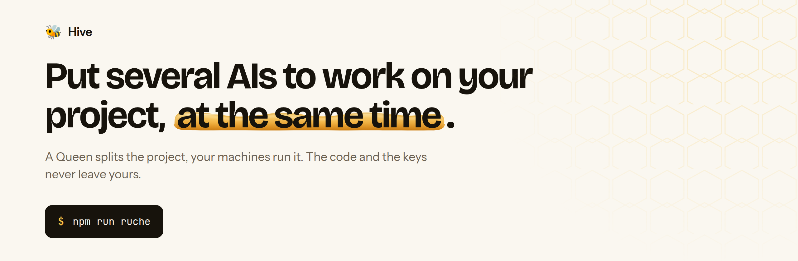
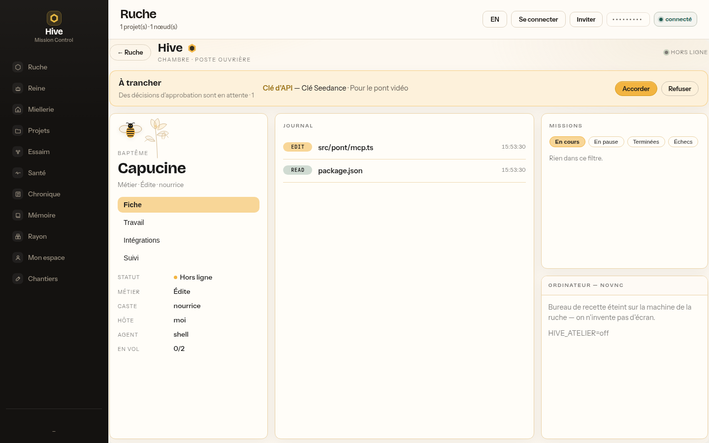

<div align="center">

<picture>
  <source media="(prefers-color-scheme: dark)" srcset="docs/images/banniere-en-sombre.png">
  
</picture>

# 🐝 Hive

[](https://github.com/Micka420-collab/hive/actions/workflows/ci.yml)


[🇫🇷 Français](README.md) · 🇬🇧 English · [🌐 Site](https://micka420-collab.github.io/hive/?lang=en) · [📚 Documentation](#-documentation)

</div>

---

**Put several AIs to work on your project, at the same time — on your machines.**

You describe what you want to build. Hive splits the work, hands it to your
team's computers, and stops in front of you at every result. Nothing is merged
without your say-so. **The code and the keys stay on your machines.**

```
                          ┌──────────────────────────────┐
       WebSocket  ◄──────►│      Orchestrator (Queen)    │◄──────►  WebSocket
                          │   Fastify · ws · SQLite      │
   ┌───────────────┐      │   scheduler · journal        │      ┌───────────────┐
   │  Member node  │      │   The Brain (knowledge)      │      │  Member node  │
   │  ruche-alpha  │      └───────────────┬──────────────┘      │  ruche-beta   │
   │ agents+sandbox│                      │ HTTP :7777          │ agents+sandbox│
   └───────────────┘              ┌───────┴────────┐            └───────────────┘
                                  │ Mission Control│
                                  │  React · 2D/3D │
                                  └────────────────┘
```

## 🖥 The interface

Shots of the running app (`npm run ruche`), not mockups.

<p align="center">
  
</p>
<p align="center">
  
</p>
<p align="center">
  
</p>
<p align="center">
  
</p>
<p align="center">
  
</p>
<p align="center">
  <a href="docs/media/chambre-presentation-demo.mp4">Video — Chambre walkthrough (FR UI)</a>
  ·
  <a href="docs/media/README.md">media notes</a>
</p>

## 🔁 How it works

1. **You describe the project.** Hive proposes a list of tasks — you correct it
   before launching.
2. **The AIs work in parallel.** Each task goes to a member's computer, in an
   isolated folder. You watch progress live.
3. **You validate, then it merges.** Nothing passes without your say-so.
4. **You open a worker’s station.** Hive view → node sheet → **Open workstation**
   (Chambre): baptismal name, **observed** files, Atelier noVNC, requisitions —
   never inventing what isn’t there. Detail:
   **[docs/FEATURES.en.md](docs/FEATURES.en.md)** (Chambre section).

## ⚡ Install

```bash
# Linux · macOS
curl -fsSL https://raw.githubusercontent.com/Micka420-collab/hive/main/install.sh | sh

# Cautious path (fingerprint before acting):
# curl -fsSLO https://micka420-collab.github.io/hive/install.sh
# sha256sum install.sh   # compare to https://micka420-collab.github.io/hive/install.sha256
# less install.sh && sh install.sh

# Windows (PowerShell)
irm https://raw.githubusercontent.com/Micka420-collab/hive/main/install.ps1 -OutFile "$env:TEMP\hive-install.ps1"; powershell -NoProfile -ExecutionPolicy Bypass -File "$env:TEMP\hive-install.ps1"

# Cautious Windows path (Pages also serves install.ps1 + the same manifest):
#   download https://micka420-collab.github.io/hive/install.ps1
#   Get-FileHash hive-install.ps1 -Algorithm SHA256   # vs install.sha256 on Pages
#   powershell -NoProfile -ExecutionPolicy Bypass -File .\hive-install.ps1
```

The script checks Node (≥ 24), fetches Hive, installs dependencies and asks
**at most three questions**. Never `sudo`, nothing written outside its folder —
`--dry-run` shows all of it without creating anything. Run as a file and it
prints its SHA-256 fingerprint (ADR 0002). Pages publishes `install.sh`,
`install.ps1` and `install.sha256`; a **signed GitHub Release** remains out of
reach (human accounts) — the Pages fingerprint guards against a blind pipe, not
a compromised repository.

Already cloned: `npm run setup` then `npm run ruche`. Containers and Cloud:
**[docs/CLOUD.md](docs/CLOUD.md)**. Acceptance desktop:
**[docs/ATELIER.md](docs/ATELIER.md)**. Full notes:
**[docs/INSTALLATION.md](docs/INSTALLATION.md)**.

## 🎚️ Editions

One product, four tiers. **The core is never crippled** to sell the tier above.
This repository collects no payment: the Cloud operator bills at their place.

| Tier           | Who it's for     | Price         | What it opens                                                             |
| -------------- | ---------------- | ------------- | ------------------------------------------------------------------------- |
| **Community**  | On your machines | **€0**        | The complete core: orchestration, nodes, unlimited seats.                 |
| **Cloud**      | Hosted by you    | from **€49**  | The same Queen on your servers, billed on the host clock.                 |
| **Team**       | A team           | **€99/month** | Fine-grained roles, per-member quotas, org projects — cloud or self-host. |
| **Enterprise** | Contract         | **on quote**  | SSO/SAML, exportable audit, retention, SLA. No price in the code.         |

Grid and rules: **[docs/MODELE-ECONOMIQUE.md](docs/MODELE-ECONOMIQUE.md)** (FR).

## 🚀 Quick start

Community (`HIVE_EDITION=community`, the default):

```bash
npm run ruche
```

Open **http://localhost:7777**. One token, one local node, the screen.

Simulated demo (no real agent, 7 tasks): `npm install` then `npm run demo`.

Join someone else's hive, with nothing to clone:

```bash
npx github:Micka420-collab/hive join hive2_your-ticket
```

## 🧠 The Brain

A hive that lasts months cannot live on logs: it needs the **rules** those logs
produced. The Brain files knowledge by kind (invariant, lesson, decision, map,
episode), refuses to truncate an invariant, and prunes episodes only. Notes
live as versionable markdown. Detail:
**[docs/FEATURES.en.md](docs/FEATURES.en.md)**. Hand-kept journal:
**[docs/ERREURS.md](docs/ERREURS.md)** (FR).

## 🎚️ Autonomy levels

| Level      | What the hive does                                       |
| ---------- | -------------------------------------------------------- |
| `off`      | Nothing automatic.                                       |
| `propose`  | It thinks and **proposes** a plan. Does not act.         |
| `gouverne` | It acts, but **every integration goes through a human**. |
| `plein`    | It ships and merges — on an explicitly enrolled repo.    |

```bash
npm run cli -- mode                      # the four modes, and where each project stands
npm run cli -- mode gouverne             # announces what it widens, writes nothing
npm run cli -- mode gouverne <project> --oui
```

Only going up asks for confirmation. `HIVE_RUNNER=off|on` (default `off`) is
the switch of the host paying for machine time.

## 🧩 Agents and models

Any coding AI plugs in through the `AgentAdapter` interface:

| Adapter        | What it runs                                            |
| -------------- | ------------------------------------------------------- |
| `claude-code`  | `claude -p "<prompt>"` in the isolated workspace.       |
| `codex`        | `codex exec "<prompt>"`                                 |
| `grok`         | `grok -p "<prompt>"` — xAI’s CLI agent, Apache 2.0.     |
| `hermes-agent` | `hermes agent run --prompt "<prompt>"`                  |
| `custom`       | Yours, via `HIVE_AGENT_CMD`.                            |
| `shell`        | **Simulated** — no process spawned, the diffs are fake. |

The node **detects what is installed** and uses it. It falls back to `shell`
only when it finds no agent — and it says so. `HIVE_AGENT` forces the choice.
Your Claude subscription is enough, no API key:
**[docs/WINDOWS-CLAUDE.md](docs/WINDOWS-CLAUDE.md)** (FR).

## 🔒 Security

- **Zero `shell: true`** — every execution goes through `spawn(bin, argv, { shell: false })`.
- **Constant-time token comparison**; trivial tokens refused outside simulation.
- **Strict CORS**, never `*`; browser WebSocket origin verified.
- **Every input validated** — JSON Schema on REST, field by field on WS, bounded bodies.
- **Per-task sandbox** — dedicated cwd, scrubbed environment, hard timeout, capped output.
- **Never a merge without human review.**

With **podman**, **docker** or **bubblewrap**, the agent only sees its own task
directory. **The network stays open**: a coding agent must reach its model's
API. Without a container engine, set `HIVE_ISOLEMENT=exige` — the node will
refuse to work in the open.

## 🛠️ Commands

| Command                     | Effect                                                               |
| --------------------------- | -------------------------------------------------------------------- |
| `npm run ruche`             | **Everything in one command** — Queen + worker + screen              |
| `npm run demo`              | Full demo (orchestrator + 2 nodes + project)                         |
| `npm run dev`               | Orchestrator only                                                    |
| `npm run node`              | A member node                                                        |
| `npm run cli -- doctor`     | **The doctor** — 13 failure causes, each with the fixing command     |
| `npm run cli -- sauvegarde` | SQLite backup via `VACUUM INTO`                                      |
| `npm run cli -- service`    | Install the hive as a service (systemd · launchd · scheduled task)   |
| `npm test`                  | The full suite (vitest) — the count lives in the badge, in one place |
| `npm run fusionner`         | Fast-forwards the branch onto `main` — no merge commit               |
| `npm run lint`              | ESLint + Prettier — zero errors required                             |
| `npm run loupe`             | **The magnifier** — is new code defended by its own tests?           |

## 📚 Documentation

| File                                                         | What's in it                                            |
| ------------------------------------------------------------ | ------------------------------------------------------- |
| **[docs/FEATURES.en.md](docs/FEATURES.en.md)**               | Each part in detail, with its trade-offs                |
| **[docs/INSTALLATION.md](docs/INSTALLATION.md)**             | Install, uninstall, service, container, backups (FR)    |
| **[docs/CLOUD.md](docs/CLOUD.md)**                           | Community free vs Cloud paid on your servers            |
| **[docs/ATELIER.md](docs/ATELIER.md)**                       | Acceptance desktop: screen, CDP, tools (FR)             |
| **[docs/WINDOWS-CLAUDE.md](docs/WINDOWS-CLAUDE.md)**         | Running solo on Windows with a Claude subscription (FR) |
| **[docs/PROTECTION-BRANCHE.md](docs/PROTECTION-BRANCHE.md)** | Protecting `main`: the exact settings, and why (FR)     |
| **[docs/ERREURS.md](docs/ERREURS.md)**                       | The error journal — by lesson, with the rules (FR)      |
| **[docs/ETAPES.md](docs/ETAPES.md)**                         | The project's real state against its own promises (FR)  |
| **[docs/MODELE-ECONOMIQUE.md](docs/MODELE-ECONOMIQUE.md)**   | Quotas, subscriptions, what is billed (FR)              |
| **[CHANGELOG.md](CHANGELOG.md)**                             | What changed, version by version                        |

Most of the deep documentation is in French, as is the codebase's commentary.
`docs/FEATURES.en.md` is the English reference.

## 🤝 Contributing

**Anything that accumulates ships its pruning bound in the same commit.** No
untrusted data enters a prompt outside a data block. The platform is a
parameter, never `process.platform` read inline.

**[Propose a project to the hive](https://github.com/Micka420-collab/hive/issues/new?template=proposer-un-projet.yml)** ·
[see proposed projects](https://github.com/Micka420-collab/hive/issues?q=is%3Aissue+label%3A%22projet+propos%C3%A9%22)

---

<div align="center"><sub>MIT · Made with 🍯 — every worker counts.</sub></div>
