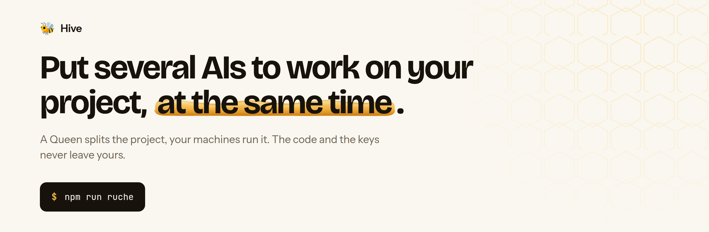

<div align="center">

<picture>
  <source media="(prefers-color-scheme: dark)" srcset="docs/images/banniere-en-sombre.png">
  
</picture>

# 🐝 Hive

[](https://github.com/Micka420-collab/hive/actions/workflows/ci.yml)


[🇫🇷 Français](README.md) · 🇬🇧 English · [🌐 Site](https://micka420-collab.github.io/hive/?lang=en) · [📚 Documentation](#-documentation)

</div>

---

**Put several AIs to work on your project, at the same time — on your machines.**

You describe what you want to build. Hive splits the work, hands it to your
team's computers, and stops in front of you at every result. Nothing is merged
without your say-so. **The code and the keys stay on your machines.**

```
                          ┌──────────────────────────────┐
       WebSocket  ◄──────►│      Orchestrator (Queen)    │◄──────►  WebSocket
                          │   Fastify · ws · SQLite      │
   ┌───────────────┐      │   scheduler · journal        │      ┌───────────────┐
   │  Member node  │      │   The Brain (knowledge)      │      │  Member node  │
   │  ruche-alpha  │      └───────────────┬──────────────┘      │  ruche-beta   │
   │ agents+sandbox│                      │ HTTP :7777          │ agents+sandbox│
   └───────────────┘              ┌───────┴────────┐            └───────────────┘
                                  │ Mission Control│
                                  │  React · 2D/3D │
                                  └────────────────┘
```

## 🖥 The interface

Shots of the running app (`npm run ruche`), not mockups.
Every view of the navigation bar, the Chambre and a task drawer, desktop and
mobile, are re-shot in one command on a lab hive: `npm run captures`
([docs/CAPTURES.md](docs/CAPTURES.md), FR). Who settles what when the AIs
disagree: [docs/PROTOCOLE-DEBAT.en.md](docs/PROTOCOLE-DEBAT.en.md).

<p align="center">
  
</p>
<p align="center">
  
</p>
<p align="center">
  
</p>
<p align="center">
  
</p>
<p align="center">
  
</p>
<p align="center">
  
</p>
<p align="center">
  <a href="docs/media/chambre-presentation-demo.mp4">Video — Chambre walkthrough (FR UI)</a>
  ·
  <a href="docs/media/README.md">media notes</a>
</p>

## 🔁 How it works

1. **You describe the project.** Hive proposes a list of tasks — you correct it
   before launching.
2. **The AIs work in parallel.** Each task goes to a member's computer, in an
   isolated folder. You watch progress live.
3. **You validate, then it merges.** Nothing passes without your say-so. After
   a successful production, the worker runs the `test`, `typecheck`, `build`
   and `lint` scripts the repository declared **before** the change (nothing,
   if the change touched the scripts), on the base plus the diff, in its
   sandbox — podman, docker or bubblewrap; without one, agent code never runs
   on the bare host and the screen says so. The Evaluator counts them like
   GitHub CI and always says which one spoke (“Hive sandbox” or “GitHub CI”).
   When the tests fail and their default output reads **complete and
   consistent** (vitest, jest, `node --test`, TAP — no argument added to the
   script), each failure is compared to the **base**, replayed apart in the
   sandbox: a test already red at the base, **with the same failure**, no
   longer blocks `accepted`, which **says** it; a regression asks for a
   correction that **names** it; a test seen red then green is “flaky” —
   neither a regression nor green. That output is partly written by the
   agent's code: a glued line, a summary that does not count everything, a
   duplicate name, and Hive does not read it — **at the slightest doubt, the
   script’s verdict stays**. **Overhead, announced in the progress line:** only
   when tests fail — the base replayed apart (extraction, install, build,
   tests: up to 25 min), then, if a regression is still possible, the
   production replayed the same way from its delivered tree and a second run
   of the base, 55 min at worst; a base the node already replayed is not
   replayed again.
4. **You open a worker’s station.** Hive view → node sheet → **Open workstation**
   (Chambre): baptismal name, **observed** files, Atelier noVNC, requisitions —
   never inventing what isn’t there. Detail:
   **[docs/FEATURES.en.md](docs/FEATURES.en.md)** (Chambre section).

## ⚡ Install

**The desktop app** — the simplest path: one installer per OS, no Node, no
terminal. The Queen, one worker per signed-in agent and Mission Control in one
window, with a tray icon and automatic updates.

| Windows                | macOS                               | Linux                                                 |
| ---------------------- | ----------------------------------- | ----------------------------------------------------- |
| `Hive-Setup-X.Y.Z.exe` | `Hive-X.Y.Z-arm64.dmg` / `-x64.dmg` | `hive_X.Y.Z_amd64.deb` · `Hive-X.Y.Z-x86_64.AppImage` |

Download from the [Releases](https://github.com/Micka420-collab/hive/releases).
While builds are unsigned, SmartScreen and Gatekeeper warn — how to get past
them, where data lives, uninstalling: **[docs/APPLICATION.md](docs/APPLICATION.md)**
(English summary at the end).

**From a terminal** (Node ≥ 24.18) — for a server, a developer, a worker:

```bash
# Linux · macOS
curl -fsSL https://raw.githubusercontent.com/Micka420-collab/hive/main/install.sh | sh

# Cautious path (fingerprint before acting):
# curl -fsSLO https://micka420-collab.github.io/hive/install.sh
# sha256sum install.sh   # compare to https://micka420-collab.github.io/hive/install.sha256
# less install.sh && sh install.sh

# Windows (PowerShell)
irm https://raw.githubusercontent.com/Micka420-collab/hive/main/install.ps1 -OutFile "$env:TEMP\hive-install.ps1"; powershell -NoProfile -ExecutionPolicy Bypass -File "$env:TEMP\hive-install.ps1"

# Cautious Windows path (Pages also serves install.ps1 + the same manifest):
#   download https://micka420-collab.github.io/hive/install.ps1
#   Get-FileHash hive-install.ps1 -Algorithm SHA256   # vs install.sha256 on Pages
#   powershell -NoProfile -ExecutionPolicy Bypass -File .\hive-install.ps1
```

The script checks Node (≥ 24.18; on Linux, glibc ≥ 2.34: Ubuntu 22.04+,
Debian 12+ — [why](docs/INSTALLATION.md#pourquoi-node-2418-et-pas-moins)),
fetches Hive, installs dependencies and asks **at most three questions**.
Never `sudo`, nothing written outside its folder — `--dry-run` shows all of it
without creating anything. Run as a file and it prints its SHA-256 fingerprint
(ADR 0002). Pages publishes `install.sh`,
`install.ps1` and `install.sha256`; a **signed GitHub Release** remains out of
reach (human accounts) — the Pages fingerprint guards against a blind pipe, not
a compromised repository.

Already cloned: `npm run setup` then `npm run ruche`. Containers and Cloud:
**[docs/CLOUD.md](docs/CLOUD.md)**. Acceptance desktop:
**[docs/ATELIER.md](docs/ATELIER.md)**. Full notes:
**[docs/INSTALLATION.md](docs/INSTALLATION.md)**.

## 🎚️ Editions

One product, four tiers. **The core is never crippled** to sell the tier above.
This repository collects no payment: the Cloud operator bills at their place.

| Tier           | Who it's for     | Price         | What it opens                                                             |
| -------------- | ---------------- | ------------- | ------------------------------------------------------------------------- |
| **Community**  | On your machines | **€0**        | The complete core: orchestration, nodes, unlimited seats.                 |
| **Cloud**      | Hosted by you    | from **€49**  | The same Queen on your servers, billed on the host clock.                 |
| **Team**       | A team           | **€99/month** | Fine-grained roles, per-member quotas, org projects — cloud or self-host. |
| **Enterprise** | Contract         | **on quote**  | SSO/SAML, exportable audit, retention, SLA. No price in the code.         |

Grid and rules: **[docs/MODELE-ECONOMIQUE.md](docs/MODELE-ECONOMIQUE.md)** (FR).

## 🚀 Quick start

Community (`HIVE_EDITION=community`, the default):

```bash
npm run ruche
```

Open **http://localhost:7777**. One token, one worker per installed agent, the
screen. A single worker: `npm run ruche -- --une-ouvriere`.

Administrative actions that create or revoke access (inviting, issuing a
ticket, listing or excluding a node) require an administrator account session.
`HIVE_TOKEN` identifies the hive and its nodes; it is not an administrative
credential. For the CLI, provide the admin JWT through `HIVE_JWT`.

Simulated demo (no real agent, 7 tasks): `npm install` then `npm run demo`.

Join someone else's hive, with nothing to clone:

```bash
npx github:Micka420-collab/hive join hive2_your-ticket
```

## 🧠 The Brain

A hive that lasts months cannot live on logs: it needs the **rules** those logs
produced. The Brain files knowledge by kind (invariant, lesson, decision, map,
episode), refuses to truncate an invariant, and prunes episodes only. Notes
live as versionable markdown. Detail:
**[docs/FEATURES.en.md](docs/FEATURES.en.md)**. Hand-kept journal:
**[docs/ERREURS.md](docs/ERREURS.md)** (FR).

## 🎚️ Autonomy levels

| Level      | What the hive does                                       |
| ---------- | -------------------------------------------------------- |
| `off`      | Nothing automatic.                                       |
| `propose`  | It thinks and **proposes** a plan. Does not act.         |
| `gouverne` | It acts, but **every integration goes through a human**. |
| `plein`    | It ships and merges — on an explicitly enrolled repo.    |

```bash
npm run cli -- mode                      # the four modes, and where each project stands
npm run cli -- mode gouverne             # announces what it widens, writes nothing
npm run cli -- mode gouverne <project> --oui
```

Only going up asks for confirmation. `HIVE_RUNNER=off|on` (default `off`) is
the switch of the host paying for machine time.

## 🧩 Agents and models

Any coding AI plugs in through the `AgentAdapter` interface:

| Adapter        | What it runs                                                                                                    |
| -------------- | --------------------------------------------------------------------------------------------------------------- |
| `claude-code`  | `claude -p "<prompt>"` in the isolated workspace.                                                               |
| `cursor`       | `cursor-agent -p --force --output-format stream-json -- "<prompt>"` — binary overridable via `HIVE_CURSOR_BIN`. |
| `cline`        | `cline --json --auto-approve true "<prompt>"` — binary overridable via `HIVE_CLINE_BIN`.                        |
| `codex`        | `codex exec --json -- "<prompt>"` — tokens declared, cost unknown (never derived from tokens).                  |
| `grok`         | `grok -p "<prompt>"` — xAI’s CLI agent, Apache 2.0.                                                             |
| `hermes-agent` | `hermes agent run --prompt "<prompt>"`                                                                          |
| `custom`       | Yours, via `HIVE_AGENT_CMD`.                                                                                    |
| `shell`        | **Simulated** — no process spawned, the diffs are fake.                                                         |

The node **detects what is installed** and uses it. It falls back to `shell`
only when it finds no agent — and it says so. `HIVE_AGENT` forces the choice.
Your Claude subscription is enough, no API key:
**[docs/WINDOWS-CLAUDE.md](docs/WINDOWS-CLAUDE.md)** (FR).

**Several agents installed, several workers.** As soon as the machine has two
real agent families (Claude Code, Codex, Cursor…), `npm run ruche` starts one
worker per family, each running one task at a time: every production is
reviewed by the OTHER families, up to two — with Claude Code, Codex and Cursor,
that is two reviews per production — and the router learns from those
verdicts. An idle worker spends nothing; a review, though, is a real task, and
the startup line counts them. A review only goes to its family: if that family
disappears (worker stopped, restart with `--une-ouvriere`), the review fails
after five minutes and the journal says why. A review that ends without a
verdict (absent family, failing reviewer, empty answer) is handed ONCE to
another family independent of the producer if one is online; otherwise the
Evaluator asks for a human review, stating « relecture impossible : <cause> ».
The producer is never retried for its reviewer's failure. The first worker keeps its
previous name, folder and `HIVE_MODELES`; the others take `<name>-<family>`. To
start only one: `npm run ruche -- --une-ouvriere`, or `HIVE_AGENT` in `.env`. An
agent that is installed but not signed in — its own status command says so
(`claude auth status`, `cursor-agent status`, `codex login status`) and no key
is set — gets no worker: the hive and `hive doctor` say so, with the command
that signs it in. A worker that dies or refuses to start no longer stops the
hive: the launcher quotes its last line (the reason and the fix), and only
stops, with a non-zero code, when the Queen dies or no worker is left. `^C`
still stops everything.

## 🔒 Security

- **Zero `shell: true`** — every execution goes through `spawn(bin, argv, { shell: false })`.
- **Constant-time token comparison**; trivial tokens refused outside simulation.
- **Strict CORS**, never `*`; browser WebSocket origin verified.
- **Every input validated** — JSON Schema on REST, field by field on WS, bounded bodies.
- **Per-task sandbox** — dedicated cwd, scrubbed environment, hard timeout, capped output.
- **Never a merge without human review.**

With **podman**, **docker** or **bubblewrap**, the agent only sees its own task
directory. **The network stays open**: a coding agent must reach its model's
API. Without a container engine, set `HIVE_ISOLEMENT=exige` — the node will
refuse to work in the open. What CI proves, per OS and per sandbox (Linux,
macOS, Windows × no sandbox, bubblewrap, Podman, Docker):
[docs/INSTALLATION.md](docs/INSTALLATION.md), “Systèmes et bacs à sable” (FR).

The default image, `localhost/hive-agent:local` (Claude Code, Codex, Cline), is
built on each node with `npm run bac:image`; Hive never downloads it. The node
keeps the first engine whose preflight passes (image present, agent runnable)
and says why the others were skipped. Every container carries its node's label:
restarted after a hard stop, the node removes the ones it left behind.

**The security gate.** On every result that carries a diff — successful or
failed — the node passes what the production **adds** to two pinned tools,
invoked and never linked.

- **Secrets**: Betterleaks (MIT), on the diff's added lines only, with its
  **high**-confidence rules (`--confidence high`: the generic rules read
  healthy code as passwords) and without its prefilter (a lockfile, an `.svg`,
  a `go.sum` are read). It runs nothing of the production. The value,
  redacted by the tool (`--redact`), is re-read by the node and replaced with
  `[secret]` in the diff, the logs and the final text — only in a token form
  (16 characters or more, no whitespace): the gate never rewrites a line on
  the sole faith of a finding.
- **Dependencies**: osv-scanner (Apache-2.0), for a successful production that
  touches a dependency file it reads (npm, PyPI, Cargo, Go, NuGet, Maven and
  Gradle, RubyGems, Composer, Pub, Hex, CRAN, Conan lockfiles…). Each file is
  read offline, one at a time; only vulnerabilities **introduced** relative to
  the base count; a lockfile the production leaves unreadable is a finding.
- **What leaves for `api.osv.dev`** — the gate's only connection: the ecosystem,
  name and version of the packages the production **introduces** whose
  lockfile names a known public source (registry.npmjs.org, PyPI, crates.io,
  rubygems.org, packagist.org, pub.dev, hex.pm, CRAN), and the base versions of
  those same packages. Never a commit, a path, a package from a private
  registry the lockfile names, nor an unchanged package. `pnpm-lock.yaml`,
  `bun.lock` and `yarn.lock` (berry) do not name their registry: nothing
  leaves from them. **Limit**: `go.mod`, NuGet, Maven and Conan do not name
  theirs either — a private package there is indistinguishable from a public
  one, and its name leaves. Introduced packages that do not leave are never
  counted green: the verdict says how many. Behind an outbound proxy,
  `HTTPS_PROXY` and `NO_PROXY` are passed to that query only; `hive doctor`
  checks that api.osv.dev is reachable, sending nothing.
- **The verdict**: a finding, and the Evaluator asks for a correction — a
  verdict that blocks delivery — citing the rule and the line, or the advisory
  and its CVE, never the value. Not verified (tool missing, osv.dev
  unreachable…), the gate is **never counted green** and its reason is said.
  Under `strict` polyethism it turns the production from `accepted` into
  `human_review_required`, and that is all: delivery already required a human
  approval, which this verdict does not block. What changes: the Evaluator no
  longer accepts on its own (no memory kept in the Hive Mind without a human,
  no production "judged" in the workers' quality), and the approving human
  reads why.
- **Limit, said**: the agent's LIVE output goes to the dashboards while it
  works, before the gate. With Claude Code, the content of a file the agent
  writes (Write or Edit tools) is in that stream: a key Hive does not
  recognize by its format (`ghp_…`, `sk-…`…) or by its value (a credential
  passed to the agent) is relayed as is. The gate protects what is stored —
  diff, logs, final text — not that ephemeral stream. Named follow-up: redact
  the live stream with Betterleaks' rules.

The sandbox image pins betterleaks 1.9.0 and osv-scanner 2.6.0 by version and
SHA-256; under bubblewrap or without a sandbox they are the host's, resolved to
their absolute path (a relative PATH entry is never read), and `hive doctor`
says what the gate will find.

Inside the sandbox the agent gets an ephemeral HOME: a `claude login` or
`codex login` session does not reach it. Hive forwards the headless credentials
**by name** — `CLAUDE_CODE_OAUTH_TOKEN` (`claude setup-token`) or
`ANTHROPIC_API_KEY` for Claude Code, `CODEX_API_KEY` for Codex (which ignores
`OPENAI_API_KEY`) — and no probe ever receives them. With a session but none of
these variables, `auto` falls back to the process sandbox and `exige` refuses,
naming the variable to set. Bubblewrap mounts the agent's and Node's
installation read-only, never the HOME.

Claude Code runs nothing a task's repository brings: Hive launches it with
`--setting-sources user`, `--settings '{"disableAllHooks":true}'` and
`--strict-mcp-config`, so the project's hooks, `.mcp.json` servers and settings
`env` block no longer apply — without them `claude -p` ran them unasked, and a
repository `ANTHROPIC_BASE_URL` received the member's key. The repository's
`CLAUDE.md` and `.claude/rules` are re-read by Hive as bounded plain data
appended to the system prompt; the task log says so. Deliberate trade-off:
outside the sandbox, the member's **own** hooks and MCP servers are off too for
hive tasks. Codex sees the repository as untrusted (neither its
`.codex/config.toml` nor its hooks load); its `AGENTS.md` reaches Codex the same
way, as bounded plain data.

Cursor and Cline have no such switch: Cursor (`--force` counts as folder trust)
runs the hooks of `.cursor/hooks.json` and, in Claude format, those of
`.claude/settings.json` and `.claude/settings.local.json`; Cline runs those of
`.clinerules/hooks/` and `.cline/hooks/` and loads `.cline/plugins/` as code.
The node therefore moves these paths out of the task tree before the agent
starts — on every OS, sandboxed or not — and puts them back before the diff, so
they never show up as deletions. A sparse checkout keeps these paths out of the
tree for the agent's git: `checkout`, `reset --hard`, `stash` and `pull
--rebase` do not bring them back, not even a version pushed after dispatch —
only an explicit `checkout <revision> -- <paths>` by the agent rewrites them,
as if it wrote them itself. The task log says so; if moving them fails, the
task is refused before the agent runs, with the reason.

## 🛠️ Commands

| Command                                         | Effect                                                                                                                                                                                                                                                                                                                                                                                                                                                                                                                                                                                                                                                                                                                                                                                                                                                                                                                       |
| ----------------------------------------------- | ---------------------------------------------------------------------------------------------------------------------------------------------------------------------------------------------------------------------------------------------------------------------------------------------------------------------------------------------------------------------------------------------------------------------------------------------------------------------------------------------------------------------------------------------------------------------------------------------------------------------------------------------------------------------------------------------------------------------------------------------------------------------------------------------------------------------------------------------------------------------------------------------------------------------------- |
| `npm run ruche`                                 | **Everything in one command** — Queen + one worker per installed agent + screen                                                                                                                                                                                                                                                                                                                                                                                                                                                                                                                                                                                                                                                                                                                                                                                                                                              |
| `npm run ruche -- --une-ouvriere`               | A single worker, even when several agents are installed                                                                                                                                                                                                                                                                                                                                                                                                                                                                                                                                                                                                                                                                                                                                                                                                                                                                      |
| `npm run app:dev`                               | The **desktop app** from the repository (Electron) — see [docs/APPLICATION.md](docs/APPLICATION.md)                                                                                                                                                                                                                                                                                                                                                                                                                                                                                                                                                                                                                                                                                                                                                                                                                          |
| `npm run app:dist:linux`                        | The app packages (AppImage + .deb; `:win` → .exe, `:mac` → .dmg) in `desktop/release/`                                                                                                                                                                                                                                                                                                                                                                                                                                                                                                                                                                                                                                                                                                                                                                                                                                       |
| `npm run demo`                                  | Full demo (orchestrator + 2 nodes + project)                                                                                                                                                                                                                                                                                                                                                                                                                                                                                                                                                                                                                                                                                                                                                                                                                                                                                 |
| `npm run dev`                                   | Orchestrator only                                                                                                                                                                                                                                                                                                                                                                                                                                                                                                                                                                                                                                                                                                                                                                                                                                                                                                            |
| `npm run node`                                  | A member node                                                                                                                                                                                                                                                                                                                                                                                                                                                                                                                                                                                                                                                                                                                                                                                                                                                                                                                |
| `npm run cli -- doctor`                         | **The doctor** — 15 failure causes, each with the fixing command                                                                                                                                                                                                                                                                                                                                                                                                                                                                                                                                                                                                                                                                                                                                                                                                                                                             |
| `npm run preuve:v2-alpha -- --racine . --oui`   | **The V2 Alpha proof** — one real mission handed to a real agent, judged criterion by criterion once settled (review returned, no Evaluator retry pending); `--workers 3` requires the swarm (3 Workers from 2 families, one of them Claude Code or Codex, the only adapters that can delegate; independent tasks in parallel, a delegation whose child a real agent returns (it may run on its parent's own Worker: the Queen cannot pin it), cross-family review) and reports the retry after an objection and the Evaluator without requiring them; `--exige-bac` requires a container sandbox on every node that ran the mission, delegated children and reviews included; `--depot <url>` (an https GitHub repo, and `HIVE_GITHUB_TOKEN` on the Queen, both checked before spending) delivers every production as a PR, delegated children included (nothing is created without `--oui`: it spends the agents' credits) |
| `npm run boucle:v3 -- --racine . --mission "…"` | **The Hive → Hive loop (V3)** — Hive gives itself a mission on its own repository: architecture, an implementation reviewed by another family, the sensitive-change gate, QA of that exact production, then a PR (never main) carrying its risk report; a production touching security, permissions, secrets, deployment, billing, self-execution or the gate itself — or that no other family reviewed — stops BEFORE QA (exit 75) until a human approves it in the Miellerie with an owner or administrator account (the hive token does not approve), then `--reprendre <project>`; never merges, nothing is created without `--oui`                                                                                                                                                                                                                                                                                      |
| `npm run cli -- livrer-local <project>`         | **Deliver without GitHub** — the mission committed to `hive/mission-<project>-<n>` (`--pousser` pushes it)                                                                                                                                                                                                                                                                                                                                                                                                                                                                                                                                                                                                                                                                                                                                                                                                                   |
| `npm run captures`                              | **The screenshots** — every navigation-bar view, the Chambre and a drawer, desktop and mobile, on a lab hive (needs `npx playwright install --only-shell chromium` once)                                                                                                                                                                                                                                                                                                                                                                                                                                                                                                                                                                                                                                                                                                                                                     |
| `npm run cli -- sauvegarde`                     | SQLite backup via `VACUUM INTO`                                                                                                                                                                                                                                                                                                                                                                                                                                                                                                                                                                                                                                                                                                                                                                                                                                                                                              |
| `npm run cli -- service`                        | Install the hive as a service (systemd · launchd · scheduled task)                                                                                                                                                                                                                                                                                                                                                                                                                                                                                                                                                                                                                                                                                                                                                                                                                                                           |
| `npm test`                                      | The full suite (vitest) — the count lives in the badge, in one place                                                                                                                                                                                                                                                                                                                                                                                                                                                                                                                                                                                                                                                                                                                                                                                                                                                         |
| `npm run fusionner`                             | Fast-forwards the branch onto `main` — no merge commit                                                                                                                                                                                                                                                                                                                                                                                                                                                                                                                                                                                                                                                                                                                                                                                                                                                                       |
| `npm run lint`                                  | ESLint + Prettier — zero errors required                                                                                                                                                                                                                                                                                                                                                                                                                                                                                                                                                                                                                                                                                                                                                                                                                                                                                     |
| `npm run loupe`                                 | **The magnifier** — is new code defended by its own tests?                                                                                                                                                                                                                                                                                                                                                                                                                                                                                                                                                                                                                                                                                                                                                                                                                                                                   |

## 📚 Documentation

| File                                                         | What's in it                                               |
| ------------------------------------------------------------ | ---------------------------------------------------------- |
| **[docs/FEATURES.en.md](docs/FEATURES.en.md)**               | Each part in detail, with its trade-offs                   |
| **[docs/BANC-OMBRE.md](docs/BANC-OMBRE.md)**                 | Shadow bench: two models, one task, never delivered (FR)   |
| **[docs/APPLICATION.md](docs/APPLICATION.md)**               | The desktop app: install, update, signing (FR + EN)        |
| **[docs/INSTALLATION.md](docs/INSTALLATION.md)**             | Install, uninstall, service, container, backups (FR)       |
| **[docs/CLOUD.md](docs/CLOUD.md)**                           | Community free vs Cloud paid on your servers               |
| **[docs/ATELIER.md](docs/ATELIER.md)**                       | Acceptance desktop: screen, CDP, tools (FR)                |
| **[docs/CAPTURES.md](docs/CAPTURES.md)**                     | Mission Control screenshots, and how to re-shoot them (FR) |
| **[docs/WINDOWS-CLAUDE.md](docs/WINDOWS-CLAUDE.md)**         | Running solo on Windows with a Claude subscription (FR)    |
| **[docs/PROTECTION-BRANCHE.md](docs/PROTECTION-BRANCHE.md)** | Protecting `main`: the exact settings, and why (FR)        |
| **[docs/ERREURS.md](docs/ERREURS.md)**                       | The error journal — by lesson, with the rules (FR)         |
| **[docs/ETAPES.md](docs/ETAPES.md)**                         | The project's real state against its own promises (FR)     |
| **[docs/MODELE-ECONOMIQUE.md](docs/MODELE-ECONOMIQUE.md)**   | Quotas, subscriptions, what is billed (FR)                 |
| **[CHANGELOG.md](CHANGELOG.md)**                             | What changed, version by version                           |
| **[docs/RELEASING.md](docs/RELEASING.md)**                   | Versions, tags, upgrading without losing anything (FR)     |

Most of the deep documentation is in French, as is the codebase's commentary.
`docs/FEATURES.en.md` is the English reference.

## 🤝 Contributing

**Anything that accumulates ships its pruning bound in the same commit.** No
untrusted data enters a prompt outside a data block. The platform is a
parameter, never `process.platform` read inline.

**[Propose a project to the hive](https://github.com/Micka420-collab/hive/issues/new?template=proposer-un-projet.yml)** ·
[see proposed projects](https://github.com/Micka420-collab/hive/issues?q=is%3Aissue+label%3A%22projet+propos%C3%A9%22)

---

<div align="center"><sub>MIT · Made with 🍯 — every worker counts.</sub></div>
