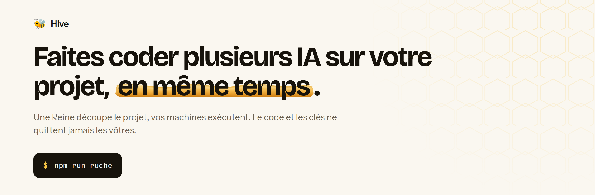
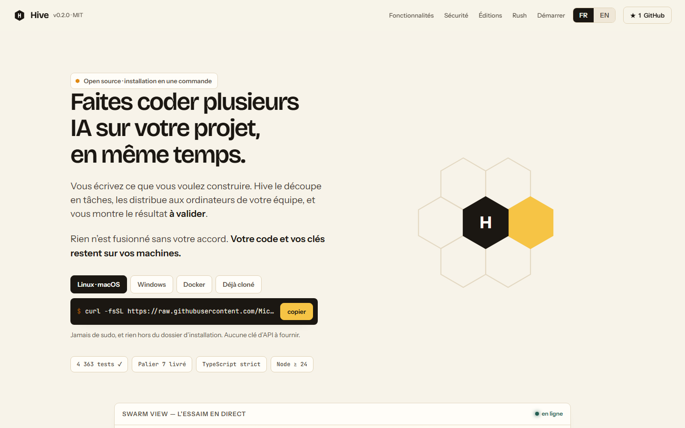
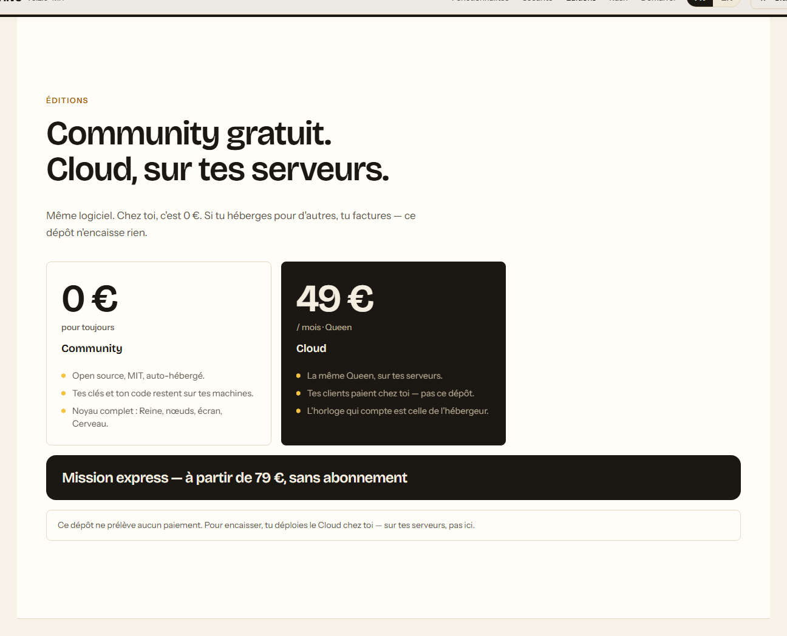
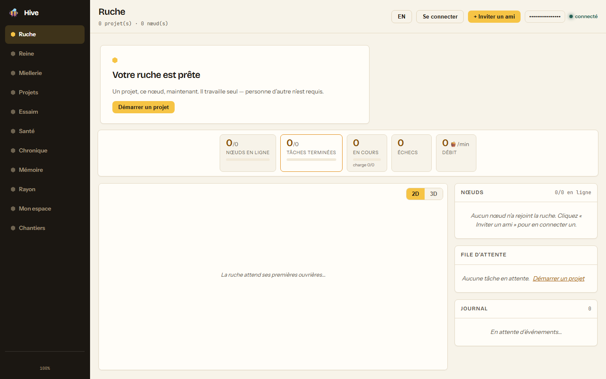
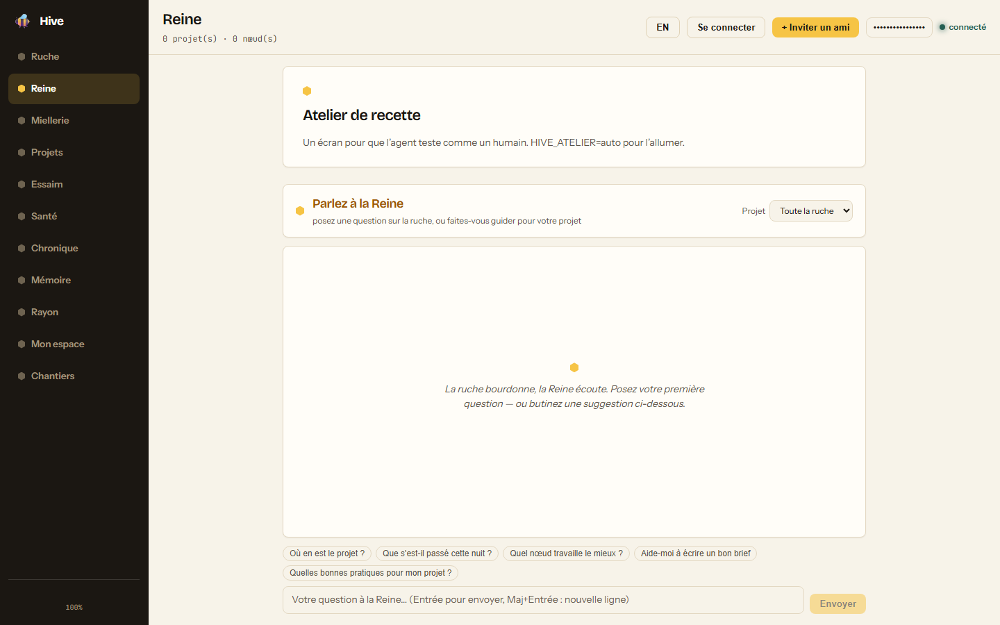

<div align="center">

<picture>
  <source media="(prefers-color-scheme: dark)" srcset="docs/images/banniere-sombre.png">
  
</picture>

# 🐝 Hive

[](https://github.com/Micka420-collab/hive/actions/workflows/ci.yml)


🇫🇷 Français · [🇬🇧 English](README.en.md) · [🌐 Site](https://micka420-collab.github.io/hive/) · [📚 Documentation](#-documentation)

</div>

---

**Faites travailler plusieurs IA sur votre projet, en même temps — sur vos machines.**

Vous décrivez ce que vous voulez construire. Hive découpe le travail, le
distribue aux ordinateurs de l'équipe, et s'arrête devant vous à chaque
résultat. Rien n'est fusionné sans votre accord. **Le code et les clés restent
chez vous.**

```
                          ┌──────────────────────────────┐
       WebSocket  ◄──────►│     Orchestrateur (Reine)    │◄──────►  WebSocket
                          │   Fastify · ws · SQLite      │
   ┌───────────────┐      │   ordonnanceur · journal     │      ┌───────────────┐
   │  Nœud membre  │      │   Le Cerveau (savoir)        │      │  Nœud membre  │
   │  ruche-alpha  │      └───────────────┬──────────────┘      │  ruche-beta   │
   │ agents+bac    │                      │ HTTP :7777          │ agents+bac    │
   └───────────────┘              ┌───────┴────────┐            └───────────────┘
                                  │ Mission Control│
                                  │  React · 2D/3D │
                                  └────────────────┘
```

## 🖥 L'interface

Captures de l'écran réel (`npm run ruche`), pas de maquettes.

<p align="center">
  
</p>
<p align="center">
  
</p>
<p align="center">
  
</p>
<p align="center">
  
</p>

## 🔁 Comment ça marche

1. **Vous décrivez le projet.** Hive propose une liste de tâches — vous la
   corrigez avant de lancer.
2. **Les IA travaillent en parallèle.** Chaque tâche part sur l'ordinateur d'un
   membre, dans un dossier isolé. L'avancement s'affiche en direct.
3. **Vous validez, puis ça fusionne.** Rien ne passe sans votre accord.

## ⚡ Installation

```bash
# Linux · macOS
curl -fsSL https://raw.githubusercontent.com/Micka420-collab/hive/main/install.sh | sh

# Windows (PowerShell)
irm https://raw.githubusercontent.com/Micka420-collab/hive/main/install.ps1 -OutFile "$env:TEMP\hive-install.ps1"; powershell -NoProfile -ExecutionPolicy Bypass -File "$env:TEMP\hive-install.ps1"
```

Le script vérifie Node (≥ 24), récupère Hive, installe les dépendances et pose
**au plus trois questions**. Jamais de `sudo`, rien hors de son dossier —
`--dry-run` montre tout sans rien créer.

Déjà cloné : `npm run setup` puis `npm run ruche`. Conteneur et Cloud :
**[docs/CLOUD.md](docs/CLOUD.md)**. Bureau de recette :
**[docs/ATELIER.md](docs/ATELIER.md)**. Détail :
**[docs/INSTALLATION.md](docs/INSTALLATION.md)**.

## 🎚️ Éditions

Un seul logiciel, quatre paliers. **Le cœur n'est jamais bridé** pour vendre
le palier au-dessus. Ce dépôt n'encaisse rien : l'opérateur Cloud facture chez
lui.

| Palier         | Pour qui         | Prix          | Ce qu'il ouvre                                                              |
| -------------- | ---------------- | ------------- | --------------------------------------------------------------------------- |
| **Community**  | Chez vous        | **0 €**       | Le noyau complet : orchestration, nœuds, sièges illimités.                  |
| **Cloud**      | Hébergé par vous | dès **49 €**  | La même Queen sur vos serveurs, facturée à l'horloge de l'hébergeur.        |
| **Team**       | Une équipe       | **99 €/mois** | Rôles fins, quotas par membre, projets d'organisation — cloud ou self-host. |
| **Enterprise** | Au contrat       | **sur devis** | SSO/SAML, audit exportable, rétention, SLA. Aucun prix dans le code.        |

Grille et règles : **[docs/MODELE-ECONOMIQUE.md](docs/MODELE-ECONOMIQUE.md)**.

## 🚀 Démarrage rapide

Community (`HIVE_EDITION=community`, c'est le défaut) :

```bash
npm run ruche
```

Ouvrez **http://localhost:7777**. Un jeton, un nœud local, l'écran.

Démo simulée (aucun agent réel, 7 tâches) : `npm install` puis `npm run demo`.

Rejoindre la ruche de quelqu'un d'autre, sans cloner :

```bash
npx github:Micka420-collab/hive join hive2_votre-billet
```

## 🧠 Le Cerveau

Une ruche qui dure des mois ne peut pas se contenter des logs : elle a besoin
des **règles** qu'ils ont produites. Le Cerveau range le savoir par genre
(invariant, leçon, décision, carte, épisode), refuse de tronquer un invariant,
et n'élague que les épisodes. Les notes vivent en markdown versionnable.
Détail : **[docs/FONCTIONNALITES.md](docs/FONCTIONNALITES.md)**. Le journal
tenu à la main : **[docs/ERREURS.md](docs/ERREURS.md)**.

## 🎚️ Autonomie

| Niveau     | Ce que la ruche fait                                       |
| ---------- | ---------------------------------------------------------- |
| `off`      | Rien d'automatique.                                        |
| `propose`  | Elle réfléchit et **propose** un plan. N'agit pas.         |
| `gouverne` | Elle agit, mais **toute intégration passe par un humain**. |
| `plein`    | Elle livre et fusionne — dépôt explicitement inscrit.      |

```bash
npm run cli -- mode                      # les quatre modes, et où en est chaque projet
npm run cli -- mode gouverne             # annonce ce que ça élargit, n'écrit rien
npm run cli -- mode gouverne <projet> --oui
```

Seule la montée se confirme. `HIVE_RUNNER=off|on` (défaut `off`) est le
commutateur de l'hôte qui paie le temps-machine.

## 🧩 Agents et modèles

Toute IA de codage se branche via l'interface `AgentAdapter` :

| Adaptateur     | Ce qu'il lance                                           |
| -------------- | -------------------------------------------------------- |
| `claude-code`  | `claude -p "<prompt>"` dans l'espace isolé.              |
| `codex`        | `codex exec "<prompt>"`                                  |
| `grok`         | `grok -p "<prompt>"` — l’agent CLI de xAI, Apache 2.0.   |
| `hermes-agent` | `hermes agent run --prompt "<prompt>"`                   |
| `custom`       | Le vôtre, via `HIVE_AGENT_CMD`.                          |
| `shell`        | **Simulé** — aucun processus lancé, les diffs sont faux. |

Le nœud **détecte ce qui est installé** et s'en sert. Il n'emploie `shell` que
s'il ne trouve aucun agent — et il le dit. `HIVE_AGENT` force le choix.
Votre abonnement Claude suffit, sans clé d'API :
**[docs/WINDOWS-CLAUDE.md](docs/WINDOWS-CLAUDE.md)**.

## 🔒 Sécurité

- **Zéro `shell: true`** — toute exécution passe par `spawn(bin, argv, { shell: false })`.
- **Jeton comparé à temps constant** ; jeton trivial refusé hors simulation.
- **CORS restreint**, jamais `*` ; origine des WebSockets vérifiée.
- **Toute entrée validée** — JSON Schema au REST, champ par champ en WS, corps bornés.
- **Bac à sable par tâche** — cwd dédié, environnement épuré, délai dur, sortie plafonnée.
- **Jamais de fusion sans revue humaine.**

Avec **podman**, **docker** ou **bubblewrap**, l'agent ne voit que le répertoire
de sa tâche. **Le réseau reste ouvert** : un agent de codage doit joindre l'API
de son modèle. Sans moteur de conteneurs, posez `HIVE_ISOLEMENT=exige` — le nœud
refusera de travailler à découvert.

## 🛠️ Commandes

| Commande                    | Effet                                                                        |
| --------------------------- | ---------------------------------------------------------------------------- |
| `npm run ruche`             | **Tout en une commande** — Reine + ouvrière + écran                          |
| `npm run demo`              | Démo complète (orchestrateur + 2 nœuds + projet)                             |
| `npm run dev`               | Orchestrateur seul                                                           |
| `npm run node`              | Un nœud membre                                                               |
| `npm run cli -- doctor`     | **Le docteur** — 13 causes de panne, et la commande qui répare               |
| `npm run cli -- sauvegarde` | Sauvegarde SQLite par `VACUUM INTO`                                          |
| `npm run cli -- service`    | Installer la ruche en service (systemd · launchd · tâche planifiée)          |
| `npm test`                  | La suite complète (vitest) — le compte vit dans le badge, en un seul endroit |
| `npm run fusionner`         | Porte la branche sur `main` en **avance rapide** — sans commit de fusion     |
| `npm run lint`              | ESLint + Prettier — zéro erreur exigé                                        |
| `npm run loupe`             | **La loupe** — le code neuf est-il défendu par ses tests ?                   |

## 📚 Documentation

| Fichier                                                      | Ce qu'on y trouve                                        |
| ------------------------------------------------------------ | -------------------------------------------------------- |
| **[docs/INSTALLATION.md](docs/INSTALLATION.md)**             | Installer, désinstaller, service, conteneur, sauvegardes |
| **[docs/CLOUD.md](docs/CLOUD.md)**                           | Community 0 € vs Cloud payant sur tes serveurs           |
| **[docs/ATELIER.md](docs/ATELIER.md)**                       | Bureau de recette : écran, CDP, outils                   |
| **[docs/WINDOWS-CLAUDE.md](docs/WINDOWS-CLAUDE.md)**         | Tourner seul sous Windows avec son abonnement Claude     |
| **[docs/PROTECTION-BRANCHE.md](docs/PROTECTION-BRANCHE.md)** | Protéger `main` : les réglages exacts, et pourquoi       |
| **[docs/FONCTIONNALITES.md](docs/FONCTIONNALITES.md)**       | Chaque partie en détail, avec ses arbitrages             |
| **[docs/FEATURES.en.md](docs/FEATURES.en.md)**               | The same, in English                                     |
| **[docs/ERREURS.md](docs/ERREURS.md)**                       | Le journal des erreurs — par leçon, avec les règles      |
| **[docs/ETAPES.md](docs/ETAPES.md)**                         | L'état réel du projet face à ses propres promesses       |
| **[docs/MODELE-ECONOMIQUE.md](docs/MODELE-ECONOMIQUE.md)**   | Quotas, abonnements, ce qui est facturé                  |
| **[CHANGELOG.md](CHANGELOG.md)**                             | Ce qui a changé, version par version                     |

## 🤝 Contribuer

**Tout ce qui s'accumule ship sa borne d'élagage dans le même commit.** Aucune
donnée non fiable n'entre dans un prompt hors d'un bloc de données. La
plateforme est un paramètre, jamais `process.platform` lu en ligne.

**[Proposer un projet à la ruche](https://github.com/Micka420-collab/hive/issues/new?template=proposer-un-projet.yml)** ·
[voir les projets proposés](https://github.com/Micka420-collab/hive/issues?q=is%3Aissue+label%3A%22projet+propos%C3%A9%22)

---

<div align="center"><sub>MIT · Fait avec 🍯 — chaque ouvrière compte.</sub></div>
