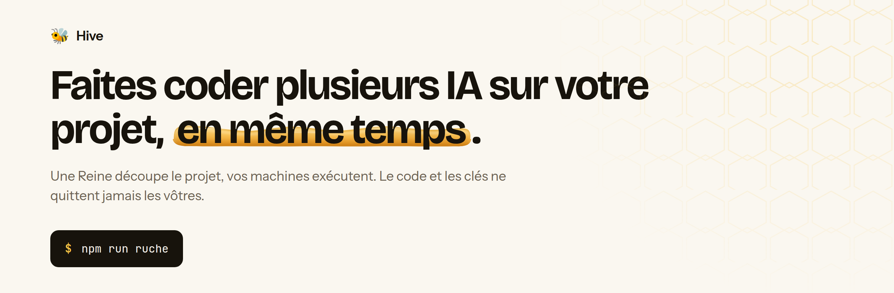
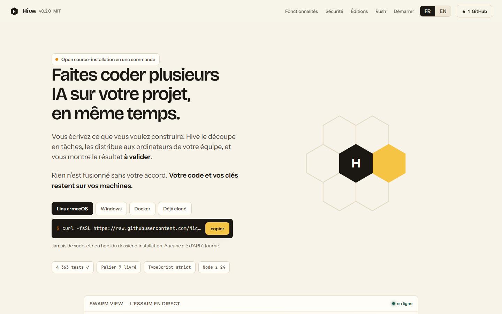
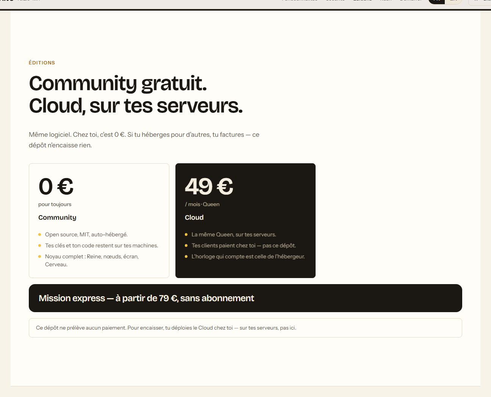
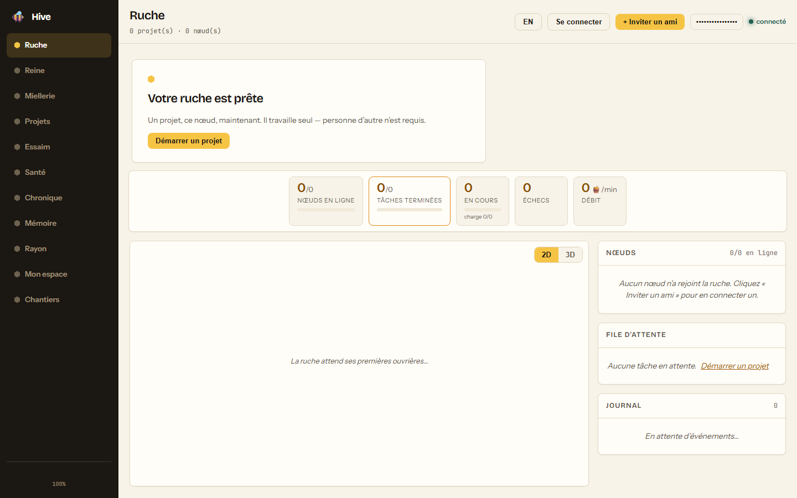
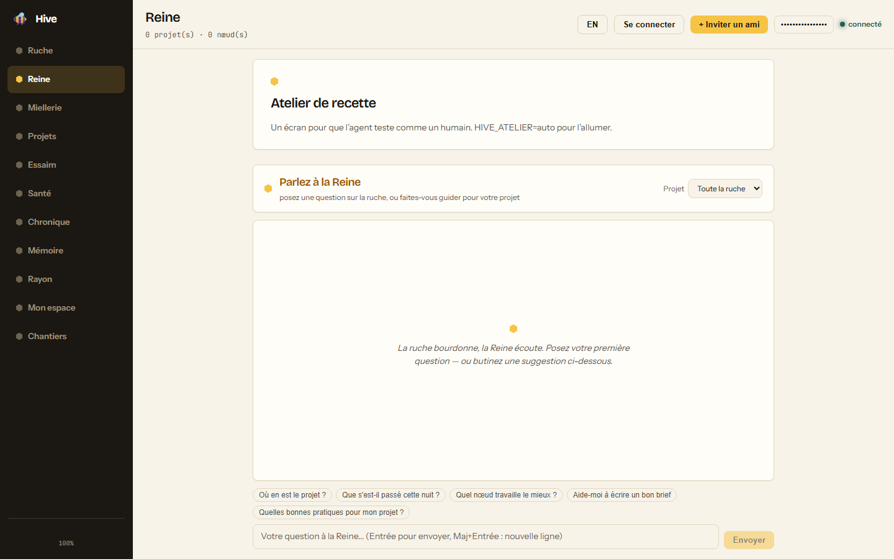
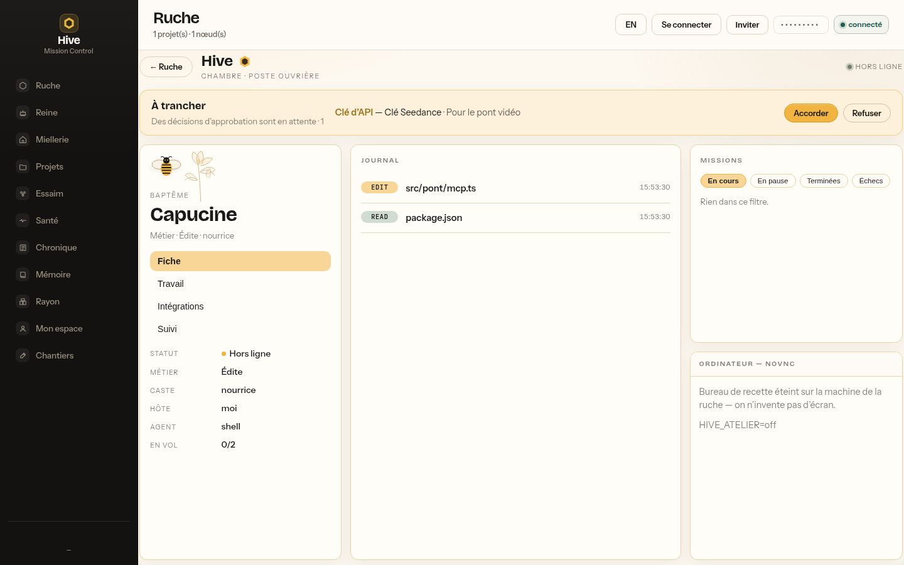
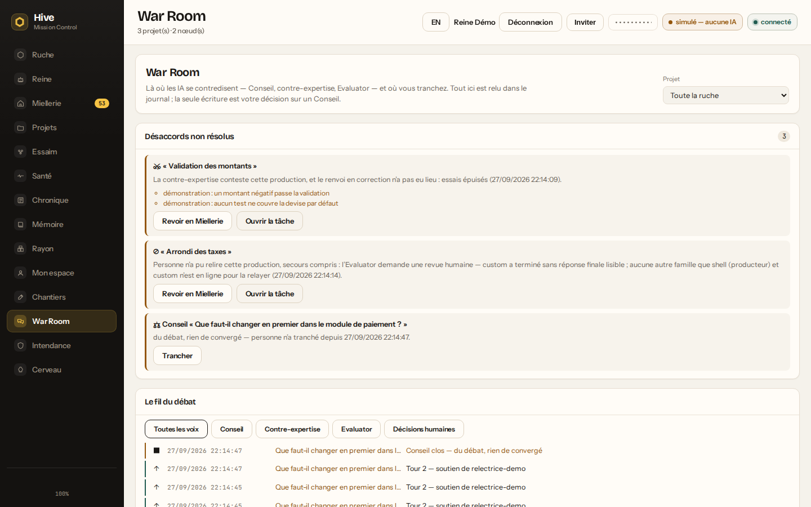

<div align="center">

<picture>
  <source media="(prefers-color-scheme: dark)" srcset="docs/images/banniere-sombre.png">
  
</picture>

# 🐝 Hive

[](https://github.com/Micka420-collab/hive/actions/workflows/ci.yml)


🇫🇷 Français · [🇬🇧 English](README.en.md) · [🌐 Site](https://micka420-collab.github.io/hive/) · [📚 Documentation](#-documentation)

</div>

---

**Orchestrer plusieurs agents IA pour livrer une mission de développement vérifiable.**

Hive est une plateforme locale-first composée d’un orchestrateur, de nœuds
Worker et d’une interface Mission Control. Vous décrivez une mission ; Hive la
décompose, distribue les tâches aux agents disponibles, conserve les résultats
et prépare une livraison Git que vous pouvez vérifier. Rien n’est fusionné sans
votre accord et les secrets restent sur vos machines.

> Le badge suit le total mesuré par la CI. Il ne remplace pas une preuve de
> validation de la mission : l’état réel se trouve dans GitHub et dans la
> [Roadmap & Audit Notion](https://app.notion.com/p/d8787e3f019a4e8786b585e47fc9f77c?v=3db94c8d5ab28173bcda000ca345fbfe).

## La boucle produit

```text
Mission → analyse → Task Graph → Workers et modèles → exécution
        → résultats → revue croisée → Evaluator → corrections
        → tests / typecheck / build → branche, PR et livraison Git
```

Le projet possède déjà une Queen Fastify/WebSocket, SQLite, un ordonnanceur,
la décomposition de tâches, le routage appris, des Workers, la délégation
bornée et Mission Control. Les briques sont intégrées progressivement ; chaque
carte Notion distingue le code présent de la preuve de bout en bout.

```
                          ┌──────────────────────────────┐
       WebSocket  ◄──────►│     Orchestrateur (Reine)    │◄──────►  WebSocket
                          │   Fastify · ws · SQLite      │
   ┌───────────────┐      │   ordonnanceur · journal     │      ┌───────────────┐
   │  Nœud membre  │      │   Le Cerveau (savoir)        │      │  Nœud membre  │
   │  ruche-alpha  │      └───────────────┬──────────────┘      │  ruche-beta   │
   │ agents+bac    │                      │ HTTP :7777          │ agents+bac    │
   └───────────────┘              ┌───────┴────────┐            └───────────────┘
                                  │ Mission Control│
                                  │  React · 2D/3D │
                                  └────────────────┘
```

## État réel du projet

Mis à jour le 27 septembre 2026. Tout ce qui suit est fusionné sur `main`,
avec une CI verte sur les trois OS ; les liens mènent aux PR les plus récentes.

**Prouvé :**

- **Installation et démarrage.** Installeur une-commande (Linux, macOS,
  Windows) essayé en CI jusqu'à une ruche qui répond, un invité qui rejoint par
  billet et une tâche exécutée. `npm run ruche` lance la Reine, les ouvrières et
  l'écran ; la Reine et chaque ouvrière tournent dans un seul processus, ce
  qui garantit un arrêt propre ([#443](https://github.com/Micka420-collab/hive/pull/443)).
  Dès que deux familles d'agent sont installées, c'est une ouvrière par
  famille : la contre-expertise croisée est sur le chemin par défaut
  ([#466](https://github.com/Micka420-collab/hive/pull/466)).
- **Reprise après panne**, rejouée à chaque CI (Linux, macOS) sur de vrais
  processus — une Reine, un nœud, une base sur disque
  (`tests/resilience-processus.test.ts`) :
  - `kill -9` de la Reine ou d'un nœud en pleine mission ;
  - base verrouillée 15 s par un autre processus ;
  - réseau gelé au-delà du délai de vie.

  Chaque tâche y finit `done`, avec exactement un succès rangé. Qu'aucun
  résultat ne soit compté deux fois repose sur deux gardes, éprouvées à part
  parce qu'aucune de ces pannes ne les atteint à coup sûr : un résultat se
  range en une seule transaction, tout ou rien
  (`tests/resultat-tout-ou-rien.test.ts`), et le résultat tardif d'une tâche
  réaffectée est écarté (`tests/scheduler.test.ts`). Un chemin réseau mort
  sans fermeture est éprouvé sur le vrai client et de vraies sockets
  (`tests/noeud-veille.test.ts`) : le nœud détecte la connexion morte par
  ping/pong au lieu d'attendre TCP
  ([#437](https://github.com/Micka420-collab/hive/pull/437)). Un nœud qui
  s'arrête (Ctrl+C, SIGTERM de `npm run ruche`, de systemd ou d'un `kill`,
  terminal fermé) emporte l'**arbre** de chaque agent, merge, chantier et
  validation en cours, sous-processus compris, au lieu de le laisser tourner
  orphelin ([#468](https://github.com/Micka420-collab/hive/pull/468)) : groupe
  de processus sous Linux et macOS, `taskkill /T` sous Windows, où
  `npm run ruche` arrête ses pièces par leur canal IPC puisqu'un SIGTERM y tue
  net. Éprouvé sur les trois systèmes avec de vrais processus, côté nœud
  (`tests/arbre-processus.test.ts`, `tests/noeud-arret-signal.test.ts`) ;
  l'envoi de l'ordre par `npm run ruche` sous Windows ne l'est pas encore.

- **Sécurité** :
  - les identifiants des dépôts privés ne sortent plus vers l'essaim
    ([#435](https://github.com/Micka420-collab/hive/pull/435)) ;
  - le premier compte (administrateur) exige le jeton de ruche
    ([#440](https://github.com/Micka420-collab/hive/pull/440)), sur toute
    ruche, proxy local compris ;
  - derrière un proxy, chaque client garde ses compteurs anti-abus
    (`HIVE_TRUST_PROXY`, [#439](https://github.com/Micka420-collab/hive/pull/439)) ;
  - le jeton de ruche n'engage plus le projet d'autrui ; livrer et fusionner
    avec la clé GitHub de l'hôte exigent de répondre du projet et du dépôt, et
    l'Evaluator arrête ce qu'il rejette, sur la voie humaine comme autonome
    ([#467](https://github.com/Micka420-collab/hive/pull/467)).
- **Bac à sable.** Preflight Docker, Podman et bubblewrap. L'image
  `docker/agents` embarque Claude Code, Codex et Cline, sondés dans le
  preflight durci de Hive (racine en lecture seule, `/tmp` noexec, uid non
  privilégié), installés depuis un fichier de verrouillage
  ([#447](https://github.com/Micka420-collab/hive/pull/447)). En Docker, les
  clés d'API accordées depuis la Chambre sont rangées dans le volume de
  données ([#446](https://github.com/Micka420-collab/hive/pull/446)).
- **Orchestration.** Graphe de délégation borné et persistant, Workers
  (identité, historique, ressources observées, limites d'autonomie), Evaluator
  et contre-revue exacte, visibles dans Mission Control.
- **Validations sans GitHub.** Après une production réussie, le nœud lance
  dans son bac les scripts `test`, `typecheck`, `build` et `lint` que le dépôt
  déclarait **avant** la production (rien, si la production a touché aux
  scripts), sur la base plus le diff — ce que git ignore est retiré d'abord.
  L'Evaluator les compte comme la CI GitHub, et Mission Control dit toujours
  laquelle a parlé : « bac Hive » ou « CI GitHub ». Un script que le projet ne
  déclare pas est « non applicable », jamais vert. **Il faut un bac** (podman,
  docker ou bubblewrap) : sans lui, le code de l'agent ne tourne pas sur l'hôte
  nu, et l'écran le dit. `accepted` demande en plus la relecture croisée.
- **Mission Control explique ce qu'il a fait**, depuis le journal, sans rien
  recalculer ni estimer :
  - pourquoi ce Worker et ce modèle : le classement de l'Aiguillage figé à
    l'instant du choix ([#449](https://github.com/Micka420-collab/hive/pull/449),
    [#450](https://github.com/Micka420-collab/hive/pull/450)) — y compris le
    drone vainqueur d'une course et son modèle, et le modèle qui a planté sur
    une tâche : écarté de ses reprises tant qu'un autre nœud de la ruche peut
    la porter (la reprise attend qu'il se libère), re-tenté et dit tel quel
    sinon, jamais compté comme une note ;
  - où est passé le temps : attente, démarrage, exécution, reprises,
    corrections, revue ([#451](https://github.com/Micka420-collab/hive/pull/451)) ;
  - la réputation d'un Worker par catégorie de tâche, « inconnue » là où il
    n'a jamais été jugé ([#452](https://github.com/Micka420-collab/hive/pull/452)) ;
  - le registre Genome : ce que chaque modèle a réellement fait, par
    catégorie — rendus, reprises, corrections de l'Evaluator, avis des
    relectrices, revue humaine, durée — sans note ni classement
    ([#454](https://github.com/Micka420-collab/hive/pull/454)) ;
  - le coût et le temps modèle **déclarés par le CLI de l'agent** (Claude
    Code), avec leur couverture — « inconnu » quand rien n'est déclaré
    ([#455](https://github.com/Micka420-collab/hive/pull/455),
    [#456](https://github.com/Micka420-collab/hive/pull/456)) ; Codex, lancé
    en `codex exec --json`, déclare ses **jetons** d'entrée et de sortie, et
    rien d'autre : ni coût, ni temps modèle, ni modèle exact — aucun coût
    n'est déduit des jetons ([#481](https://github.com/Micka420-collab/hive/pull/481)).

**Reste à prouver :**

- une mission **authentifiée** complète, avec un vrai agent dans un vrai bac
  Docker ou Podman (diff, tests, revue, correction, livraison Git) ;
- le coût et le temps modèle sur un **vrai** run : la lecture de la
  déclaration de Claude Code suit le format documenté et est éprouvée contre
  un faux binaire, pas encore contre le CLI réel ; celle des jetons de Codex
  est enregistrée sur le vrai codex-cli 0.156.0, mais contre un faux
  fournisseur local, pas sur un vrai run payé ;
- un nœud tué **net** (`kill -9`, ou sous Windows un `TerminateProcess` qui ne
  vient pas de `npm run ruche` — l'arrêt de la tâche planifiée de
  `hive service` compris) : ses agents sans bac lui survivent jusqu'à leur
  propre fin, ses conteneurs jusqu'à son redémarrage. Et le bac conteneur hors
  Linux, que la CI n'exerce pas : la matrice systèmes × bacs est dans
  [docs/INSTALLATION.md](docs/INSTALLATION.md) ;
- l'apprentissage : le routing apprend toujours des seules contre-visites ;
  y faire entrer les autres faits du registre Genome est une décision de
  pondération, pas encore prise ;
- une contre-expertise croisée sur un vrai run : une ouvrière par famille est
  éprouvée avec de vrais processus et de faux agents, pas encore avec Claude
  Code relu par Codex ;
- la démonstration V2 Alpha de bout en bout — elle tient désormais en une
  commande sur une ruche qui a de vrais agents authentifiés :
  `npm run preuve:v2-alpha -- --racine . --oui` confie une petite mission,
  attend qu'elle soit **réglée** (contre-revue rendue, aucun retry de
  l'Evaluator en attente), puis dit pour chaque critère ce que la Reine a
  réellement consigné (`✔` prouvé, `?` inconnu, `✘` échec). Le travail
  jugé est celui que la Reine garde (sa dernière production) ; l'évaluation
  n'est `✔` que pour `accepted` avec les quatre validations vertes.
  `--workers 3` exige l'**essaim** : trois ouvrières réelles de deux
  familles, des tâches indépendantes en parallèle, une délégation dont la
  sous-tâche est rendue par un agent réel (il faut une ouvrière Claude Code
  ou Codex : seuls leurs adaptateurs savent déléguer), une relecture par une
  autre famille. Où la sous-tâche a tourné est dit, pas exigé : la Reine ne
  l'épingle pas, et elle peut revenir à l'ouvrière même de sa tâche parente.
  La reprise après objection et l'Evaluator sont dits, sans être exigés.
  `--exige-bac` exige un bac conteneur de chaque nœud qui exécute la
  mission (sous-tâches déléguées et relectures comprises), `--depot <url>`
  (un dépôt GitHub en https, et `HIVE_GITHUB_TOKEN` côté Reine, vérifiés
  avant de dépenser) livre chaque production en pull request, sous-tâches
  déléguées comprises. Sans `--oui`, rien n'est créé : la mission consomme
  des crédits des agents.

L'adaptateur `shell` reste une **simulation** : sans agent réel installé, les
diffs produits sont factices, et l'installeur comme la Reine le disent.

## 🖥 L'interface

Captures de l'écran réel (`npm run ruche`), pas de maquettes.
Chaque vue de la barre, la Chambre et un tiroir de tâche, sur bureau et sur
mobile, se rephotographient en une commande sur une ruche de laboratoire :
`npm run captures` ([docs/CAPTURES.md](docs/CAPTURES.md)). Qui tranche quoi
quand les IA se contredisent : [docs/PROTOCOLE-DEBAT.md](docs/PROTOCOLE-DEBAT.md).

<p align="center">
  
</p>
<p align="center">
  
</p>
<p align="center">
  
</p>
<p align="center">
  
</p>
<p align="center">
  
</p>
<p align="center">
  
</p>
<p align="center">
  <a href="docs/media/chambre-presentation-demo.mp4">Vidéo — parcours Chambre (FR)</a>
  ·
  <a href="docs/media/README.md">médias</a>
</p>

## 🔁 Comment ça marche

1. **Vous décrivez le projet.** Hive propose une liste de tâches — vous la
   corrigez avant de lancer.
2. **Les IA travaillent en parallèle.** Chaque tâche part sur l'ordinateur d'un
   membre, dans un dossier isolé. L'avancement s'affiche en direct.
3. **Vous validez, puis ça fusionne.** Rien ne passe sans votre accord.
4. **Vous ouvrez le poste d'une ouvrière.** Ruche → fiche du nœud →
   **Ouvrir la Chambre** : nom baptisé, fichiers **constatés**, Atelier
   noVNC, réquisitions — sans inventer ce qui n'est pas là. Détail :
   **[docs/FONCTIONNALITES.md](docs/FONCTIONNALITES.md)** (section Chambre).

## ⚡ Installation

```bash
# Linux · macOS
curl -fsSL https://raw.githubusercontent.com/Micka420-collab/hive/main/install.sh | sh

# Variante prudente (empreinte avant d’agir) :
# curl -fsSLO https://micka420-collab.github.io/hive/install.sh
# sha256sum install.sh   # comparer à https://micka420-collab.github.io/hive/install.sha256
# less install.sh && sh install.sh

# Windows (PowerShell)
irm https://raw.githubusercontent.com/Micka420-collab/hive/main/install.ps1 -OutFile "$env:TEMP\hive-install.ps1"; powershell -NoProfile -ExecutionPolicy Bypass -File "$env:TEMP\hive-install.ps1"

# Variante prudente Windows (Pages sert aussi install.ps1 + le même manifeste) :
#   télécharger https://micka420-collab.github.io/hive/install.ps1
#   Get-FileHash hive-install.ps1 -Algorithm SHA256   # vs install.sha256 sur Pages
#   powershell -NoProfile -ExecutionPolicy Bypass -File .\hive-install.ps1
```

Le script vérifie Node (≥ 24), récupère Hive, installe les dépendances et pose
**au plus trois questions**. Jamais de `sudo`, rien hors de son dossier —
`--dry-run` montre tout sans rien créer. Lancé comme fichier, il affiche son
empreinte SHA-256 (ADR 0002). Pages publie `install.sh`, `install.ps1` et
`install.sha256` ; une **Release GitHub signée** reste hors d’atteinte (comptes
humains) — l’empreinte Pages protège du pipe aveugle, pas d’un dépôt compromis.

Déjà cloné : `npm run setup` puis `npm run ruche`. Conteneur et Cloud :
**[docs/CLOUD.md](docs/CLOUD.md)**. Bureau de recette :
**[docs/ATELIER.md](docs/ATELIER.md)**. Détail :
**[docs/INSTALLATION.md](docs/INSTALLATION.md)**.

## 🎚️ Éditions

Un seul logiciel, quatre paliers. **Le cœur n'est jamais bridé** pour vendre
le palier au-dessus. Ce dépôt n'encaisse rien : l'opérateur Cloud facture chez
lui.

| Palier         | Pour qui         | Prix          | Ce qu'il ouvre                                                              |
| -------------- | ---------------- | ------------- | --------------------------------------------------------------------------- |
| **Community**  | Chez vous        | **0 €**       | Le noyau complet : orchestration, nœuds, sièges illimités.                  |
| **Cloud**      | Hébergé par vous | dès **49 €**  | La même Queen sur vos serveurs, facturée à l'horloge de l'hébergeur.        |
| **Team**       | Une équipe       | **99 €/mois** | Rôles fins, quotas par membre, projets d'organisation — cloud ou self-host. |
| **Enterprise** | Au contrat       | **sur devis** | SSO/SAML, audit exportable, rétention, SLA. Aucun prix dans le code.        |

Grille et règles : **[docs/MODELE-ECONOMIQUE.md](docs/MODELE-ECONOMIQUE.md)**.

## 🚀 Démarrage rapide

Community (`HIVE_EDITION=community`, c'est le défaut) :

```bash
npm run ruche
```

Ouvrez **http://localhost:7777**. Un jeton, une ouvrière par agent installé,
l'écran. Une seule ouvrière : `npm run ruche -- --une-ouvriere`.

Les actions d'intendance qui créent ou révoquent des accès (inviter, émettre un
billet, consulter ou exclure un nœud) exigent une session de compte
administrateur. `HIVE_TOKEN` identifie la ruche et ses nœuds ; il ne suffit pas
à obtenir ces privilèges. Pour la CLI, passez le JWT admin dans `HIVE_JWT`.

Démo simulée (aucun agent réel, 7 tâches) : `npm install` puis `npm run demo`.

Rejoindre la ruche de quelqu'un d'autre, sans cloner :

```bash
npx github:Micka420-collab/hive join hive2_votre-billet
```

## 🧠 Le Cerveau

Une ruche qui dure des mois ne peut pas se contenter des logs : elle a besoin
des **règles** qu'ils ont produites. Le Cerveau range le savoir par genre
(invariant, leçon, décision, carte, épisode), refuse de tronquer un invariant,
et n'élague que les épisodes. Les notes vivent en markdown versionnable.
Détail : **[docs/FONCTIONNALITES.md](docs/FONCTIONNALITES.md)**. Le journal
tenu à la main : **[docs/ERREURS.md](docs/ERREURS.md)**.

## 🎚️ Autonomie

| Niveau     | Ce que la ruche fait                                       |
| ---------- | ---------------------------------------------------------- |
| `off`      | Rien d'automatique.                                        |
| `propose`  | Elle réfléchit et **propose** un plan. N'agit pas.         |
| `gouverne` | Elle agit, mais **toute intégration passe par un humain**. |
| `plein`    | Elle livre et fusionne — dépôt explicitement inscrit.      |

```bash
npm run cli -- mode                      # les quatre modes, et où en est chaque projet
npm run cli -- mode gouverne             # annonce ce que ça élargit, n'écrit rien
npm run cli -- mode gouverne <projet> --oui
```

Seule la montée se confirme. `HIVE_RUNNER=off|on` (défaut `off`) est le
commutateur de l'hôte qui paie le temps-machine.

## 🧩 Agents et modèles

Toute IA de codage se branche via l'interface `AgentAdapter` :

| Adaptateur     | Ce qu'il lance                                                                                                |
| -------------- | ------------------------------------------------------------------------------------------------------------- |
| `claude-code`  | `claude -p "<prompt>"` dans l'espace isolé.                                                                   |
| `cursor`       | `cursor-agent -p --force --output-format stream-json -- "<prompt>"` — binaire réglable par `HIVE_CURSOR_BIN`. |
| `cline`        | `cline --json --auto-approve true "<prompt>"` — binaire réglable par `HIVE_CLINE_BIN`.                        |
| `codex`        | `codex exec --json -- "<prompt>"` — jetons déclarés, coût inconnu (jamais tiré des jetons).                   |
| `grok`         | `grok -p "<prompt>"` — l’agent CLI de xAI, Apache 2.0.                                                        |
| `hermes-agent` | `hermes agent run --prompt "<prompt>"`                                                                        |
| `custom`       | Le vôtre, via `HIVE_AGENT_CMD`.                                                                               |
| `shell`        | **Simulé** — aucun processus lancé, les diffs sont faux.                                                      |

Le nœud **détecte ce qui est installé** et s'en sert. Il n'emploie `shell` que
s'il ne trouve aucun agent — et il le dit. `HIVE_AGENT` force le choix.
Votre abonnement Claude suffit, sans clé d'API :
**[docs/WINDOWS-CLAUDE.md](docs/WINDOWS-CLAUDE.md)**.

**Plusieurs agents installés, plusieurs ouvrières.** Dès que la machine porte
deux familles d'agent réelles (Claude Code, Codex, Cursor…), `npm run ruche`
lance une ouvrière par famille, chacune à une tâche à la fois : chaque
production est relue par les AUTRES familles, jusqu'à deux — Claude Code, Codex
et Cursor, c'est deux relectures par production —, et l'Aiguillage apprend de
ces verdicts. Au repos, une ouvrière ne dépense rien ; une relecture, elle, est
une vraie tâche, que la ligne de démarrage compte. Une relecture n'est confiée
qu'à sa famille : si celle-ci disparaît (ouvrière arrêtée, relance en
`--une-ouvriere`), elle échoue au bout de cinq minutes, et le journal dit
pourquoi. Une relecture qui tombe sans avis (famille absente, relecteur en
échec, réponse vide) est relayée UNE fois par une autre famille indépendante
du producteur si l'une est en ligne ; sinon l'Evaluator demande une revue
humaine en écrivant « relecture impossible : <cause> ». Le producteur n'est
jamais relancé pour la panne de son relecteur. La première ouvrière garde le nom, le dossier et les `HIVE_MODELES`
d'avant ; les autres prennent `<nom>-<famille>`. Pour n'en lancer qu'une :
`npm run ruche -- --une-ouvriere`, ou `HIVE_AGENT` dans `.env`. Un agent
installé mais non connecté — sa propre commande de statut le dit
(`claude auth status`, `cursor-agent status`, `codex login status`) et aucune
clé n'est posée — n'a pas d'ouvrière : la ruche et `hive doctor` le disent,
avec la commande qui le connecte. Une ouvrière qui tombe ou refuse de démarrer
n'arrête plus la ruche : le lanceur cite sa dernière phrase (la raison et le
remède), et ne s'arrête, en code non nul, que si la Reine meurt ou qu'il ne
reste aucune ouvrière. `^C` arrête toujours tout.

Pour un agent conteneurisé, le nom logique doit être exécutable dans l’image
choisie. Un CLI installé sur l’hôte ou une session ouverte dans l’hôte ne prouve
pas que l’agent est disponible dans le conteneur. Hive refuse ce niveau lorsque
le preflight échoue.

## 🔒 Sécurité

- **Zéro `shell: true`** — toute exécution passe par `spawn(bin, argv, { shell: false })`.
- **Jeton comparé à temps constant** ; jeton trivial refusé hors simulation.
- **CORS restreint**, jamais `*` ; origine des WebSockets vérifiée.
- **Toute entrée validée** — JSON Schema au REST, champ par champ en WS, corps bornés.
- **Bac à sable par tâche** — cwd dédié, environnement épuré, délai dur, sortie plafonnée.
- **Jamais de fusion sans revue humaine.**

Avec **podman**, **docker** ou **bubblewrap**, l'agent ne voit que le répertoire
de sa tâche lorsque le fournisseur et l’image ont passé le preflight. **Le
réseau reste ouvert** : un agent de codage doit joindre l'API de son modèle.
Sans moteur de conteneurs, posez `HIVE_ISOLEMENT=exige` — le nœud refusera de
travailler à découvert. Ce que la CI prouve, système par système et bac par bac
(Linux, macOS, Windows × sans bac, bubblewrap, Podman, Docker) :
[docs/INSTALLATION.md](docs/INSTALLATION.md), « Systèmes et bacs à sable ».

L'image par défaut, `localhost/hive-agent:local` (Claude Code, Codex, Cline), se
construit sur chaque nœud par `npm run bac:image` ; Hive ne la télécharge
jamais. Le nœud retient le premier moteur dont le preflight passe (image
présente, agent exécutable) et dit pourquoi les autres sont écartés. Chaque
conteneur porte l'étiquette de son nœud : relancé après un arrêt brutal, le
nœud supprime ceux qu'il avait laissés.

Dans le bac, l'agent a un HOME éphémère : la session de `claude login` ou de
`codex login` n'y entre pas. Hive y transmet **par leur nom** les identifiants
sans navigateur — `CLAUDE_CODE_OAUTH_TOKEN` (`claude setup-token`) ou
`ANTHROPIC_API_KEY` pour Claude Code, `CODEX_API_KEY` pour Codex (qui ignore
`OPENAI_API_KEY`) — et aucune sonde ne les reçoit. Avec une session mais sans ces
variables, `auto` revient à la sandbox de processus et `exige` refuse, en nommant
la variable à poser. Bubblewrap monte en lecture seule l'installation de l'agent
et de Node, jamais le HOME.

Claude Code n'exécute rien de ce que le dépôt d'une tâche apporte : Hive le
lance avec `--setting-sources user`, `--settings '{"disableAllHooks":true}'` et
`--strict-mcp-config`. Les hooks, les serveurs `.mcp.json` et le bloc `env` du
projet ne s'appliquent donc plus — sans cela, `claude -p` les exécutait sans
demander, et un `ANTHROPIC_BASE_URL` du dépôt recevait la clé du membre. Le
`CLAUDE.md` et les `.claude/rules` du dépôt sont relus par Hive comme simples
données, bornées, ajoutées au prompt système ; le journal de la tâche le dit.
Choix assumé : hors du bac, les hooks et serveurs MCP **du membre** lui-même
sont coupés aussi pour les tâches de la ruche.

## 🛠️ Commandes

| Commande                                      | Effet                                                                                                                                                                         |
| --------------------------------------------- | ----------------------------------------------------------------------------------------------------------------------------------------------------------------------------- |
| `npm run ruche`                               | **Tout en une commande** — Reine + une ouvrière par agent installé + écran                                                                                                    |
| `npm run ruche -- --une-ouvriere`             | Une seule ouvrière, même si plusieurs agents sont installés                                                                                                                   |
| `npm run demo`                                | Démo complète (orchestrateur + 2 nœuds + projet)                                                                                                                              |
| `npm run dev`                                 | Orchestrateur seul                                                                                                                                                            |
| `npm run node`                                | Un nœud membre                                                                                                                                                                |
| `npm run cli -- doctor`                       | **Le docteur** — 13 causes de panne, et la commande qui répare                                                                                                                |
| `npm run preuve:v2-alpha -- --racine . --oui` | **La preuve V2 Alpha** — une vraie mission confiée à un vrai agent, jugée critère par critère une fois réglée ; `--workers 3` pour l'essaim, `--exige-bac` pour exiger le bac |
| `npm run cli -- livrer-local <projet>`        | **Livrer sans GitHub** — la mission commitée sur `hive/mission-<projet>-<n>` (`--pousser`)                                                                                    |
| `npm run captures`                            | **Les captures** — chaque vue de la barre, la Chambre et un tiroir, bureau et mobile, sur une ruche de laboratoire                                                            |
| `npm run cli -- sauvegarde`                   | Sauvegarde SQLite par `VACUUM INTO`                                                                                                                                           |
| `npm run cli -- service`                      | Installer la ruche en service (systemd · launchd · tâche planifiée)                                                                                                           |
| `npm test`                                    | La suite complète (vitest) — le compte vit dans le badge, en un seul endroit                                                                                                  |
| `npm run fusionner`                           | Porte la branche sur `main` en **avance rapide** — sans commit de fusion                                                                                                      |
| `npm run lint`                                | ESLint + Prettier — zéro erreur exigé                                                                                                                                         |
| `npm run loupe`                               | **La loupe** — le code neuf est-il défendu par ses tests ?                                                                                                                    |

## 📚 Documentation

| Fichier                                                      | Ce qu'on y trouve                                        |
| ------------------------------------------------------------ | -------------------------------------------------------- |
| **[docs/INSTALLATION.md](docs/INSTALLATION.md)**             | Installer, désinstaller, service, conteneur, sauvegardes |
| **[docs/CLOUD.md](docs/CLOUD.md)**                           | Community 0 € vs Cloud payant sur tes serveurs           |
| **[docs/ATELIER.md](docs/ATELIER.md)**                       | Bureau de recette : écran, CDP, outils                   |
| **[docs/CAPTURES.md](docs/CAPTURES.md)**                     | Les captures de Mission Control, et comment les refaire  |
| **[docs/WINDOWS-CLAUDE.md](docs/WINDOWS-CLAUDE.md)**         | Tourner seul sous Windows avec son abonnement Claude     |
| **[docs/PROTECTION-BRANCHE.md](docs/PROTECTION-BRANCHE.md)** | Protéger `main` : les réglages exacts, et pourquoi       |
| **[docs/FONCTIONNALITES.md](docs/FONCTIONNALITES.md)**       | Chaque partie en détail, avec ses arbitrages             |
| **[docs/FEATURES.en.md](docs/FEATURES.en.md)**               | The same, in English                                     |
| **[docs/ERREURS.md](docs/ERREURS.md)**                       | Le journal des erreurs — par leçon, avec les règles      |
| **[docs/ETAPES.md](docs/ETAPES.md)**                         | L'état réel du projet face à ses propres promesses       |
| **[docs/MODELE-ECONOMIQUE.md](docs/MODELE-ECONOMIQUE.md)**   | Quotas, abonnements, ce qui est facturé                  |
| **[CHANGELOG.md](CHANGELOG.md)**                             | Ce qui a changé, version par version                     |
| **[docs/RELEASING.md](docs/RELEASING.md)**                   | Versions, étiquettes, mettre à jour sans rien perdre     |

## 🤝 Contribuer

**Tout ce qui s'accumule ship sa borne d'élagage dans le même commit.** Aucune
donnée non fiable n'entre dans un prompt hors d'un bloc de données. La
plateforme est un paramètre, jamais `process.platform` lu en ligne.

**[Proposer un projet à la ruche](https://github.com/Micka420-collab/hive/issues/new?template=proposer-un-projet.yml)** ·
[voir les projets proposés](https://github.com/Micka420-collab/hive/issues?q=is%3Aissue+label%3A%22projet+propos%C3%A9%22)

---

<div align="center"><sub>MIT · Fait avec 🍯 — chaque ouvrière compte.</sub></div>
