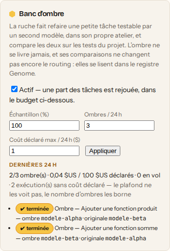
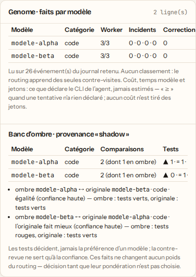

# Le banc d'ombre — comparer deux modèles sur la même petite tâche

L'Aiguillage apprend quel modèle sert le mieux chaque genre de tâche, mais il
n'apprend que de ce qu'il a **choisi** : deux modèles ne se mesurent jamais sur
la **même** tâche. Le banc d'ombre fait cette expérience contrôlée. Une petite
tâche testable, tirée au sort, est rejouée telle quelle par un **second
modèle**, dans son propre atelier. Cette « ombre » **ne se livre jamais**. Les
deux productions passent par le chemin qui juge toute production : validations
du bac, Gardiennes, contre-revue et Evaluator. Les **tests du projet**
départagent les deux, jamais la préférence d'un modèle.

Le banc est **éteint par défaut** et s'allume **par projet** : chaque ombre est
un vrai appel de modèle, payé par l'hôte.

## Allumer le banc

Dans ⬡ Projets, panneau **Banc d'ombre** (sous l'Agent Garde-Fous) : cochez
« Actif », réglez l'échantillon et le budget, puis **Appliquer**. Le panneau
montre ce que le banc a dépensé sur les 24 dernières heures, et ce qui
l'arrête s'il est arrêté.

<p align="center">
  
</p>

Par l'API, avec le jeton de ruche (projet orphelin) ou le compte du
propriétaire ou d'un administrateur :

```bash
curl -X POST http://localhost:7777/api/projects/<projet>/banc-ombre \
  -H "x-hive-token: $HIVE_TOKEN" -H 'content-type: application/json' \
  -d '{"actif": true, "tauxPourMille": 50, "executionsParJour": 3, "plafondCoutUsd": 1}'
curl http://localhost:7777/api/projects/<projet>/banc-ombre -H "x-hive-token: $HIVE_TOKEN"
```

| Champ               | Sens                                                             | Bornes            |
| ------------------- | ---------------------------------------------------------------- | ----------------- |
| `actif`             | Le banc tourne-t-il pour ce projet ?                             | —                 |
| `tauxPourMille`     | Part des tâches tirées au sort, en ‰. Défaut **50** (5 %).       | 1 à 1000          |
| `executionsParJour` | Ombres lancées au plus par **24 h glissantes**. Exigé.           | 1 à 50            |
| `plafondCoutUsd`    | Coût **déclaré** au plus par 24 h glissantes, en dollars. Exigé. | plus de 0 à 1 000 |

Régler le banc est un geste de **qui répond du projet** : un membre reçoit
403, comme pour l'autonomie, le Garde-Fous ou le plafond de la Balance. Chaque
réglage est journalisé (`shadow_bench_set`).

## Quelles tâches sont rejouées

Le tirage est un hachage de l'identifiant de la tâche : la même tâche est
toujours dans l'échantillon, ou toujours hors de lui. Une tâche hors
échantillon, ou d'un projet dont le banc est éteint, ne produit **aucun**
événement. C'est l'immense majorité des tâches.

Le banc décide sur la **première production** de la tâche : il compare un
premier essai à un premier essai. Une tâche tirée au sort puis écartée le dit
(`shadow_bench_skipped`, avec son motif), dans cet ordre :

| Motif                 | La tâche est écartée quand…                                                                                               |
| --------------------- | ------------------------------------------------------------------------------------------------------------------------- |
| `non_testable`        | sa production n'a pas de verdict de tests du bac (pas de bac, aucun script `test`, délai…) : rien ne départagerait        |
| `trop_grande`         | prompt de plus de 4 000 caractères, diff de plus de 200 lignes ou de 5 fichiers, ou plus de 15 min d'exécution            |
| `action_externe`      | le titre ou le prompt demande un geste externe ou irréversible : déployer, publier, pousser, fusionner, écrire à un tiers |
| `delegation`          | c'est une tâche déléguée, ou elle a délégué                                                                               |
| `modele_inconnu`      | aucun modèle n'a été commandé à la production : on ne saurait pas qui comparer                                            |
| `ombre_en_vol`        | une autre ombre du projet est encore en vol                                                                               |
| `budget_executions`   | `executionsParJour` est atteint                                                                                           |
| `budget_cout`         | le coût déclaré des 24 dernières heures atteint `plafondCoutUsd`                                                          |
| `aucun_second_modele` | aucune ouvrière en ligne n'offre un **autre** modèle                                                                      |

Le filtre des gestes externes est volontairement large : un faux positif
retire une tâche de l'échantillon, un faux négatif ferait refaire un geste
qu'on ne défait pas.

Le **second modèle** est le mieux classé par l'Aiguillage parmi ceux qu'une
ouvrière en ligne offre, sauf celui qui a produit l'originale. Un modèle
jamais jugé sur ce genre passe donc en premier. Le classement est **lu**, pas
écrit : le banc ne pose aucune élection.

## Le budget

- **Une ombre en vol à la fois** par projet. Le coût d'une exécution n'est
  connu qu'après elle, et trois ombres lancées d'un coup franchiraient le
  plafond de deux exécutions sans rien pouvoir arrêter.
- Le coût compté est celui que **déclarent les CLI** des agents, pour l'ombre
  **et ses relectures**. Une exécution qui ne déclare rien (Codex ne déclare que
  ses jetons) est comptée **muette** et affichée comme telle, jamais estimée.
  Le plafond de coût ne la voit pas, et c'est `executionsParJour` qui la
  borne.
- Le budget se lit dans l'état courant (`GET …/banc-ombre`, champ
  `budget.arret`), pas seulement dans un événement que l'élagage emportera.

## Ce que fait une ombre, et ce qu'elle ne fait jamais

L'ombre est une tâche du même projet, avec le **même prompt**. Son titre
commence par « Ombre — » : c'est ainsi qu'elle se reconnaît dans les listes de
tâches. Elle est annoncée par `shadow_bench_started`.

- Elle part **chez une ouvrière qui déclare son modèle**, avec ce modèle, et
  nulle part ailleurs. Si aucune ne l'offre, `shadow_bench_waiting` le dit une
  fois, puis l'ombre échoue au bout de 5 minutes (`modele_ombre_absent`).
  Elle n'est jamais relancée sur un autre modèle.
- Elle n'a **qu'un essai**. Un échec la clôt. Une contre-revue qui la conteste
  ne la relance pas : `evaluator_retry_skipped` le journalise, motif
  `shadow_task`.
- Elle **ne se livre jamais**. La route de livraison la refuse
  (`409 tache_ombre`), et la réservation de livraison la refuse aussi, pour
  toutes les voies, autonome comprise. Elle n'entre ni dans le merge, ni dans
  la livraison de mission, ni dans le rapport d'avancement, ni dans les
  décisions du Plein Essaim.
- Elle **ne se court pas** et **ne délègue pas**.
- Elle ne retient pas les productions du projet derrière elle : le Sting
  Detector ne la compte pas.
- Elle ne reçoit pas le **souvenir de son originale** en contexte. Sinon, on
  lui soufflerait la réponse de l'autre modèle.
- Elle ne laisse **aucun souvenir**, et son échec n'entre pas au Cerveau.

## La comparaison

Chaque côté donne une **issue** : `echec` (production en échec),
`tests_rouges`, `tests_verts`, ou `sans_preuve` (aucun verdict de tests). Le
**verdict** est rendu par les tests seuls : `ombre_meilleure`,
`originale_meilleure`, `egalite` ou `indecis`. Deux productions vertes font une
égalité, même si une relectrice en préfère une.

La contre-revue sert à la **confiance**. Des tests verts sur un diff qui ne
fait rien restent verts. C'est l'avis indépendant qui dit que chaque
production a vraiment fait la tâche.

| Confiance | Quand                                                                                                                 |
| --------- | --------------------------------------------------------------------------------------------------------------------- |
| `faible`  | un côté n'a pas de verdict de tests (`indecis`), ou a échoué avant tout test                                          |
| `haute`   | les deux côtés ont un verdict de tests sur le **même commit de base** connu, et chacun a reçu l'avis d'une relectrice |
| `moyenne` | le reste : bases différentes ou inconnues, ou une relecture qui manque encore                                         |

## Où le lire

Dans l'Essaim, le **registre Genome** a une section **Banc d'ombre**, de
provenance `shadow`. Elle est tenue **à part** des lignes de production :
l'ombre rejoue une tâche déjà comptée. On y trouve :

- par modèle et catégorie, les comparaisons tranchées de **son point de vue**
  (mieux, égal, moins bien, indécis) et leur confiance, sans note ni classement ;
- les dernières ombres : en vol, abandonnées ou comparées, avec l'issue de
  chaque côté.

<p align="center">
  
</p>

Captures prises sur une vraie Reine : deux nœuds WebSocket déclarent leurs
modèles (agents factices) et rendent de vrais résultats, avec leurs
validations et leurs avis.

`GET /api/genome` rend la même chose sous `ombre`. Le Journal dit chaque
réglage, chaque ombre lancée, et chaque tâche tirée au sort puis écartée.

## Décision : le banc ne change pas encore le routing

Les comparaisons **n'entrent dans aucun poids** : ni la récompense de
l'Aiguillage, ni ses élections en vol, ni les phéromones, ni l'apprentissage
des Garde-Fous. Le modèle d'une ombre n'est jamais rangé comme une élection de
l'Aiguillage. Les requêtes qui nourrissent les phéromones, les leçons d'échec
et le Garde-Fous excluent les ombres, et des tests tiennent chacune de ces
exclusions.

Pour faire entrer ces faits dans le routing, il faut choisir leur poids face
aux verdicts de contre-visite. Personne ne l'a encore choisi. D'ici là, le banc
**mesure** et le registre **montre**.

## Limites connues

- L'ombre part **après** la première production de l'originale. Le dépôt a pu
  bouger entre-temps. Le commit de base de chaque côté est comparé, et une base
  différente ne donne jamais la confiance haute.
- Le filtre des gestes externes lit le texte de la tâche. Il ne voit pas ce
  qu'un agent déciderait de lui-même. L'ombre tourne dans le bac de son nœud,
  comme toute production.
- Seule la première production d'une tâche est candidate. Une tâche dont le
  premier essai n'a rien testé n'est pas rejouée plus tard.
