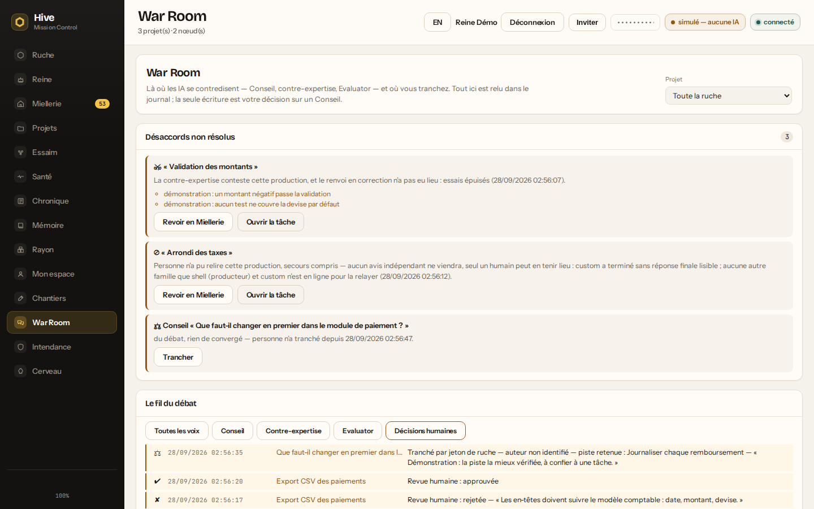
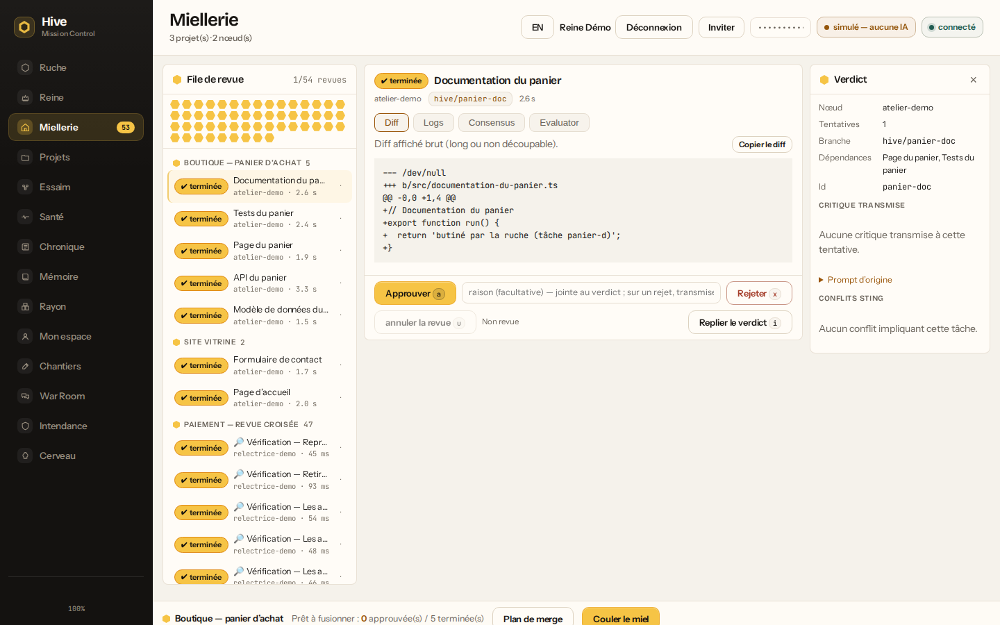
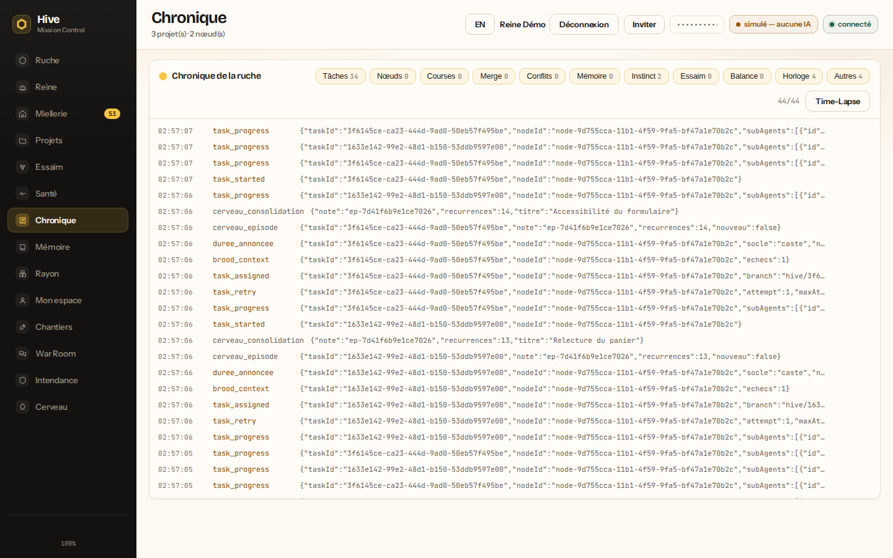

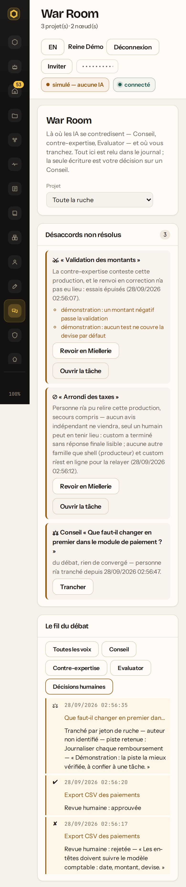
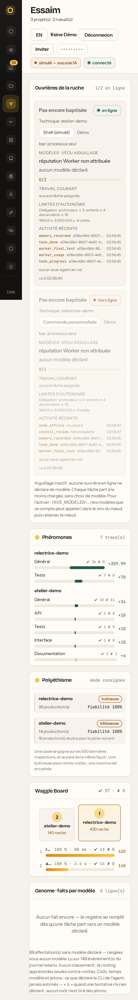
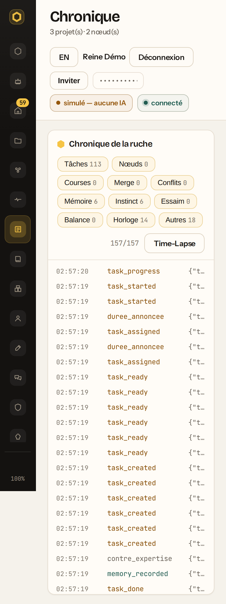

# Les captures de Mission Control

Chaque vue de la barre de navigation, la Chambre d'une ouvrière et le tiroir
d'une tâche, sur bureau et sur mobile, photographiés sur une **vraie** ruche —
une Reine et une ouvrière lancées pour l'occasion, remplies par l'API — et
refaits en une commande sur l'arbre courant.

Une capture qu'on ne sait pas refaire ne prouve que le jour où elle a été
prise. Celles-ci se refont, et disent d'où elles viennent.

## Lancer

```
npx playwright install --only-shell chromium     # une fois par machine, ≈ 110 Mo
npm run captures                                 # → captures-ecran/fr/
npm run captures -- --langue en                  # → captures-ecran/en/
npm run captures -- --theme sombre               # → captures-ecran/fr-sombre/
npm run captures -- --vues ruche,tache.mobile    # seulement celles-là
```

`--vues` retient une vue (`ruche` : tous les formats) ou une image
(`ruche.mobile`). Une vue demandée que la ruche ne montre jamais — une faute de
frappe, une vue renommée — est un échec, pas une exécution vide.

`npm ci` n'installe que la bibliothèque Playwright (dépendance de
développement), **jamais le navigateur** : ni `npm test` ni la CI n'en ont
besoin. Sous Linux, s'il manque des bibliothèques système :
`npx playwright install-deps chromium`.

`captures-ecran/` est ignoré par git. La sortie doit rester **dans le dépôt** ;
avant d'écrire, le script efface ses propres captures de l'exécution
précédente — et seulement elles (`<vue>.<format>.png`, `captures.json`). Le
dossier dit donc toujours UNE exécution : celle que décrit son manifeste.

Codes de sortie : `0` tout est photographié · `1` au moins une capture a
échoué (elles sont listées) · `2` Playwright ou son navigateur manque · `64`
ligne de commande fautive · `128 + n` interrompu par un signal (^C : `130`),
ruche arrêtée et dossier jetable effacé.

Une capture **échoue** aussi quand la vue lève une exception dans la page,
tombe (l'écran « Cette vue n'a pas pu s'afficher ») ou emporte la barre avec
elle : l'image est gardée, elle montre la panne, et le code est `1`. Les
erreurs de console ordinaires (une ressource en 409 que la vue explique) restent
des avertissements.

## La ruche de laboratoire

- **Rien de la machine.** Dossier jetable, port choisi par le système et appris
  de la Reine, environnement reconstruit sur liste blanche (`PATH`, dossier
  personnel, dossier temporaire) : ni le `.env` de l'opérateur, ni ses clés,
  ni ses `HIVE_*` n'entrent. Jeton et secret de session tirés au sort — les
  gardes de démarrage de la Reine s'appliquent.
- **Rien n'est laissé à la machine.** L'écran est construit depuis l'arbre
  courant **dans le dossier jetable** — `dashboard/dist` n'est pas touché :
  une ruche qui tourne depuis ce dépôt garde l'écran qu'elle sert, et ses
  onglets ouverts leurs morceaux. Le navigateur des captures reçoit cet écran
  du script, et la Reine de laboratoire répond au reste (API, WebSocket). ^C,
  `kill` ou le terminal qu'on ferme, à n'importe quel moment — démarrage
  compris : la ruche est arrêtée, le dossier effacé.
- **Aucun agent réel.** L'adaptateur `shell` simulé : aucun crédit consommé,
  des diffs factices, et l'écran le dit (« simulé — aucune IA »).
  `HIVE_ISOLEMENT=off` : le bac déclaré est « processus », quelle que soit la
  machine.
- **Des noms de démonstration** : ouvrière `atelier-demo`, propriétaire
  « Démo », compte « Reine Démo » (`reine@exemple.invalid`), premier compte
  donc administrateur — sans lui, Intendance et Cerveau manqueraient.
- **Remplie par l'API**, comme le ferait le tableau : deux projets, sept
  tâches, une dépendance en chaîne, et une tâche qui échoue puis reprend.
- **Un débat joué pour la War Room** (`amorcerDebat`). Le `shell` simulé ne
  relit jamais personne : sans seconde famille, chaque production finirait en
  « aucun second modèle en ligne ». Une seconde ouvrière, `relectrice-demo`,
  est branchée comme on branche n'importe quelle IA en CLI — l'adaptateur
  « commande libre » (`HIVE_AGENT=custom`) pointé sur
  `scripts/captures-relectrice.mjs`, qui répond selon le **titre exact** de
  la production relue. Tout le reste est la vraie ruche : un troisième projet,
  « Paiement — revue croisée », où « Validation des montants » est contestée
  jusqu'à épuiser ses essais, « Arrondi des taxes » n'obtient aucun avis
  (relecture impossible, #484), « Export CSV des paiements » est rejetée par
  un humain avec sa raison puis approuvée, et deux Conseils se tiennent — le
  premier tranché, le second laissé tel qu'il se clôt. Les issues des Conseils
  ne sont pas décidées : elles sont **constatées** et rangées dans le
  manifeste (`debat`). La relectrice est arrêtée ensuite — laissée en ligne,
  elle prendrait des productions du vol — et les vues la montrent hors ligne,
  ce qui est vrai. Son chemin ne doit pas contenir d'espace (`HIVE_AGENT_CMD`
  est découpé sur les espaces) : le script le refuse en le disant.

## Ce qui est photographié

| Format   | Fenêtre           | Capture      |
| -------- | ----------------- | ------------ |
| `bureau` | 1440 × 900        | l'écran      |
| `mobile` | 390 × 844, dens.2 | page entière |

- **chaque case de la barre de navigation**, cliquée : la barre fait foi (la
  case dit sa vue, `data-vue`), une vue ajoutée demain est photographiée sans
  toucher au script. Au format `mobile`, la barre est un tiroir : le script
  l'ouvre par le ☰ avant chaque clic, puis photographie le tiroir ouvert
  (`navigation.mobile.png`) ;
- la **Chambre** de l'ouvrière et le **tiroir** de la tâche reprise ;
- la **War Room filtrée sur les décisions humaines** (`warroom-decisions`) :
  le fil entier, nourri par chaque tour de Conseil, noierait ce que l'humain
  a tranché ;
- **en vol** : un lot est confié, la Ruche, la Chambre et la Chronique sont
  photographiées pendant que les sous-agents travaillent. La Chronique ne lit
  que le journal reçu depuis l'ouverture de l'onglet : au repos, elle est vide ;
- `captures.json` : pour chaque image, le **débordement horizontal** mesuré,
  la hauteur de page et les **erreurs de console** survenues pendant la vue —
  plus le commit photographié et l'état de l'arbre.

Animations figées (`prefers-reduced-motion`). Thème clair par défaut ;
`--theme sombre` photographie le thème sombre dans `captures-ecran/<langue>-sombre/`
— par la **préférence du système** (`colorScheme: 'dark'`), sans choix mémorisé :
c'est le chemin que voit un opérateur qui n'a jamais touché au menu du thème. Le
script ne juge pas l'image : il mesure ce qu'un œil rate, et le reste se regarde.

### Ce qui n'est pas photographié

La page de **Partage** (un lien porteur, rendue à la place de l'App), l'écran de
**connexion** et le **premier lancement** (`onboarding.css`), les **modales**
(Inviter, Nouveau projet). Elles demandent un autre état de la ruche — un lien
de partage, une ruche sans compte — que le script ne monte pas encore.

## La série publiée

Dans `docs/images/captures/`, avec son manifeste (`captures.json` : le commit
photographié, l'arbre propre ou non, les issues des Conseils du débat, et les
mesures de chaque image). Chaque image a été ouverte et regardée avant d'être
versée. Elle se refait, à l'identique de sa sélection, par :

```
npm run captures -- --sortie docs/images/captures --vues warroom,warroom-decisions,miellerie,ruche,essaim,ruche-en-vol.bureau,chambre-en-vol.bureau,chronique-en-vol,tache.bureau
```

<p align="center">
  
</p>
<p align="center">
  
</p>
<p align="center">
  
</p>
<p align="center">
  
</p>
<p align="center">
  
</p>
<p align="center">
  
</p>
<p align="center">
  
</p>
<p align="center">
  
</p>
<p align="center">
  
</p>
<p align="center">
  
  
  
  
  
  
</p>

## Ce que la première exécution a trouvé

- **La Chambre rendait tout le tableau blanc** — corrigé avec ce script.
  `Chambre.tsx` importait une fonction pure depuis un module de la Reine qui
  tire `node:crypto` ; dans le navigateur, ce module est vide, le morceau de
  la vue levait au chargement, et React démontait tout. La règle vit
  désormais dans `src/shared/nom-env.ts`, et
  `tests/paquet-navigateur.test.ts` refuse qu'un module de Node reparte au
  navigateur. **La famille est fermée aussi** : le tableau n'avait aucune
  frontière d'erreur, et n'importe quelle vue qui tombe — un morceau en 404
  après une reconstruction sous un onglet ouvert, une exception au rendu —
  rendait le même écran blanc. `FiletDeSecurite` (ui.tsx, posé sous chaque
  vue par App.tsx) remplace désormais la seule vue tombée par un message qui
  dit pourquoi ; la barre reste (`tests/app-filet.test.tsx`,
  `tests/app-vue-en-panne.test.tsx`).
- **Miellerie, mobile** : les onglets du panneau de revue (Diff · Logs ·
  Consensus · Evaluator) débordent de 11 px.
- **Ruche, le rayon 2D** : la barre « N/M tâches butinées » recouvre la
  dernière rangée d'alvéoles — un défaut de la mise en page du rayon, **pas
  seulement du mobile** : sur bureau, dès qu'une cinquième rangée existe
  (`ruche-en-vol.bureau.png` : pendant un vol, la barre « 7/13 » couvre T13).
  Sur mobile, le rayon est de plus réduit au point que les alvéoles ne se
  lisent plus, et sa dernière rangée vient buter contre la barre dès le repos
  (`ruche.mobile.png`).
- **Cerveau** : les chiffres des quatre tuiles d'en-tête étaient sombres sur
  fond sombre — `.cerveau-tuile` héritait (`color: inherit`) le texte de la
  page claire. Corrigé avec le thème sombre : la tuile prend la couleur de la
  carte nocturne.
- **Rayon et Chantiers** : la console relève des réponses 409 et 501 pour un
  projet sans dépôt et un GitHub non connecté. Ce sont des états attendus, que
  la vue explique elle-même ; le navigateur les compte comme des ressources en
  échec.

## Ce que le débat de la War Room a trouvé

- **Une objection suffit à contester.** La relectrice répondait d'abord
  « valide » suivi d'une ligne « - rien à objecter » : chaque production
  validée repartait en correction. C'est la règle (`agreger` compte comme
  contestation tout avis qui porte une objection) ; elle est désormais écrite
  dans [PROTOCOLE-DEBAT.md](PROTOCOLE-DEBAT.md), et la relectrice valide sans
  ligne d'objection.
- **Les souvenirs précèdent la consigne.** Le nœud fait précéder le prompt du
  contexte de la ruche, souvenirs Hive Mind compris — des consignes de
  relecture passées y figurent en toutes lettres. Lue au premier marqueur, la
  relecture d'« Export CSV » répondait à celle d'« Arrondi des taxes ». Un vrai
  agent lit la dernière consigne ; la relectrice aussi, désormais.
- **La borne d'essais n'a pas le même point de départ** selon la voie : une
  production contestée à chaque fois s'exécute quatre fois avant
  `attempts_exhausted`, quand un échec Worker fait échouer la tâche à sa
  troisième exécution. Consigné au protocole, laissé à une décision.
- **La Chronique d'un onglet neuf est vide** sur une ruche qui a déjà
  travaillé : « Rien pour l'instant » au-dessus de plus de cinquante tâches
  terminées. Le rattrapage du journal (`/api/events`) ne sert qu'aux
  reconnexions. D'où la capture « en vol », sur les deux formats — et
  pourquoi le débat n'y figure pas : il est joué avant que l'onglet s'ouvre, et
  c'est la War Room qui le relit (`warroom*.png`). Le panneau « Journal » de la
  Ruche en dit autant (`ruche.mobile.png` : « Journal 0 — Rien pour
  l'instant »).
- **Miellerie, mobile** : au-delà des 11 px de débordement des onglets déjà
  relevés, la barre d'actions (Approuver, raison, Rejeter) recouvre le diff
  (`miellerie.mobile.png`) — non corrigé ici.

## Ce qui reste

- **Les vues non photographiées** (ci-dessus) : Partage, connexion, premier
  lancement, modales.
- **La Chronique au premier affichage** : relire le journal retenu à
  l'ouverture de l'onglet, comme la War Room le fait par sa route, plutôt que
  d'attendre le direct.
- **`npm run ruche` ne dit pas son port à l'ouvrière.** Le lanceur ne pose pas
  `HIVE_URL`, et l'ouvrière retombe sur `ws://localhost:7777/ws`
  (`src/node-client/main.ts`) : un `.env` qui dit `HIVE_PORT=7911` sans
  `HIVE_URL` donne une Reine sur 7911 et une ouvrière qui appelle 7777 — une
  autre ruche, ou personne. La ruche de laboratoire le contourne (elle lit
  l'adresse annoncée) ; le lanceur, non.
