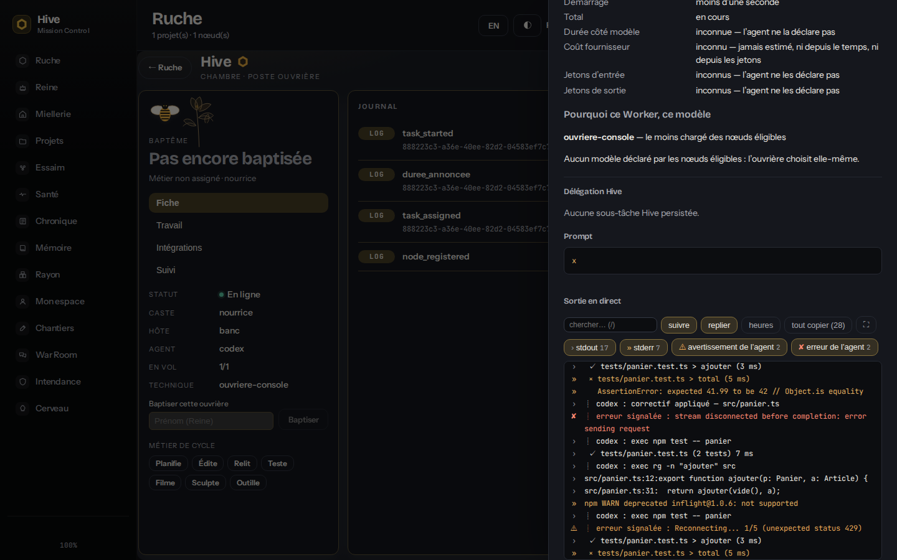
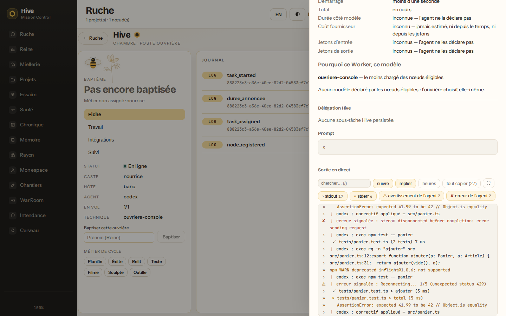
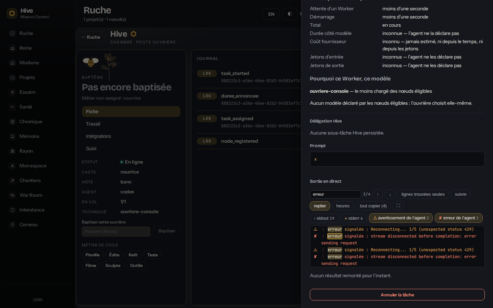
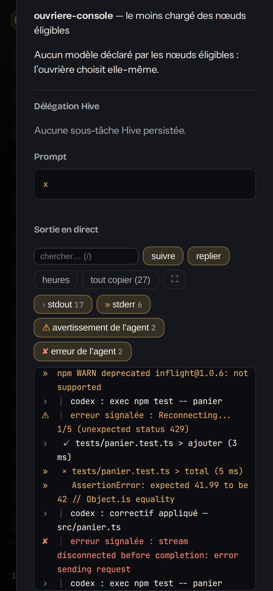
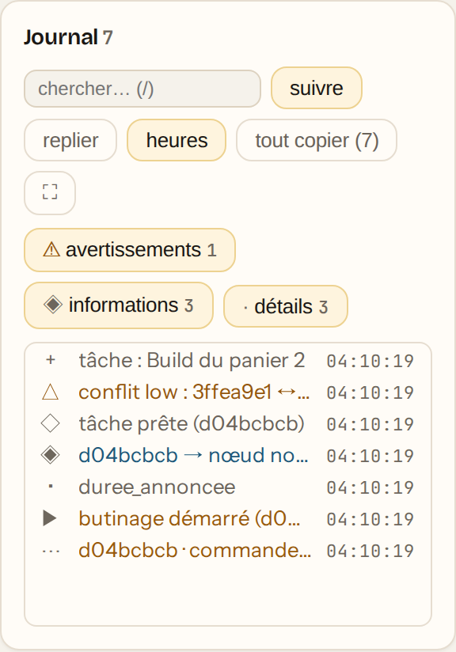
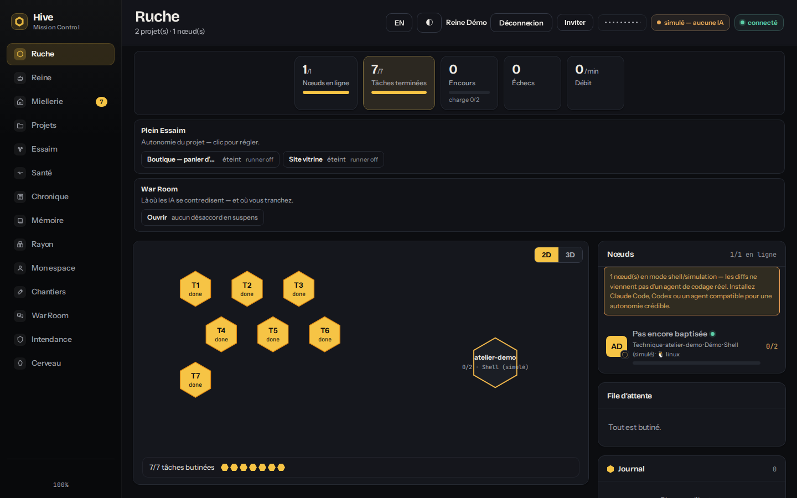
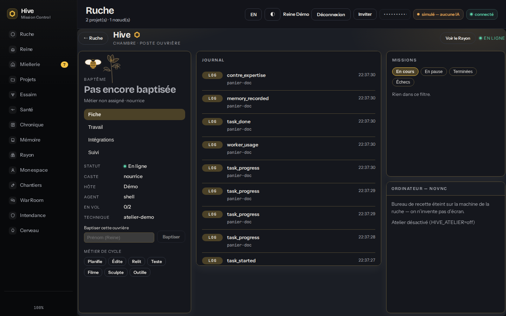
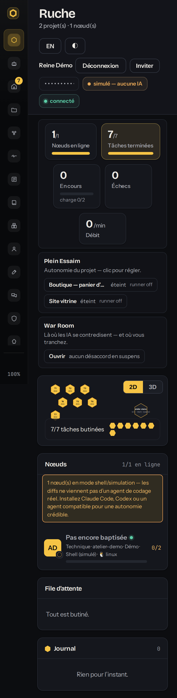

# Direction artistique de Mission Control

La référence contre laquelle chaque écran du tableau de bord est relu. Une vue
qui s'en écarte doit le justifier ; une vue qui s'y tient n'a pas à se
réinventer.

La source de vérité du code est `dashboard/src/styles.css` (les jetons, en
tête) et `dashboard/src/composants/` (les primitives). Ce document dit
**pourquoi** ; la feuille dit **combien** ; `tests/dashboard-contraste.test.ts`
vérifie que les deux disent la même chose.

## La direction, en une phrase

**Fond sombre profond, verre léger, surfaces propres, typographie forte, miel
rare.** L'ADN de la ruche — l'hexagone, le réseau, les noms (Reine, ouvrière,
butiner) — reste discret : Hive n'est **pas** un produit tout jaune.

Références de ton (handoff produit) : Delos Workers pour le concept de workers
persistants, Pulsor, Limova, Submagic, TrendTrack et Ekklo pour une direction
moderne, aérée et très lisible. On leur prend le rythme et la sobriété, pas
leurs palettes.

## Deux thèmes, un seul jeu de rôles

| Thème      | Quand                                                                  | Identité                                                             |
| ---------- | ---------------------------------------------------------------------- | -------------------------------------------------------------------- |
| **Sombre** | le système le demande, ou l'opérateur le choisit                       | la direction de référence : anthracite froid, miel rare              |
| **Clair**  | le système est en clair (le cas par défaut), ou l'opérateur le choisit | le « papier de cire » d'origine, préservé : blanc chaud, encre, miel |

Le choix vit dans la barre du haut (◐ · ☾ · ☀ : Système, Sombre, Clair). Il est
**mémorisé par navigateur** (`localStorage`, clé `hive.theme`), comme la
langue — c'est une préférence d'écran, pas un réglage de la ruche. « Système »
n'est pas « clair » : c'est un troisième choix, qui suit l'OS sans une ligne de
script (`prefers-color-scheme`). Un stockage coupé (navigation privée,
politique du poste) ne casse rien : le choix vaut pour l'onglet.

Techniquement : `data-theme="dark"|"light"` sur `<html>` (`dashboard/src/theme.ts`),
et le bloc sombre écrit **deux fois à l'identique** dans `styles.css` — une fois
sous `@media (prefers-color-scheme: dark)`, une fois sous `[data-theme='dark']`.
CSS ne sait pas réunir les deux, et le faire en JavaScript seul ferait clignoter
le mauvais thème au chargement. Le test vérifie que les deux copies ne
divergent jamais.

## Les rôles (jetons sémantiques)

Une règle d'écran ne nomme **jamais** une couleur : elle nomme un rôle. Les
noms historiques (`--bg`, `--panel`, `--honey`…) sont gardés parce que des
centaines d'emplois les désignent ; ce sont eux, les rôles.

| Rôle                | Jetons                                                                           | Règle                                                                                                                                                              |
| ------------------- | -------------------------------------------------------------------------------- | ------------------------------------------------------------------------------------------------------------------------------------------------------------------ |
| Page                | `--bg`, `--bg-2`                                                                 | le fond ; jamais sous du texte long sans carte                                                                                                                     |
| Surfaces            | `--panel` (carte), `--panel-2` (dans une carte), `--panel-3` (creux, jauge vide) | trois niveaux, pas plus                                                                                                                                            |
| Verre               | `--verre`                                                                        | seulement barre du haut, bandeau du rayon, voile de modale (voir « Verre »)                                                                                        |
| Texte               | `--text`, `--muted` (secondaire), `--faint` (tertiaire)                          | `--faint` jamais sous 11 px                                                                                                                                        |
| Filets              | `--border`, `--border-2`                                                         | 1 px ; la structure vient des filets, pas des ombres                                                                                                               |
| Accent              | `--miel`, `--miel-2`                                                             | **remplissage** seulement (jauge, alvéole active, bouton primaire) ; texte posé dessus : `--encre`                                                                 |
| Accent écrit        | `--honey`, `--gold`, `--amber`, `--orange`                                       | le miel quand il doit **écrire** (lien, valeur mise en avant) — avec parcimonie                                                                                    |
| Miel en fond        | `--miel-fond`, `--miel-fond-fort`                                                | le miel **sous** du texte `--text` (onglet actif, pastille) ; plus sourd en sombre                                                                                 |
| Statuts             | `--green` succès · `--amber` attention · `--red` danger · `--blue` info          | couleurs de **texte** ; un fond de statut se mélange : `color-mix(in srgb, var(--red) 10%, transparent)`                                                           |
| Sur un statut plein | `--sur-plein`                                                                    | le texte posé sur un dégradé rouge → ambre (bouton armé)                                                                                                           |
| Chrome              | `--encre`, `--sur-encre`, `--sur-encre-fort`, `--rouge`                          | la barre latérale, sombre dans les deux thèmes ; `--rouge` : la pastille critique pleine                                                                           |
| Focus               | `--focus`, `--focus-halo`                                                        | contour 2 px `--focus` ; halo 3 px `--focus-halo` sur un champ                                                                                                     |
| Graphes             | `--graphe-1` … `--graphe-6`                                                      | séries dans cet ordre ; miel en premier, puis les froids (bleu, vert, violet) — **réservés** : posés et jugés, câblés par les lots d'écrans qui refont les graphes |
| Voiles              | `--voile`, `--voile-dense`                                                       | derrière une modale ; `--voile-dense` quand le flou manque                                                                                                         |
| Ombres              | `--shadow-sm`, `--shadow`, `--shadow-lg`                                         | carte, élévation, surface flottante (modale, tiroir, menu, toast)                                                                                                  |

### Contraste mesuré (WCAG 2.x)

Le plus bas des rapports d'un texte sur la page, la carte et le creux
(`--bg`, `--panel`, `--panel-3`) — mesure du 27 septembre 2026. Le test juge
**toutes** les paires (cinq surfaces, dix textes, la barre, les remplissages,
le focus et les graphes) dans les deux thèmes, et rougit sous 4,5:1 pour du
texte, sous 3:1 pour ce qui n'en est pas.

| Jeton     | Clair   | min.   | Sombre  | min.   |
| --------- | ------- | ------ | ------- | ------ |
| `--text`  | #1a1714 | 14.7:1 | #eeebe5 | 12.6:1 |
| `--muted` | #6a635a | 4.9:1  | #a9abb2 | 6.5:1  |
| `--faint` | #6e675d | 4.6:1  | #8f929b | 4.8:1  |
| `--honey` | #9a5508 | 4.7:1  | #f0b64a | 8.2:1  |
| `--amber` | #94560c | 4.8:1  | #e8a857 | 7.3:1  |
| `--red`   | #a53e2a | 5.2:1  | #ff8a73 | 6.5:1  |
| `--green` | #215c51 | 6.4:1  | #5ccfa8 | 7.8:1  |
| `--blue`  | #1c587a | 6.3:1  | #72b6f0 | 6.9:1  |

`--faint` était annoncé AA dans le thème clair et ne l'était pas (#7a7267 :
3,89:1 sur `--panel-3`) ; il est passé à #6e675d avec ce lot.

## Typographie

Trois familles, servies depuis le dépôt (`site/fonts`, jamais un CDN) :
**Bricolage Grotesque** pour les titres (`--titre`), **Instrument Sans** pour le
texte (`--texte`), **JetBrains Mono** pour le code, les identifiants et les
chiffres alignés (`--mono`).

Une seule échelle, dix pas, rien sous 11 px :

| Jeton      | Taille | Emploi                                               |
| ---------- | ------ | ---------------------------------------------------- |
| `--fs-2xs` | 11 px  | le plancher : horodatage, pastille, légende de tuile |
| `--fs-xs`  | 12 px  | libellé, métadonnée, cellule de tableau dense        |
| `--fs-sm`  | 13 px  | texte d'interface, bouton, puce                      |
| `--fs-md`  | 14 px  | texte courant (le corps de la page), titre de carte  |
| `--fs-lg`  | 16 px  | texte d'accroche, titre d'un état vide               |
| `--fs-xl`  | 18 px  | titre de modale, chiffre secondaire                  |
| `--fs-2xl` | 20 px  | titre de tiroir                                      |
| `--fs-3xl` | 24 px  | chiffre de tuile                                     |
| `--fs-4xl` | 28 px  | titre de vue                                         |
| `--fs-5xl` | 34 px  | titre d'accueil (ruche vide)                         |

Titres : graisse 600-700, approche serrée (`letter-spacing` négatif, −0,03 à
−0,045 em). Texte : 400-500, interligne 1,45-1,55. Les chiffres qui se
comparent sont tabulaires (`font-variant-numeric: tabular-nums`).

Aucune feuille n'écrit une taille en px ou en rem hors de ces jetons (garde :
`tests/dashboard-contraste.test.ts`). Permis : `0` (cacher un texte en gardant
sa boîte) et `em` (un `<code>` relatif à sa phrase).

## Espace, forme, élévation

- **Espacement** : grille de 4 px, pas de base 8 px (`--sp`). Carte : 14-16 px
  de marge intérieure ; entre cartes : 16 px ; dans une rangée de puces : 6-8 px.
- **Rayons** : `--r-sm` 8 px (puce, champ compact), `--r` 10 px (bouton, champ,
  menu), `--r-lg` 12 px (carte), `--r-xl` 16 px (modale). Pilule (`999px`)
  réservée aux pastilles de statut.
- **Élévation** : les filets découpent, les ombres ne font que détacher ce qui
  flotte. Carte : `--shadow-sm`. Surface flottante (modale, tiroir, menu,
  toast) : `--shadow-lg`. Pas d'ombre colorée, pas de lueur.

## Verre

Le verre (`backdrop-filter`) est un **accent**, pas un matériau : trois surfaces
seulement — la barre du haut, le bandeau de progression du rayon, le voile
d'une modale. Jamais sous un paragraphe.

- Fond `--verre` : 88 % de `--panel` en clair, 80 % en sombre — assez couvrant
  pour que le texte posé dessus garde son contraste quel que soit ce qui défile
  dessous.
- **Sans flou** (`@supports not (backdrop-filter…)`) : fond plein `--panel`,
  voile `--voile-dense`.
- **Contraste renforcé** (`prefers-contrast: more`) : fond plein, filet à la
  couleur du texte, voile dense.
- **Couleurs forcées** (`forced-colors: active`, Contraste élevé de Windows) :
  flou coupé, fonds rendus au système (`Canvas`), cadre `CanvasText`, focus
  `Highlight`.

Les trois cas sont gardés par les tests (`dashboard-feuilles` et
`dashboard-contraste`).

## Mouvement

Court et fonctionnel : 120-280 ms, `ease`. Une apparition (fondu + 4-6 px), une
transition d'état (couleur, bordure), un pouls pour ce qui **travaille
réellement** (tâche en cours, sous-agent en vol) — jamais pour décorer.

`prefers-reduced-motion: reduce` éteint **tout**, par une garde universelle en
tête de `styles.css` (durées ramenées à 0,01 ms, une seule itération) : elle
couvre aussi les animations qui n'existent pas encore.

## Iconographie et ADN de la ruche

- Glyphes au trait, 15-16 px, `currentColor`, dans une case de 22-28 px.
- L'**hexagone** est la marque : logo, alvéole de navigation, marque de titre
  de carte (12 × 14 px, miel), état vide. Un hexagone plein de miel signale
  quelque chose ; il n'orne pas.
- Pas d'émoji comme icône d'interface.

## Primitives

Dans `dashboard/src/composants/`, stylées par les seuls jetons, testées dans
`dashboard/tests/composants.test.tsx` (le `Terminal`, dans `tests/terminal.test.tsx`) :

| Primitive                                 | Contrat                                                                                                                                                                                                                                                                                                                                                                                              |
| ----------------------------------------- | ---------------------------------------------------------------------------------------------------------------------------------------------------------------------------------------------------------------------------------------------------------------------------------------------------------------------------------------------------------------------------------------------------- |
| `Input`, `Textarea`, `Select`, `Fieldset` | contrôle natif ; `<label for>` réel ; aide et erreur dans `aria-describedby` ; `aria-invalid` ; zone d'erreur vivante avant l'erreur                                                                                                                                                                                                                                                                 |
| `Champ`                                   | le même cadre pour un contrôle **non natif** (liste à saisie, sélecteur de fichier) : il reçoit `id`, `aria-describedby`, `aria-invalid`, `required` ; ce que l'appelant pose déjà est fusionné, jamais écrasé                                                                                                                                                                                       |
| `Tabs`                                    | motif WAI-ARIA : un seul arrêt de tabulation, ← → Début Fin, panneau nommé par son onglet                                                                                                                                                                                                                                                                                                            |
| `Tooltip`                                 | survol **et** focus ; reliée par `aria-describedby` ; Échap ferme la bulle **seule** (pas le dialogue autour) ; survolable                                                                                                                                                                                                                                                                           |
| `Menu`                                    | bouton de menu WAI-ARIA ; focus entrant (sur le choix coché), ↑ ↓ Début Fin, Échap/choix rendent le focus au bouton ; `menuitemradio` pour les choix exclusifs                                                                                                                                                                                                                                       |
| `ToastProvider`, `useToast`               | deux files vivantes (`status` poli, `alert` pour l'erreur), toasts sans rôle propre — jamais lus deux fois ; une information s'efface en 5 s, une **erreur reste** jusqu'à fermeture                                                                                                                                                                                                                 |
| `Skeleton`                                | réserve la place ; annoncé une fois (« Chargement… »), lignes muettes                                                                                                                                                                                                                                                                                                                                |
| `EmptyState`                              | nomme l'absence, propose le geste qui la comble                                                                                                                                                                                                                                                                                                                                                      |
| `ErrorState`                              | `role="alert"`, toujours un bouton **Réessayer** (qui garde le focus pendant la relance)                                                                                                                                                                                                                                                                                                             |
| `Terminal`                                | des lignes lues comme un terminal (console en direct, Journal) : recherche surlignée (k/N, Entrée / Maj+Entrée, `/` `n` `N`), filtre par **niveau présent** — donné par l'appelant, d'un vrai signal —, suivi du bas détachable (« ↓ N nouvelles lignes »), copie de la sélection ou des lignes affichées, repli, heures, plein écran (Échap) ; **virtualisé** (seule la fenêtre visible est rendue) |

### La console et le Journal

Le niveau d'une ligne de la console en direct vient du **nœud** : le flux du
processus (stdout, stderr), la gravité que le flux structuré de l'agent
déclare (erreur ou avertissement de Codex `--json` et du stream-json de Claude
Code et de Cursor), ou une ligne de Hive (omission annoncée) — jamais deviné
dans le texte (`src/shared/niveaux-sortie.ts`). Le Journal range chaque
événement à la sévérité de sa fiche.

  

  

  
  
  

## À faire / à ne pas faire

**À faire**

- Nommer un rôle (`var(--muted)`), jamais une couleur.
- Mélanger une teinte de statut avec `transparent` ou `--panel`, pour qu'elle
  suive le thème.
- Doubler toute information de couleur par une forme ou un mot (pastilles
  d'alerte : plein, halo, creux ; toasts : « Erreur », « Attention »).
- Un geste = une issue visible : succès (toast, état), refus (message qui dit
  quoi faire), ou non-issue assumée.
- Vérifier chaque vue touchée dans **les deux** thèmes (`npm run captures` et
  `npm run captures -- --theme sombre`).

**À ne pas faire**

- Du texte sur `--miel` autre que `--encre` ; du miel vif comme couleur de
  texte ; des aplats de miel sur des surfaces entières.
- Une couleur en dur hors des blocs de jetons (seule exception nommée : la
  carte nocturne du Cerveau, peinte en JavaScript).
- Une taille de texte hors de l'échelle, ou sous 11 px.
- Du verre sous du texte courant, ou sans repli.
- Une animation qui tourne sans que rien ne travaille.

---

## English summary

Mission Control's reference direction: **deep dark background, light glass,
clean surfaces, strong typography, rare honey** — the hive DNA (hexagon,
network, names) stays discreet; Hive is not an all-yellow product.

- **Two themes, one semantic token layer** (`dashboard/src/styles.css`):
  dark (the reference, used when the OS prefers it or the user picks it) and
  light (the original "wax paper" identity, preserved). The top-bar menu offers
  System · Dark · Light, stored per browser (`hive.theme`), resilient to a
  failing `localStorage`; `data-theme` on `<html>`, with the dark block written
  twice (media query + attribute) and kept identical by a test.
- **Roles, not colours**: surfaces, text, borders, honey fill vs honey text,
  status colours, focus, chart series, overlays, shadows. Every text/surface
  pair is checked for WCAG AA in both themes by
  `tests/dashboard-contraste.test.ts`, which also forbids hard-coded colours
  outside the token blocks (the Cerveau night map is the one named exception).
- **One type scale** of ten `--fs-*` steps, 11 px floor; no px/rem font sizes
  outside it.
- **Glass** only on the top bar, the comb progress strip and the modal
  backdrop, with fallbacks for missing `backdrop-filter`, `prefers-contrast:
more` and `forced-colors: active`. Reduced motion switches off every
  animation through one universal guard.
- **Primitives** in `dashboard/src/composants/` (Input, Textarea, Select,
  Fieldset, Champ, Tabs, Tooltip, Menu, Toast, Skeleton, EmptyState, ErrorState,
  Terminal — the live console and the Journal: highlighted search, level
  filters from real signal, detachable follow, copy, wrap, fullscreen,
  virtualized),
  token-only, keyboard- and screen-reader-tested.

  

  

  

