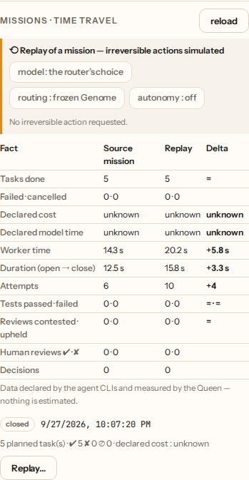
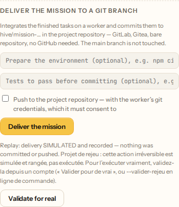

# Features — in detail

> The [README](../README.en.md) says what Hive is and how to run it. This file
> says what each part does, and **why it is built that way** — the trade-offs,
> the accepted limits, and what was measured rather than assumed.
>
> It is deliberately long. A README that contains everything is read by nobody;
> a reference you open when you need it, is.

---

## 🎛️ Mission Control — the cockpit

The dashboard (served on `:7777`) is a full hive-management application,
keyboard-navigable (keys **1-9**, `0`, `h`, `w`, `i`, `c`) through a honeycomb sidebar:

| View                | What you do there                                                                                                                                                                                                                                                                                                                                                                                                                                                                                                                                                                                                                                                                                                                                |
| ------------------- | ------------------------------------------------------------------------------------------------------------------------------------------------------------------------------------------------------------------------------------------------------------------------------------------------------------------------------------------------------------------------------------------------------------------------------------------------------------------------------------------------------------------------------------------------------------------------------------------------------------------------------------------------------------------------------------------------------------------------------------------------ |
| 🐝 **Hive**         | Overview: 2D/3D Swarm View, KPIs including the **declared spend of the last 24 h** (always with its coverage, “3/5 attempts declared” — never a bill, never extrapolated), a **What is stopping the hive** block (no worker online, a review waiting for an absent family, infrastructure refusals, an impossible review no human has settled, a project stopped by its cap — each line leads to the gesture that clears it), the **recent decisions** (commanded model, cross-review, Evaluator retries, human reviews, Balance), **Full Swarm pulse** (level / pause / drift → Projects), clickable honeycomb, queue, journal.                                                                                                                 |
| 👑 **Queen**        | Talk to the hive in **your language**: progress, health, leaderboard, brief-scoping help. **SSE streaming** (progressive text), read-only multi-agent / Full Swarm context, Anthropic token counts, Chat / Plan / Autonomy / Backups modes, **Restore…** chip when failures sit next to a checkpoint.                                                                                                                                                                                                                                                                                                                                                                                                                                            |
| 🍯 **Honey House**  | **Review what the AIs produced**: per-file diffs, logs, Parliament verdict **and surface — did two agents go to the same place, or not**, keyboard approve (a) / reject (x), then Honeycomb merge.                                                                                                                                                                                                                                                                                                                                                                                                                                                                                                                                               |
| ⬡ **Projects**      | Progress reports, **mission report** (per task: Evaluator decision, cross-review, retries by source, time and declared spend with its coverage; the mission's Genome facts — never through a share link), brief→DAG workshop (Queen Bee), merge planning and launch, Sting conflicts.                                                                                                                                                                                                                                                                                                                                                                                                                                                            |
| 🐝 **The Comb**     | **The project's code, readable**: file tree, highlighted editor, preview of the site produced, edit → task (with an `avant_retouche` safety net), and a **checkpoint timeline** (view the patch; restore opens a task).                                                                                                                                                                                                                                                                                                                                                                                                                                                                                                                          |
| 🕺 **Swarm**        | Member node cards — with their **economics** (declared cost and model time with their coverage, median duration of a success, per Worker and per model) — + Waggle Board (nectar podium). A worker's sheet (Chambre) adds its **record**: the share of its productions **accepted by the Evaluator** and its correction rate, two separate measures, “unknown” below three judged productions.                                                                                                                                                                                                                                                                                                                                                   |
| 💓 **Health**       | Hive pulse (throughput, p50/p95 latency, success rate) + Ghost anomalies.                                                                                                                                                                                                                                                                                                                                                                                                                                                                                                                                                                                                                                                                        |
| 📜 **Chronicle**    | Filterable journal + Time-Lapse Replay (sepia "you are watching the past" mode).                                                                                                                                                                                                                                                                                                                                                                                                                                                                                                                                                                                                                                                                 |
| 🧠 **Memory**       | Search the hive's knowledge (Hive Mind) + OpenAlex scientific library.                                                                                                                                                                                                                                                                                                                                                                                                                                                                                                                                                                                                                                                                           |
| 🏗 **Works**         | **The works the repository DECLARES**, one click away: its scripts on a hive node, its workflows on GitHub. The hive picks from that list and never invents a command — and whatever leaves the machine carries its reason for needing a human.                                                                                                                                                                                                                                                                                                                                                                                                                                                                                                  |
| ⚔ **War Room**      | **Where the AIs contradict each other, and where you settle**: Council, counter-review (impossible reviews included), Evaluator retries, human reviews and overrides read back from the journal, per project and per task, filterable by voice (Council, counter-review, Evaluator, human decisions). On top, what is **waiting on someone** — a Council without consensus nobody has settled, a contest whose correction retry could not happen, a production nobody could review. Protocol: [PROTOCOLE-DEBAT.en.md](PROTOCOLE-DEBAT.en.md). Convening a Council and **settling** it (a path or none, a required reason, the author recorded) works here as on the project card; it is the view's only write. Direct access from the Hive home. |
| 🧪 **Sandbox Live** | **Runs in progress, live**: phase (preparing → agent → validations), worker, agent, model, declared sandbox, redacted command, CPU / memory / process count of the agent's process tree (or of the container, from its engine — "unknown" when nothing can be measured), sub-agents **as a tree**, sandbox validations as they complete, observed open files. **Pause / Resume** (SIGSTOP/SIGCONT of the tree, engine `pause`/`unpause`; hidden where the worker cannot, Windows without a container) also suspends the task's timeout and budget. The **diff so far** is fetched on demand (bounded, redacted); **Explain** reads back the recorded state with no model call. Key `l`. Its totals (CPU, memory peak) stay in the task drawer.   |
| 🪪 **My space**     | One person's dashboard: their projects, quota, subscriptions, machines — and whatever needs their attention, ranked by urgency.                                                                                                                                                                                                                                                                                                                                                                                                                                                                                                                                                                                                                  |
| 🖥 **Stewardship**   | _Administrators only._ The machines started for subscribers, and the hive's accounts.                                                                                                                                                                                                                                                                                                                                                                                                                                                                                                                                                                                                                                                            |
| 🧠 **Brain**        | _Administrators only._ The hive's knowledge as a **living graph**, Obsidian-style: notes repel each other, links pull them together, and a halo breathes on whatever was used recently. A **hollow** dot has never been used — knowledge stored without use. Dead links are listed but **never drawn**: tracing them into the void would invent a note that does not exist. Read-only. **Explorable**: accent-insensitive search, filters by kind, a “dormant” filter, zoom, pan, and a **list** view — a real table, keyboard-navigable, because a screen existing only in pixels would be the one place where `NO_COLOR` and `TERM=dumb` stop.                                                                                                 |

**My space** answers a single question: _what will cost me something if I do
nothing today?_ Alerts therefore come before cards, and their order is a stance
— what is **irreversible** (data about to be erased) outranks what stops the
service, which outranks a quota running low. A bill can be paid after the fact;
erased data does not come back.

**Stewardship** requires an administrator ACCOUNT, never the hive token alone:
that token is handed to every member node, and using it as proof would give full
powers to any machine that forages. The first account created is an
administrator, and the last one cannot step down. Creating that first account
**always** requires the hive token — otherwise whoever came first would become
administrator. Always, not only on a hive listening beyond loopback: a proxy on
the same machine relays the Internet through loopback, so the listening address
does not say who is talking.

Review decisions are **shared across all operators** (stored on the
orchestrator, synced in real time over WebSocket; offline localStorage
fallback). "Pour the honey" only integrates **approved** productions — merging
always remains an explicit human gesture.

**The companion.** A small creature lives at the bottom of the sidebar and sums
the hive up at a glance: it **rests**, **works** (with the number of running
tasks), **fidgets** when something waits for a human (a production to review, a
My space alert), **celebrates** for a few seconds when a delivery is accepted,
and turns grey with a "?" when the live feed is down — nobody knows what the
hive is doing then, and it does not make it up. It lives in the sidebar, never
over the content; with "reduce motion" it does not move at all. A click opens
its settings: the **honeybee**, the **bumblebee** or the **mason bee**, or
**your own** — a PNG or WebP image of 150 KiB at most, still or a horizontal
strip of frames, kept in this browser for this account (three at most, under a
cap shared by every account on the browser) and never sent to the hive. The bytes decide: an SVG or an HTML page renamed `.png` is refused. "Put
the companion away" leaves a single cell to bring it back.


## 🐝 The Comb — seeing the code, watching the AI work

What members could see so far were **tasks**: titles, states, diffs. Never the
code. You worked on a project without being able to open it — like helping fix
an engine without being allowed to lift the hood. The Comb lifts the hood.

| What you find     | For whom                                                                                                                              |
| ----------------- | ------------------------------------------------------------------------------------------------------------------------------------- |
| **Tree + editor** | Any bee with access to the project. Highlighting for 16 languages, files capped at 512 KiB.                                           |
| **Preview**       | The site the AI just wrote, **rendered** — not only its diff.                                                                         |
| **Edit**          | Queen only. Fixing a line on screen creates a **task**, never a write. `avant_retouche` reverse-patch safety net before the proposal. |
| **Backups**       | Checkpoint timeline (captured diff); **view / copy the patch**; restore opens a **task**, then a Honey House shortcut.                |
| **Share link**    | Show progress and code **without handing over the hive**: distinct token, expiring, revocable.                                        |

**The hub keeps its own mirror**: a read-only shallow clone per project
(`data/rayons/<id>`), refreshed at most once a minute. Going through the GitHub
API would have required the **host's token** — showing the code to a bee would
spend a right that is not hers. **`.git` is never served**: it holds `config`,
hence the remote URL, hence the private repository's credentials; neither are
`.env`, `.npmrc`, `id_rsa` or key extensions.
The mirror shows **the bytes the repository stores**: no filter or
`.gitattributes` conversion (line endings, `$Id$`, encoding) is applied, and
**a Git LFS file appears as its pointer** (a few `version … oid sha256:… size …`
lines), never downloaded — in the tree and in the Preview alike. A still-empty
repository gives an empty Rayon; if the upstream default branch changes, the
mirror is recloned on the new one — beside the old copy, which stays served
until the new clone succeeds. An upstream whose `HEAD` points at no existing
branch is reported as a failure, not as an empty repository.

**An edit is not saved — it is proposed.** The mirror is a disposable copy;
writing to it would give the illusion of having fixed something, until the next
refresh silently erased it. A change therefore becomes a **task** carrying the
file's context, reviewed like any other production. Someone holding a share link
**reads**; they do not manufacture work for somebody else's swarm.

**The preview runs in an opaque origin.** Previewing a site the agent just wrote
means executing, in your browser, HTML and JavaScript nobody has read: served on
the same origin as the dashboard, three lines would be enough to send your
session token elsewhere. The document is therefore folded into a single
self-contained file and displayed in an `<iframe sandbox>` **without
`allow-same-origin`** — the frame reads neither `localStorage` nor cookies —
with a `Content-Security-Policy` that cuts the network (`connect-src 'none'`,
`form-action 'none'`) and no navigation of any kind.

**Letting a worker into a private project** is done from the "Team" panel in the
Projects view. A repository imported from GitHub arrives **without an owner** —
the import authenticates with the hive token, which is nobody's account: an
administrator **adopts** it first, then admits whoever they want. Admission goes
by **account identifier**, never by email: email would turn this route into an
oracle answering "does this email have an account here?" for any project owner.
Everyone reads their own identifier on that same card, and hands it over the way
one hands over an invitation ticket.

**Sharing read-only** is done from the "Read-only sharing" panel in the Projects
view and yields a URL to paste
(`https://<your-tunnel>/#/rayon/<project>?partage=hive3_…`). Whoever opens it has
**neither an account nor the hive token**: they land on a stripped-down screen
that says what it is (read-only), shows progress and code, and nothing else — no
sidebar, no swarm, no journal, no edit button. They do not see **who** is
working either: node identifiers name the machines of people who never agreed to
appear in a link being passed around. The token travels after the `#` — so it
shows up in no access log — and it is removed from the address bar once stored. The share token is **not** the hive
token: it carries two acts only (see progress, read code), applies to **one**
project, expires (7 days by default, 90 at most) and is revoked one at a time
without touching the others.

**Deleting a project** is done at the bottom of its card in the Projects view —
or with `DELETE /api/projects/<id>`. It is a **deletion**, not an archive:
tasks, results, journal, Hive Mind memories (and their pending proposals),
routing constraints, delegation spend, external connector grants and journal,
replayable missions and their snapshots, shadow-bench comparisons, share
links, members and the code mirror leave the Queen. A replay of this project
(ANOTHER project) stays a replay — its irreversible actions stay simulated —
and its comparison says its source is gone. Only one audit line remains, `project_deleted` (who,
when, which name, how many rows), which journal pruning spares for the 1,000
most recent deletions. It takes an
**account**: the owner, or an administrator (the only one for an ownerless
project) — the hive token alone deletes no project (ADR 0007) — and the
confirmation requires **retyping the project's name**. Running tasks make the deletion refused (the
list is shown); asking again with `force=true` cancels them first. A merge, a
chantier or a delivery in flight, an autonomy cycle, an active subscription
or a machine still at the provider refuse it even when forced: those cannot be
cancelled. Workers clean up their own workspaces; a mission branch delivered on
a node stays there. The Cerveau episodes born of the project (title,
objections, Evaluator rejections) go too; the Cerveau notes written by hand
stay. An episode or a memory born of a **private** project is only served to
projects with the same owner, or, when it has none, to ownerless projects,
whose members are its own (see Hive Mind).

## 📦 The environment — the agent installs what it needs

`npm test` on a fresh clone fails for want of `node_modules`. The merge
therefore accepts a **preparation** before the tests:

```bash
npm run cli -- merge-run <projectId> -- --preparer npm ci --tester npm test
# or the two fields of the "Merge plan" panel in ⬡ Projects
```

**Preparation installs what the REPOSITORY declares, never what the COMMAND
names.** `npm ci` reads the repository's `package-lock.json`; `npm install
lodash` lets the hub choose what runs on a member's machine. Refused, therefore:
binaries that install nothing (`sh`, `curl`, `make`), subcommands that are not
installations (`npm run deploy`), arguments that name a package, and flags that
relocate the **source** (`--index-url`, `--registry`, `--userconfig`…).
Preparation goes through the node's sandbox, just like the tests.

If the install fails — machine offline, registry unreachable, lockfile out of
step — **the tests are not run** and the report says "environment not prepared".
A `✘ tests red` would have sent you hunting for a regression in code that is
perfectly fine.

## 🌿 Delivering without GitHub — one mission, one branch

GitHub delivery opens one pull request **per task**, with the host's key. A
project on GitLab, Gitea, a bare repository on a home server — or a repository
on the host's disk — is delivered differently: the **whole** mission, integrated
by a worker, committed to **one** branch of the project repository.

```bash
npm run cli -- livrer-local <projectId>                       # commit, keep the branch on the worker
npm run cli -- livrer-local <projectId> --pousser --preparer npm ci --tester npm test
npm run cli -- livrer-local <projectId> --forcer="read by hand"      # override the Evaluator
npm run cli -- livrer-local <projectId> --prolonger=1         # fix: advance hive/mission-<projectId>-1
# or "Deliver the mission" in ⬡ Projects, under "What the delivered work becomes"
```

- **The branch** is `hive/mission-<projectId>-<n>`, `n` following the highest
  one already taken — on the worker, in the repository, or in the hive's log
  (a branch kept on another worker). The commit is the **integrated** tree,
  composed before preparation and tests: no `node_modules`, nothing a test
  rewrote. After them, no git command touches the clone again: whatever the
  tested code writes into its `.git` (`origin`, hooks, HEAD) decides neither
  the parent nor the destination. The main branch is never touched.
- **Provenance travels in the commit**, as trailers git reads back
  (`git log --format='%(trailers)'`): `Hive-Task`, `Hive-Result` (the exact
  integrated result, `inconnu` when it has none), `Hive-Evaluator` (the verdict
  at delivery time), `Hive-Evaluator-Forced` (the reason for an override),
  `Hive-Tests`.
- **Nothing is committed** when a task conflicts (a partial integration is not
  the mission), when preparation fails or when tests are red — and the report
  says so. If the worker goes silent on the way (disconnection, timeout), the
  report says **"unknown outcome"** rather than "nothing committed": it may have
  committed, and even pushed, before disappearing.
- **One delivery per project at a time, and alone**: while it runs, a trial
  merge of the same project is refused (and the other way round) — its report
  would overwrite the delivery's.
- **The Evaluator guards the door**, as for GitHub delivery, and judges the
  **exact** integrated result: a task in `correction_required` or `rejected`
  stops the mission. The owner (or an
  administrator, or the hive token on an ownerless project) may override it by
  giving a reason; the act is logged (`evaluator_overridden`). A project member
  does not deliver.
- **Without `--pousser`**, the branch is kept on the worker, in
  `livraisons/<projectId>.git` under its work directory (a bare repository whose
  `origin` is the project repository, credentials stripped): `git fetch` from
  that path, or `git -C … push origin hive/mission-…` on the worker.
- **With `--pousser`**, the worker pushes to the project address the hive sent
  it, with **its own** git credentials — the ones used to clone —, never
  forced, never another branch. A repository that does not answer within two
  minutes (credentials awaited?) fails the push, and the report says so. It only does so if its operator started it with
  `HIVE_LIVRAISON_POUSSER=1`: the repository and the diff come from the hub, and
  the hive token sits on every member machine. And only the host asks for it
  (hive token or administrator account): the operator consented for the hive,
  not for every owner of a registered project. With no consenting worker the
  request is refused **before** any work, with that fix spelled out. A refusal
  from the remote comes back stripped of any credential, and the branch stays on
  the worker.
- **Fixing a delivered mission** means **extending** it (`--prolonger=<n>`)
  instead of opening `hive/mission-<projectId>-<n+1>`: the hive hands the merge
  to the worker that holds the branch, the new commit has the head the journal
  knows as its **only parent** (`Hive-Suite` trailer), and the branch advances
  without ever being forced. If the repository carries commits on that branch
  that the hive did not deliver, nothing is committed and the report says so:
  extending would erase their work. At most three extensions per branch. It is
  the same rule as resuming a GitHub pull request, which **advances the PR's
  branch** instead of opening a second one.

## ⟲ Replayable missions — Time Travel

The Chronicle's Time-Lapse **rewinds** time; a replayable mission is
**replayed**. A mission is an activity episode of a project: it opens when a
task is live on a project with nothing in flight — at its birth, at the latest
at its first assignment, or when a finished task is retried — and closes when
nothing flies any more (reviews included). Its tasks are recorded one by one: a
retried task does not drag the previous mission along. The Queen takes a
**snapshot** at each edge — plan and task graph, prompts, models (commanded,
declared, offered), routing policy and **Genome version** (its fingerprint and
history), autonomy level, guardrails and spending cap, artifacts (branches,
pull requests, mission branch), typed decisions. A human review or a delivery
that lands after closure retakes the end snapshot. No human reason, no
objection, no credential goes in.

```bash
GET  /api/projects/<id>/missions                      # missions, summarised
GET  /api/projects/<id>/missions/<missionId>          # both snapshots
POST /api/projects/<id>/missions/<missionId>/rejouer  # {modele?, politiqueRoutage?, autonomie?}
GET  /api/projects/<replay>/rejeu/comparaison         # source vs replay
# or "Missions · Time Travel" in ⬡ Projects
```

- **Replaying** creates a NEW project on the same repository (so fresh branches
  and sandboxes), recreates the starting plan — not the reviews nor the
  delegations, which the replay redoes itself — and imposes, as chosen: a
  **model** (tasks wait for a node offering it, and say so:
  `rejeu_modele_absent`), a **routing policy** (`apprise`: today's history;
  `figee`: the Genome frozen at the mission's start; `neutre`: no history) and
  an **autonomy level** — under the **same spending cap** as the source. It is a
  setting: owner or administrator.
- **Nothing irreversible leaves a replay.** Pull request, merge, mission
  commit, push, GitHub workflow — and the autonomous hive — are **simulated**:
  stored (once), journaled (`rejeu_action_simulee`), never executed; the route
  answers `409 rejeu_simule` (nothing left) and the autonomous hive moves on.
  Only a human signed in with an **account that answers for the replay** —
  its owner or a hive administrator, who must also answer for every project
  holding the same repository — can approve one: “Validate for real” on
  screen, `--valider-rejeu` on the command line (`livrer`,
  `livrer-local`, `fusionner`), or `validerRejeu: true` in the request; the hive
  token, which every machine carries, never approves. **External connectors**
  (Slack, webhook) stay silent too: what they would have sent from a replay —
  a fact, or the Stewardship test — is stored and journaled the same way, and
  no relay can be approved by a human.
- **The comparison** puts side by side the result, the declared cost (with its
  coverage), model time, worker time, duration, tests, reviews, human reviews
  and decisions. It computes on declared data only: a silent side makes the
  delta **unknown**, a mission in flight is **provisional**, a log pruned during
  the mission is **incomplete**. A cancelled task has its own status, distinct
  from a failure — in the Chronicle's timeline too. Reading it requires read
  access to the **source** project as well (`403 source_illisible` otherwise):
  it shows the source mission's plan. When the source project is deleted, its
  snapshots go with it and the comparison says `source_elaguee`; the tasks the
  replay copied at creation belong to the replay and stay until it is deleted.

<p>
  
  
</p>

## 👑 The Queen replies — talking to the hive

Every member (project owner and node holder alike) can ask the hive questions
in natural language — the message's language is detected and the answer comes
back in that language:

```bash
npm run cli -- ask "Où en est le projet ?"
npm run cli -- ask "Which node works best?"
# or: POST /api/chat { "message": "…", "projectId"?: "…", "stream"?: true }
#     · Accept: text/event-stream → deltas then done
#     · 👑 Queen view and `hive ask` (same progressive SSE path)
```

Two modes, never blocking: **live state** (deterministic answers composed from
reports, pulse, nectar, anomalies and memory — 100% offline) and **AI** (if
`ANTHROPIC_API_KEY` is set on the Queen: `HIVE_CHAT_MODEL`, default
`claude-haiku-4-5`; the key never leaves the orchestrator, and the model only
receives the hive's real numbers). AI and live replies **stream** over SSE when
the client asks (`stream: true` or `Accept: text/event-stream`) — the dashboard
Queen bubble and `npm run cli -- ask` share that path. Leaving the view,
**Clear**, or **Ctrl+C** on `hive ask` aborts the stream (no error bubble /
`(interrompu)`). The prompt also sees read-only **in-flight work**,
**sub-agents**, and **Full Swarm** state — the Queen never raises autonomy or
rewrites git. The Queen also guides the project owner: best practices per
project type (web, API, mobile, data, e-commerce, CLI) and an effective brief
structure. In AI mode, Anthropic **token counts** show on each reply (and for
the session). Mode chips link Chat → Plan (Projects / Queen Bee) → Autonomy
(Full Swarm on the project) → Backups (Comb). When recent failures sit next to
a checkpoint, the Queen offers a **Restore…** chip that opens the Comb
timeline.

## 🪑 Chambre — worker station (ADR 0010)

From a **node sheet** (Hive view) → **Open workstation** (`#/chambre/<nodeId>`):
baptismal name, cycle role, caste, **observed** open files (Read/Edit/Write),
that worker’s **Journal** and **Missions**, and **Computer** = Atelier noVNC (or “off” —
no fake desktop). On **node cards**, the observed baptism (`GET /api/baptemes`,
hive token) is the title — otherwise “Not baptised yet”. From the node sheet,
**Open workstation** is labelled with the baptism when observed. On the **Comb**,
cursors show who is on which path
(baptismal name, otherwise silence) — a click opens that worker’s **Chambre**;
the **Working on…** strip lists presence even when the repo mirror is empty —
a click on the **path** opens the file in the tree.
On **Swarm**, worker cards (and the Waggle board) show the observed baptism;
a click opens the **Chambre** too.
**Requisitions** (API key, MCP, binary,
studio, software) are granted or denied from the Chambre — secrets stay on the
Queen. A share link **never** sees these identities.

**Forge** proposes a tool (npm script, bridge, MCP) as a task → review → merge;
Chantiers may run it only **after** merge and declaration in `package.json`.
**Horizon** keeps a facts ≠ hypotheses ledger (without bloating the snapshot).
Cross-project **motifs** (e.g. 3D game: forge before assets) create ordered
tasks — never another repo’s diff.

On screen: **Needs a decision** banner (requisitions), **Journal** with live
**tool stream** (READ/EDIT/WRITE badges), filtered **Missions**, Sheet / Work /
Integrations / Horizon tabs (ledger + forge). **Open Rayon** focuses the latest
observed path (otherwise navigation only). Escape → Hive, except while typing /
in a dialog / in the Atelier iframe. Mockup: `docs/maquettes/chambre/`.
In the dashboard 👑 Queen view: **mic** (browser Web Speech dictation),
**voice** (read replies aloud), and **attach** documents (PDF, Word `.docx`,
text, code…). The browser **extracts text** before send — video and audio are
not auto-transcribed (attach a script or dictate). No API key crosses the
browser.

## 🧠 Queen Bee — from brief to DAG

In **"New project"**, describe the goal in natural language and click
**"✨ Generate the tasks"**: Hive proposes a task graph, editable before launch.
From a terminal: `POST /api/plan { "brief": "…" }`.

The planner is **pluggable**, with automatic fallback — never blocking:

| Mode            | When                                        | Cost / key                 |
| --------------- | ------------------------------------------- | -------------------------- |
| **Heuristic**   | Default. Deterministic keyword-based split. | Offline, free              |
| **AI (Claude)** | If `ANTHROPIC_API_KEY` is set on the Queen. | Key **local** to the Queen |

```bash
# Enable the AI planner (optional) — the key never leaves the orchestrator.
ANTHROPIC_API_KEY=sk-ant-…            # presence → AI mode, otherwise heuristic
HIVE_PLANNER_MODEL=claude-haiku-4-5   # fast/economical default; opus for more finesse
```

## 🧬 Hive Mind — the hive learns

The hive keeps a **shared memory**: every **validated** production leaves a
_memory_ (what was done + the agent's answer). Before assigning a new task, the
orchestrator retrieves the most relevant memories and **injects them into the
worker's prompt** — later tasks benefit from work already done.

What a project learns (Hive Mind memories and Cerveau episodes alike) serves
a task of another project when the source is **public**, when both projects
have the **same owner**, or **neither has one** (the hive-token world, one
person and their projects), and every member of the target project is also a
member of the source (with no members at all, there is nothing to check). A task picks its memories through its title and
prompt: without that condition, someone invited into one of Alice's projects
could read, through their tasks, what all her other projects learned. So a
shared project's knowledge flows into Alice's private projects, never the other
way. Between different owners, or between an owned project and an ownerless
one, a **private** project keeps its knowledge to itself. Membership never
widens anything. The project never appears in the prompt. The Queen
(`/api/chat`) focused on a project follows the same rule; without a focus, like
the Hive Mind panel and `GET /api/hive-mind`, which take the hive token, it
sees the whole memory.

A success declared by the worker is not enough: the memory enters only when the
**Evaluator accepts** the production or a **human approves** it in review.
"Accepted" needs all of it at once: clean Guardians, **green tests** from a
sandbox (bubblewrap, podman or docker on the node) or from GitHub CI, and a
favorable review from **another agent family**. A production without a diff is
never reviewed. So on a default install — one agent family, no sandbox, no CI —
the Hive Mind stays **empty until a human approves** productions in review.

A human approval does not override an objection: a reviewer's objection, a red
validation, a suspicious Guardians signal or a Parliament mismatch keeps the
memory out, and the log says why (`memory_withheld`). A rejection (objection,
red CI, human rejection) withdraws a kept memory; so does undoing the human
approval that alone validated it. Review tasks never leave one. The event log
says so: `memory_recorded` (with who validated), `memory_forgotten` (with why)
and `memory_withheld`. A memory recorded before this rule, at raw success, is
withdrawn the same way when its task is rejected.

Failures go to the **Brain** (the `cerveau/` folder next to the database): a
worker failure, a reviewer's objection and an Evaluator rejection each leave an
attributed _episode_ — agent, commanded model, node, exact task and result.
One rejected production leaves one episode, whichever door comes first. An
Evaluator rejection is counted per task: two unrelated tasks with red tests are
two episodes, not a recurring pattern. The hive marks an episode `serviLe`
(last used) at most once a day when it reaches a worker; hand-written notes are
never rewritten.

Retrieval is **100% offline** (BM25-style lexical scoring, no embeddings, no
API), hence deterministic and free. The dashboard shows a live **Hive Mind
panel** (search + recent memories). Query the memory:

```bash
npm run cli -- mind "jwt authentication"    # most relevant memories
npm run cli -- mind                         # recent memories
# or: GET /api/hive-mind?q=…
```

## 📜 The journal keeps its proofs

Everything the hive does goes through its **journal**, and the journal is
bounded. Two families of events do not live there for the same time:

- **traces** (agent progress, nodes, Councils, access gestures): the **last
  5,000** events, which screens catch up on live and which the Chronicle,
  Pulse, Waggle and Ghost fold;
- a task's **proofs** — CI and sandbox checks, cross-reviews and their
  verdicts, human review, retries and critiques, routing reason, Genome register
  facts, delivery provenance, Worker measurement — live **with their task**:
  while the hive can still decide something about it (in flight, waiting for a
  review, a delivery or a merge), no night of chatter erases them; once closed
  (failed, merged, rejected with no new attempt) it keeps them for **thirty
  days**; once deleted, it keeps nothing.

A **50,000-row cap** bounds everything as a last resort: it first removes the
proofs of the longest-closed tasks, then those of the open tasks idle the
longest — **one whole task at a time**, never half a dossier. If that is not
enough (a task that **loops** — refused then reassigned every three seconds —
always has a recent proof), it **cuts** as the very last resort: first the
proofs a newer one of the same type replaces, then the oldest. The journal
never exceeds the cap. Every pass that removes something writes it to the
Journal (“journal pruned: …”, with the cap and the cut named apart) and counts
it by type; the Genome register only calls itself “truncated” when facts of a
still-known task may have gone (the flag is conservative: it can say so
wrongly, never hide a loss).

**Known limits.** A finished task still waiting for a review or a delivery
keeps its proofs as long as it exists — but the task itself is deleted thirty
days after its last update (`pruneTasks`), merged or not, unless a dependent or
a delegation holds it. And a delegation's history (`delegation_*`, tied to its
root rather than to a task) stays a trace: it only lives in the window of the
last 5,000 events.

## 🌳 Delegation — a Worker hands off a sub-task

A Claude Code or Codex Worker can hand a bounded sub-task to another Worker
through two MCP tools: `hive_delegate`, then `hive_wait_for_delegation_result`.
The bounds are written in the tool description itself, and every refusal names
the bound it hit and what is left:

- at most **3 levels** below the root task, **4 children** per parent,
  **16 descendants** per root (finished children included);
- budgets **cumulative per root** — each child reserves its share, never given
  back: **30 min**, **5,000,000 µUSD** (5 USD of cost _declared_ by the agent's
  CLI) and **4 resource units** (an abstract count: nothing is measured behind
  it).

When the tree's declared spend reaches its cost budget, no further child is
admitted, no correction restarts, and the ones in flight are cancelled — each
with its reason, which a waiting parent receives at once — as does a parent
whose child failed without returning anything. An attempt with no declared
cost, or interrupted before returning (lost worker, cancellation), never counts
as zero: the task drawer says "at least". A parent waiting on its children
**releases its slot to its own tree** on its worker: a tree no longer deadlocks
on a full worker, and another root does not slip into that slot —
`maxConcurrency` still bounds new work.

`preferredAgent` / `preferredModel` only **break ties** — the router keeps the
last word, and the recorded reason says whether the preference mattered. The
**operator** can force instead: in a task's drawer, the **routing constraint**
pins or excludes an agent family or a model (project owner or admin). It is a
hard exclusion that neither preferences nor a drone race can cross; the
assignment is recorded as "forced by the operator", and no learned score is
touched. If no online worker satisfies it, the task waits and the journal says
so.

## 🌗 The shadow bench — two models, the same small task

The router only learns from what it chose: two models never meet on the same
task. The **shadow bench**, enabled per project, has a small testable task,
drawn by lot (5% by default), replayed by a **second model** in a worker's
isolated sandbox (bubblewrap or a container, without the host credentials).
That shadow is **never delivered**: no delivery, no merge, no
report. Both productions go through the sandbox validations, the Gardiennes,
the counter-review and the Evaluator. **The project's tests** decide, and the
counter-review only sets the confidence.

The budget is required to enable it: at most a number of shadows and a
declared cost per rolling 24 h, one shadow in flight at a time. Comparisons are
read in the Genome register (`shadow` provenance) and **change no routing
weight** until their weighting is chosen.

```bash
# or the “Shadow bench” panel in ⬡ Projects
curl -X POST http://localhost:7777/api/projects/<project>/banc-ombre \
  -H "x-hive-token: $HIVE_TOKEN" -H 'content-type: application/json' \
  -d '{"actif": true, "executionsParJour": 3, "plafondCoutUsd": 1}'
```

Admission rules, budget, confidence and limits (FR):
**[BANC-OMBRE.md](BANC-OMBRE.md)**.

## 🕸️ Experience graph — linking what the hive went through

The graph **links** facts that are already stored — journal, Brain, reviews,
tests — without creating any: project, mission, task, worker, model version,
decision, review, test, error, lesson and artifact, linked by `produced_by`,
`reviewed_by`, `failed_with`, `fixed_by`, `validated_by`, `similar_to`,
`derived_from` and `supersedes`. Every node and every link carries its
**provenance** (the journal event id, or the Brain note) and its **date**. It is
an in-memory projection, rebuilt on demand: no table.

Three kinds of knowledge never mix: **facts** (the journal), **correlations**
("these two tasks name the same files", "success followed this error") and
**validated lessons** (a note written in the Brain, a validated Hive Mind
memory). A correlation is never stored as a fact, and never becomes a rule.
A Hive Mind memory only enters as a lesson when the journal names WHO
validated it (the Evaluator or a human, `memory_recorded.source`): the
worker's word alone does not make one.

On every assignment, past tasks that **resemble** the new one — same error
signatures, same named files, same category — are attached to the worker's
prompt as **untrusted data**: title, shared traits, outcome, models, titles of
linked lessons, never the content Hive Mind, the Brood chamber or the Brain
already carry. A task's drawer shows them under "Why this Worker, this model" —
correlations, not the reason for the choice.

**Isolated by default**: a worker only receives its own project's experience.
Cross-project federation is a host setting, in the Queen's `.env`:

```bash
HIVE_EXPERIENCE_PORTEE=ruche   # default: projet
```

Federated, project A's worker also reads the titles, files and models of
similar tasks from the other projects whose knowledge it may receive, by the
memories and episodes rule (see Hive Mind): **public** projects, or private
projects with the same owner whose audience includes A's. The host setting never
carries a private project's experience to another person. A's journal does not
copy them: the drawer
says "a task from another project", without its id, project or title.

The 🧠 **Memory** view shows a project's graph (list and a node's
neighbourhood); "The whole hive" is reserved to administrators. A project's
graph names Brain errors, lessons and decisions by id only: their titles speak
for the whole hive (an error's title is the title of the last task that hit
it, from any project), and are only readable under "The whole hive".


```bash
# GET /api/projects/:id/experience[?genre=task][&noeud=task:<id>]
# GET /api/admin/experience            (administrator account)
```

## 🛡️ Sting Detector — conflict prevention

Two tasks that could run **at the same time** (no dependency ordering between
them) while **touching the same file** risk stepping on each other. The Sting
Detector spots them — offline analysis of titles/prompts, no agent executed:

- **Strong conflict** (same file named) → the scheduler **defers** one of the
  two until the other finishes (serialization, effective prevention).
- **Weak conflict** (heavy vocabulary overlap) → a simple journal **warning**,
  never blocking.

A **Conflicts panel** appears in the dashboard as soon as a conflict is
detected, serialized tasks are **marked ⏸** in the table, and events stream
into the Journal in real time.

```bash
npm run cli -- stings <projectId>            # the project's potential conflicts
# or: GET /api/projects/:id/conflicts
```

## 🔌 External connectors — signed webhook and Slack

The hive **pushes its facts outward** — a production awaiting a verdict, a
review decision, a blocked task, a merged delivery — and, for Slack, **receives
approvals**. Everything is set in **Stewardship → External connectors** (admin):

- **Enable**: set the connector's secret. It is written to the Queen's `.env`
  (like API keys), **never to the database, never sent to a node, never read
  back** — the screen only shows that it is present.
- **Authorize per project**: a connector does **nothing** for a project that has
  not authorized it. Scopes come from a closed set (`lecture`, `notification`,
  `approbation`, `action`), bounded by the connector's **mode**: a read-only
  connector can never approve.
- **Test**: sends a test fact and reports the **real outcome** (a receiver
  answering 500 is not "sent"); at most one test per connector and project
  every 10 seconds (`429` otherwise).
- **Journal**: every outside call — succeeded, failed or refused — leaves a
  line: who, which act, which scope, which result, the SHA-256 of the exact
  request body sent (redacted beforehand) and a **redacted preview of at most
  200 characters** — never a secret, never the full payload. 90 days, and it
  leaves with its project when that project is deleted.

**Generic webhook**: an HMAC-signed JSON `POST` (`X-Hive-Signature` header,
`t=…,v1=…`) to the URL you set — `https://`, or `http://` to loopback only;
a redirect is never followed. It receives nothing.

**Slack**: the bot token (`xoxb-…`, `chat:write` scope) posts to the **listed
channels** (by ID: `C0…`) — and only among those the **administrator** allows
(`SLACK_CANAUX`, comma-separated IDs, set in Stewardship): a project cannot list
any other channel, and without that list Slack posts nowhere. A project's listed
channels and users, and its journal, are readable only by its owner or an
administrator. The app token (`xapp-…`) opens **Socket Mode** — the
only inbound path, with no public URL. An "Approve" / "Reject" button is applied
only if the project granted `approbation` **and** both the channel **and** the
user (`U0…`) are listed; empty lists mean nobody. It joins **the same review**
as the Honey House — never a new authority; the `task_reviewed` fact says it
came from Slack and which user, with no invented reason — and each button is bound to the
production it shows: a click on an older attempt, or on a verdict changed since,
is refused as stale. The clicker sees the outcome in Slack. Without the app
token, approval requests are posted **without** buttons and point to the Honey
House.


## 🤝 Invite a friend (connect their AI in 30 s)

1. **You (host)** — start the orchestrator with a real token (`npm run dev`),
   then create a **ticket**:

   ```bash
   npm run cli -- invite                    # on the local network
   npm run cli -- tunnel                    # from anywhere, over encrypted wss://
   npm run cli -- invite --uses 3 --hours 2 # 3 machines, valid for 2 h
   ```

   You get a single command to send:

   ```
   npm run join -- hive2_eyJ2IjoyLCJ1cmwiOiJ3c3M6…
   ```

2. **Your friend** — gets Hive, runs `npm install`, then **pastes the command**.
   Their Claude Code / Codex is auto-detected, and their node key is remembered
   across restarts — together with the hive's address: a later bare
   `npm run join` takes its place back. The key is only ever presented to the
   hive that issued it; another hive's ticket is exchanged normally.

   ```bash
   npm run join -- hive2_eyJ2IjoyLCJ1cmwiOiJ3c3M6…
   # 🐝 Connecting to: wss://…/ws  ("Micka's Hive")
   #    🔑 Node key obtained and stored — restarts won't ask again.
   # ✔ Node started — you're foraging for the hive.
   ```

### What a ticket is, and what it is not

A ticket **grants no power over the hive**: it only serves to obtain a key that
belongs to your friend's machine. That is what makes possible what previously
was not:

|                             |                                                                                                      |
| --------------------------- | ---------------------------------------------------------------------------------------------------- |
| **Ephemeral**               | 24 h by default (`--hours`), then it is worthless                                                    |
| **Counted uses**            | one machine by default (`--uses`)                                                                    |
| **Revocable**               | `npm run cli -- revoquer <ticketId>`                                                                 |
| **Individual removal**      | `npm run cli -- exclure <nodeId>` cuts **one** person off, immediately, without touching anyone else |
| **Nothing stored in clear** | only PBKDF2 hashes are stored: a stolen database grants no access                                    |

```bash
npm run cli -- membres         # who holds keys, which tickets are still around
npm run cli -- exclure node-…  # their key becomes worthless, their socket is closed
```

> A removed member **cannot come back using the master token**: the refusal is
> final, it does not fall back to the old door.

### The machine next door, without copying a ticket (local network)

When the machine to add is on the **same local network**, you do not need to
send yourself a ticket. Two settings, **off by default**:

1. **On the hive** — `HIVE_DECOUVERTE=1` (and `HIVE_HOST=0.0.0.0`, otherwise no
   machine can reach it; `hive doctor` says so). It listens for machines that
   announce themselves over mDNS (`_hive._tcp`).
2. **On the machine** — `hive join --decouvrable` (or `HIVE_DECOUVRABLE=1`). It
   announces itself and prints a **pairing code**, e.g. `K7Q2-9XMP`.
3. **In the dashboard** — **Invite** → “On your local network” → **Join**, then
   type the code. The machine trades its ticket for its key and shows up among
   the workers. It remembers its key and the hive's address: restarted
   (`hive join --decouvrable` or bare), it rejoins without a new pairing.

<p align="center">
  
</p>

What keeps this shortcut safe:

|                                 |                                                                                                                                                                                        |
| ------------------------------- | -------------------------------------------------------------------------------------------------------------------------------------------------------------------------------------- |
| **Nothing extra broadcast**     | name, OS family, connected agent families, slots, state (free / member) and a member's public hive fingerprint — that's all                                                            |
| **Never in without the code**   | the code only exists on the machine's screen: a neighbouring hive that hears it cannot claim it                                                                                        |
| **The ticket travels sealed**   | encrypted under the code (AES-256-GCM, PBKDF2 key); an impostor receiving the offer cannot open it, nor can an eavesdropper                                                            |
| **Five tries per code**         | on the fifth refusal the machine draws a new one; an unopened ticket is revoked at once, and it expires after 10 minutes                                                               |
| **The same door afterwards**    | the ticket is exchanged through `POST /api/rejoindre` like any ticket — a per-node, revocable key                                                                                      |
| **Only the hive's own segment** | the hive offers only to a private address on one of its own subnets — never loopback nor the cloud metadata address `169.254.169.254`: a forged source does not make it post elsewhere |

The hive's fingerprint (`abcd-efgh-jkmn`) is shown in the dashboard **and** by
the machine when it receives the offer: compare them, as you would an SSH host
key. It is **drawn at random** on first start and stored in the hive's
database — never derived from a secret, since it is broadcast. A member that
announces itself says which hive it belongs to; this is a claim, not a proof
(the fingerprint can be copied) — only the list of connected workers is
authoritative.

Limits: IPv4 only, one network segment (mDNS does not cross routers). A
firewall blocking UDP 5353: the machine **does not appear** in the list. A
firewall blocking the machine's offer port: it appears, but **Join** answers
“machine unreachable”. Either way, the ticket stays the fallback.

### Connecting from outside

By default the hive is only reachable on the local network. For a friend
elsewhere, `npm run cli -- tunnel` opens an encrypted outbound tunnel and issues
the ticket on it — **no port to open on your router, no VPN, no domain name**:

```bash
npm run cli -- tunnel
# 🌍 Opening a tunnel via Cloudflare Quick Tunnel…
#    ✔ https://xyz.trycloudflare.com  →  wss://xyz.trycloudflare.com/ws
```

No `cloudflared`? One command tells you what to do on **your** machine:

```bash
npm run cli -- cloudflare            # diagnosis + next steps
npm run cli -- cloudflare --install  # local binary, NO sudo
```

Hive ships **no tunnel dependency**: the command detects a `cloudflared` (or
`localtunnel`) that you installed yourself. Routing every member's source code
through a third party must be your choice, not a side effect of `npm install`.

> ⚠️ **`ws://` to a public address is refused by default.** It is not only the
> ticket that would leak, but **all traffic**: prompts, logs and **source-code
> diffs**. Use `wss://`, or `--insecure` knowing exactly what you are doing.

#### A stable URL — for a hive that lasts

A quick tunnel's URL **changes on every restart**. Nodes remember their key and
survive restarts, but the URL they learned dies with the tunnel: you would have
to issue a new ticket to **every member, on every restart**.

With a (free) Cloudflare account and a domain, ten minutes once buys a permanent
address:

```bash
npm run cli -- cloudflare --setup hive.mydomain.com
```

The command lists the four steps (`login`, `create`, `route dns`, `run`),
**says why each one exists**, flags the one that opens a browser, and gives you
the line to put in your `.env`:

```
HIVE_PUBLIC_URL=wss://hive.mydomain.com/ws
```

It executes nothing on your behalf: you must be able to read what is about to
happen on your Cloudflare account before it happens.

**Other address options**: `HIVE_PUBLIC_URL=wss://mydomain/ws`, or
`npm run cli -- invite wss://mydomain/ws`.

<details>
<summary>Legacy <code>hive1_</code> format</summary>

`hive1_` invitations contain the **master token**: full access, with no expiry
and no individual revocation. They are still accepted so existing hives keep
working, but `npm run join` prints a warning. Issue a ticket as soon as you can.

</details>
