# Fonctionnalités — le détail

> Le [README](../README.md) dit ce qu'est Hive et comment le lancer. Ce
> fichier-ci dit ce que chaque partie fait, et **pourquoi elle est faite comme
> ça** — les arbitrages, les limites assumées, et ce qui a été mesuré plutôt
> que supposé.
>
> Il est volontairement long. Un README qui contient tout n'est lu par
> personne ; une référence qu'on ouvre quand on en a besoin, si.

---

## 🎛️ Mission Control — l'interface de pilotage

Le dashboard (servi sur `:7777`) est une application complète de gestion de la
ruche, navigable au clavier (touches **1-9**, `0`, `h`, `w`, `i`, `c`) via une sidebar alvéolaire :

| Vue               | Ce qu'on y fait                                                                                                                                                                                                                                                                                                                                                                                                                                                                                                                                                                                                                                                                                                                                                                 |
| ----------------- | ------------------------------------------------------------------------------------------------------------------------------------------------------------------------------------------------------------------------------------------------------------------------------------------------------------------------------------------------------------------------------------------------------------------------------------------------------------------------------------------------------------------------------------------------------------------------------------------------------------------------------------------------------------------------------------------------------------------------------------------------------------------------------- |
| 🐝 **Ruche**      | Vue d'ensemble : Swarm View 2D/3D, KPIs dont la **dépense déclarée des dernières 24 h** (toujours avec sa couverture, « 3/5 tentatives déclarées » — jamais une facture ni une extrapolation), un bloc **Ce qui arrête la ruche** (aucune ouvrière en ligne, relecture qui attend une famille absente, refus d'infrastructure, relecture impossible sans décision humaine, projet arrêté par son plafond — chaque ligne mène au geste qui la lève), les **décisions récentes** (modèle commandé, contre-revue, renvois de l'Evaluator, revues humaines, Balance), **pouls Plein Essaim** (niveau / pause / dérive → Projets), rayon de miel cliquable, file d'attente, journal.                                                                                                 |
| 👑 **Reine**      | Dialoguer avec la ruche dans **votre langue** : avancement, santé, classement, aide au cadrage de brief. **Flux SSE** (texte progressif), contexte multi-agents / Plein Essaim en lecture, tokens Anthropic, modes Chat / Plan / Autonomie / Sauvegardes, puce **Restaurer…**.                                                                                                                                                                                                                                                                                                                                                                                                                                                                                                  |
| 🍯 **Miellerie**  | **Revoir ce que les IA ont produit** : diffs par fichier, logs, verdict du Parlement **et surface — deux agents allés au même endroit, ou pas**, approbation (a) ou rejet (x) au clavier, puis merge Honeycomb.                                                                                                                                                                                                                                                                                                                                                                                                                                                                                                                                                                 |
| ⬡ **Projets**     | Connecter un dépôt GitHub, rapports d'avancement, **rapport de mission** (par tâche : décision de l'Evaluator, contre-revue, reprises par source, temps et dépense déclarée avec sa couverture ; faits Genome de la mission — jamais par un lien de partage), atelier brief→DAG (Queen Bee), plan et lancement de merge, conflits Sting, équipe, partage en lecture, Conseil des Éclaireuses.                                                                                                                                                                                                                                                                                                                                                                                   |
| 🐝 **Rayon**      | **Le code du projet, lisible** : arbre de fichiers, éditeur coloré, aperçu du site produit, retouche → tâche (avec filet `avant_retouche`), et **timeline de sauvegardes** (voir le patch, restaurer ouvre une tâche).                                                                                                                                                                                                                                                                                                                                                                                                                                                                                                                                                          |
| 🕺 **Essaim**     | Cartes des nœuds membres — avec leur **économie** (coût et temps modèle déclarés avec leur couverture, durée médiane d'une réussite, par Worker et par modèle) — + Waggle Board (podium nectar). La fiche d'une ouvrière (Chambre) ajoute son **bilan** : la part de ses productions **acceptées par l'Evaluator** et son taux de correction, deux mesures séparées, « inconnues » sous trois productions jugées.                                                                                                                                                                                                                                                                                                                                                               |
| 💓 **Santé**      | Pouls de la ruche (débit, latences p50/p95, succès) + anomalies Ghost.                                                                                                                                                                                                                                                                                                                                                                                                                                                                                                                                                                                                                                                                                                          |
| 📜 **Chronique**  | Journal filtrable + Time-Lapse Replay (mode sépia « vous regardez le passé »).                                                                                                                                                                                                                                                                                                                                                                                                                                                                                                                                                                                                                                                                                                  |
| 🧠 **Mémoire**    | Recherche dans le savoir de la ruche (Hive Mind) + bibliothèque scientifique OpenAlex.                                                                                                                                                                                                                                                                                                                                                                                                                                                                                                                                                                                                                                                                                          |
| 🏗 **Chantiers**   | **Les travaux que le dépôt DÉCLARE**, à un clic : ses scripts sur un nœud de la ruche, ses workflows sur GitHub. La ruche choisit dans cette liste et n'invente jamais une commande — et ce qui SORT de la machine porte la raison pour laquelle il faut un humain.                                                                                                                                                                                                                                                                                                                                                                                                                                                                                                             |
| ⚔ **War Room**    | **Là où les IA se contredisent, et où vous tranchez** : Conseil, contre-expertise (relectures impossibles comprises), renvois de l'Evaluator, revues humaines et forçages relus dans le journal, par projet et par tâche, filtrables par voix (Conseil, contre-expertise, Evaluator, décisions humaines). En tête, ce qui **attend quelqu'un** — un Conseil sans consensus que personne n'a tranché, une contestation dont le renvoi en correction n'a pas pu avoir lieu, une production que personne n'a pu relire. Protocole : [PROTOCOLE-DEBAT.md](PROTOCOLE-DEBAT.md). Réunir un Conseil et le **trancher** (piste ou aucune, raison obligatoire, auteur rangé) se fait ici comme depuis la carte projet ; c'est la seule écriture de la vue. Accès direct depuis la Ruche. |
| 🪪 **Mon espace** | Le tableau de bord d'une personne : ses projets, son quota, ses abonnements, ses machines — et ce qui réclame son attention, classé par urgence.                                                                                                                                                                                                                                                                                                                                                                                                                                                                                                                                                                                                                                |
| 🖥 **Intendance**  | _Administrateurs seulement._ Les machines démarrées pour les abonnés, les comptes de la ruche, et **les clés** : qui a une clé de votre ruche, et de quoi la révoquer.                                                                                                                                                                                                                                                                                                                                                                                                                                                                                                                                                                                                          |
| 🧠 **Cerveau**    | _Administrateurs seulement._ Le savoir de la ruche en **graphe vivant**, à la manière d'Obsidian : les notes se repoussent, les liens les rapprochent, un halo respire sur ce qui a servi récemment. Un point **creux** n'a jamais servi — c'est du savoir stocké sans usage. Les liens morts sont listés mais **jamais dessinés** : les tracer vers le vide inventerait une note qui n'existe pas. Lecture seule. **S'explore** : recherche insensible aux accents, filtres par genre, filtre « dorment », zoom, déplacement, et une vue **liste** — un vrai tableau navigable au clavier, parce qu'un écran qui n'existerait qu'en pixels serait le seul endroit où `NO_COLOR` et `TERM=dumb` s'arrêteraient.                                                                 |

**Mon espace** répond à une seule question : _qu'est-ce qui va me coûter quelque
chose si je ne fais rien aujourd'hui ?_ Les alertes passent donc avant les
cartes, et leur ordre est une prise de position — ce qui est **irréversible**
(des données sur le point d'être effacées) prime ce qui coupe le service, qui
prime un quota qui se vide. Une facture se règle après coup ; des données
effacées ne reviennent pas.

**L'Intendance** exige un COMPTE administrateur, jamais le seul jeton de ruche :
celui-ci est distribué à chaque nœud membre, et s'en servir comme preuve
donnerait les pleins pouvoirs à toute machine qui butine. Le premier compte créé
est administrateur, et le dernier ne peut pas se retirer. La création de ce
premier compte exige **toujours** le jeton de ruche — sans quoi le premier venu
deviendrait administrateur. Toujours, et pas seulement sur une ruche qui écoute
hors boucle locale : un proxy posé sur la même machine relaie Internet par la
boucle locale, et l'adresse d'écoute ne dit pas qui parle. Ce n'est pas une
entorse à la règle précédente : avant le premier compte, aucun billet n'a pu
être frappé (frapper exige un administrateur), donc seul l'hôte détient le jeton.

Les décisions de revue sont **partagées entre tous les opérateurs** (stockées
côté orchestrateur, synchronisées en temps réel via WebSocket ; repli
localStorage hors-ligne). « Couler le miel » n'intègre que les productions
**approuvées** — le merge reste toujours un geste humain explicite.

**Le compagnon.** Un petit animal habite le bas de la barre et résume la ruche
d'un coup d'œil : il **se repose**, **travaille** (avec le nombre de tâches en
cours), **s'agite** quand quelque chose attend un humain (une production à
revoir, une alerte de Mon espace), **fait la fête** quelques secondes quand une
livraison est acceptée, et devient gris avec un « ? » quand le flux est coupé —
on ne sait alors pas ce que fait la ruche, et il ne l'invente pas. Il vit dans
la barre, jamais au-dessus du contenu ; sous « réduire les animations » il ne
bouge pas du tout. Un clic ouvre ses réglages : l'**abeille**, le **bourdon** ou
l'**osmie**, ou **le vôtre** — une image PNG ou WebP de 150 Kio au plus, fixe ou
en planche horizontale d'images, gardée dans ce navigateur pour ce compte (trois
au plus, sous un plafond commun à tous les comptes du navigateur) et jamais
envoyée à la ruche. Les octets décident : un SVG ou une page HTML
renommés en `.png` sont refusés. « Ranger le compagnon » ne laisse qu'une
alvéole pour le rappeler.

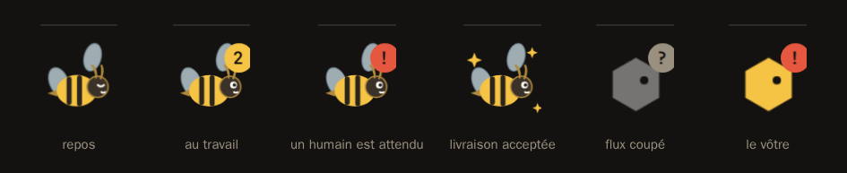

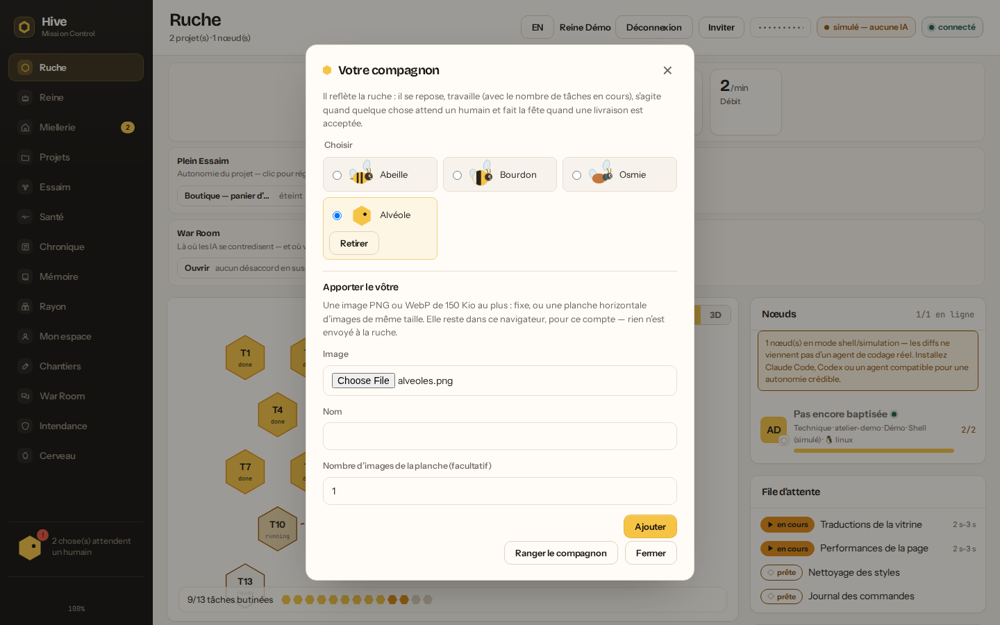

## 🐝 Le Rayon — voir le code, voir l'IA travailler

Ce que les membres voyaient jusqu'ici, c'étaient des **tâches** : des titres,
des états, des diffs. Jamais le code. On travaillait sur un projet sans pouvoir
l'ouvrir — comme aider à réparer un moteur sans avoir le droit de soulever le
capot. Le Rayon ouvre le capot.

| Ce qu'on y trouve      | Pour qui                                                                                                                                               |
| ---------------------- | ------------------------------------------------------------------------------------------------------------------------------------------------------ |
| **Arbre + éditeur**    | Toute abeille qui a accès au projet. Coloration pour 16 langages, fichiers bornés à 512 Ko.                                                            |
| **L'Aperçu**           | Le site que l'IA vient d'écrire, **rendu** — pas seulement son diff.                                                                                   |
| **La retouche**        | La Reine seulement. Corriger une ligne à l'écran crée une **tâche**, jamais une écriture. Filet `avant_retouche` (patch inverse) avant la proposition. |
| **Sauvegardes**        | Timeline d’étapes (diff capturé) ; **voir / copier le patch** ; restaurer ouvre une **tâche** puis raccourci Miellerie.                                |
| **Le lien de partage** | Montrer l'avancement et le code **sans donner la ruche** : jeton distinct, expirable, révocable.                                                       |

**Le hub tient son propre miroir** : un clone superficiel en lecture seule par
projet (`data/rayons/<id>`), rafraîchi au plus une fois par minute. Passer par
l'API GitHub aurait exigé le **jeton de l'hôte** — montrer le code à une abeille
dépenserait pour elle un droit qui n'est pas le sien. **`.git` n'est jamais
servi** : il contient `config`, donc l'URL distante, donc les identifiants du
dépôt privé ; ni `.env`, `.npmrc`, `id_rsa` et les extensions de clés.
Le miroir montre les **octets que le dépôt stocke** : aucun filtre ni
conversion du `.gitattributes` (fins de ligne, `$Id$`, encodage) n'est
appliqué, et **un fichier Git LFS apparaît comme son pointeur** (quelques
lignes `version … oid sha256:… size …`), jamais téléchargé — dans l'arbre comme
dans l'Aperçu. Un dépôt encore vide donne un Rayon vide ; si la branche par
défaut de l'amont change, le miroir est recloné sur la nouvelle — à côté de
l'ancienne copie, qui reste servie tant que le nouveau clone n'a pas réussi.
Un amont dont le `HEAD` ne désigne aucune branche existante est signalé comme
une panne, pas comme un dépôt vide.

**La retouche ne s'enregistre pas — elle se propose.** Le miroir est une copie
jetable : y écrire donnerait l'illusion d'avoir corrigé quelque chose, jusqu'au
prochain rafraîchissement qui effacerait tout en silence. Une modification
devient donc une **tâche** avec le contexte du fichier, qui passe par la revue
comme n'importe quelle production. Un porteur de lien de partage **lit** ; il ne
fabrique pas de travail pour l'essaim de quelqu'un d'autre.

**L'Aperçu s'exécute dans une origine opaque.** Prévisualiser un site que l'agent
vient d'écrire, c'est exécuter dans votre navigateur du HTML et du JavaScript que
personne n'a relus : servi en même origine que le tableau de bord, trois lignes
suffiraient à envoyer votre jeton de session ailleurs. Le document est donc replié
en un seul fichier auto-suffisant et affiché dans une `<iframe sandbox>` **sans
`allow-same-origin`** — le cadre ne lit ni le `localStorage`, ni les cookies — avec
une `Content-Security-Policy` qui coupe le réseau (`connect-src 'none'`,
`form-action 'none'`) et sans aucune navigation possible.

**Faire entrer une ouvrière dans un projet privé** se fait depuis le panneau
« Équipe » de la vue Projets. Un dépôt importé de GitHub arrive **sans
propriétaire** — l'import s'authentifie par le jeton de ruche, qui n'est le
compte de personne : un administrateur l'**adopte** d'abord, puis admet qui il
veut. On admet par **identifiant de compte**, jamais par courriel : le courriel
ferait de cette route un oracle « ce courriel a-t-il un compte ici ? »
interrogeable par tout propriétaire de projet. Chacun lit son propre
identifiant sur cette même carte, et le donne comme on se passe un billet.

**Partager en lecture** se fait depuis le panneau « Partage en lecture » de la
vue Projets, et donne une URL à coller :

```
https://<votre-tunnel>/#/rayon/<projet>?partage=hive3_…
```

Celui qui l'ouvre n'a **ni compte ni jeton de ruche** : il arrive sur un écran
dépouillé qui dit ce qu'il est (lecture seule), montre l'avancement et le code,
et rien d'autre — pas de barre latérale, pas d'essaim, pas de journal, et aucun
bouton de retouche. Il ne voit pas non plus **qui** travaille : les identifiants
de nœuds nomment les machines de gens qui n'ont pas consenti à figurer dans un
lien qu'on fait circuler. Le jeton voyage après le `#` — donc il n'apparaît dans
aucun journal d'accès — et il est retiré de la barre d'adresse dès qu'il est
rangé.

Le jeton de partage n'est **pas** le jeton de ruche : il porte deux actes
seulement (voir l'avancement, lire le code), vaut pour **un** projet, expire
(7 jours par défaut, 90 au plus) et se révoque un par un sans toucher aux
autres.

**Supprimer un projet** se fait en bas de sa carte, dans la vue Projets — ou
par `DELETE /api/projects/<id>`. C'est une **suppression**, pas un archivage :
tâches, résultats, journal, mémoires du Hive Mind (et leurs propositions en
attente), consignes de routage, dépenses de délégation, autorisations et
journal des connecteurs externes, missions rejouables et leurs instantanés,
comparaisons du banc d'ombre, liens de partage, membres et miroir du code
quittent la Reine. Un rejeu de ce projet (un AUTRE projet) reste un rejeu —
ses actions irréversibles restent simulées — et sa comparaison dit sa source
absente. Il ne reste qu'une ligne d'audit,
`project_deleted` (qui, quand, quel nom, combien de lignes), que l'élagage du
journal épargne pour les 1 000 suppressions les plus récentes. Il faut un
**compte** : le propriétaire, ou un administrateur (le seul pour un projet sans
propriétaire) — le jeton de ruche seul ne supprime aucun projet (ADR 0007) — et
la confirmation exige de **retaper le nom** du projet. Des tâches qui tournent font refuser la suppression (la liste est
affichée) ; la redemander avec `force=true` les annule d'abord. Un merge, un
chantier ou une livraison en vol, un cycle d'autonomie, un abonnement actif ou
une machine encore chez le fournisseur la font refuser même forcée : ceux-là ne
s'annulent pas. Les ateliers des ouvrières se nettoient chez elles ; une branche
de mission livrée sur un nœud y reste. Les épisodes du Cerveau nés du projet
(titre, objections, rejets de l'Evaluator) partent aussi ; les notes du Cerveau
écrites à la main restent. Un épisode ou un souvenir né d'un projet **privé**
ne sert ailleurs qu'aux projets du même propriétaire, ou, s'il n'en a pas, aux
projets sans propriétaire, dont les membres sont les siens (voir Hive Mind).

## 📦 L'environnement — l'agent installe ce dont il a besoin

`npm test` sur un clone frais échoue faute de `node_modules`. Le merge accepte
donc une **préparation** avant les tests :

```bash
npm run cli -- merge-run <projectId> -- --preparer npm ci --tester npm test
# ou les deux champs du panneau « Plan de merge » dans ⬡ Projets
```

**La préparation installe ce que le DÉPÔT déclare, jamais ce que la COMMANDE
nomme.** `npm ci` lit le `package-lock.json` du dépôt ; `npm install lodash`
laisse le hub choisir ce qui s'exécute sur la machine d'un membre. Sont donc
refusés : les binaires qui n'installent rien (`sh`, `curl`, `make`), les
sous-commandes qui ne sont pas des installations (`npm run deploy`), les
arguments qui nomment un paquet, et les drapeaux qui déplacent la **source**
(`--index-url`, `--registry`, `--userconfig`…). La préparation passe par le bac
à sable du nœud, comme les tests.

Si l'installation échoue — machine hors ligne, registre injoignable, lockfile
désaccordé — **les tests ne sont pas lancés** et le rapport le dit : « environnement
non préparé ». Un `✘ tests rouges` vous aurait envoyé chercher une régression
dans du code qui va très bien.

## 🌿 Livrer sans GitHub — une mission, une branche

La livraison GitHub ouvre une pull request **par tâche**, avec la clé de l'hôte.
Un projet sur GitLab, Gitea, un dépôt nu d'un serveur maison — ou un dépôt du
disque de l'hôte — se livre autrement : la mission **entière**, intégrée par une
ouvrière, commitée sur **une** branche du dépôt du projet.

```bash
npm run cli -- livrer-local <projectId>                       # commite, garde la branche sur l'ouvrière
npm run cli -- livrer-local <projectId> --pousser --preparer npm ci --tester npm test
npm run cli -- livrer-local <projectId> --forcer="relu à la main"   # passer outre l'Evaluator
npm run cli -- livrer-local <projectId> --prolonger=1         # corriger : avancer hive/mission-<projectId>-1
# ou « Livrer la mission » dans ⬡ Projets, sous « Ce que devient le travail livré »
```

- **La branche** s'appelle `hive/mission-<projectId>-<n>`, `n` suivant la plus
  grande déjà prise — sur l'ouvrière, dans le dépôt, ou au journal de la ruche
  (une branche gardée sur une autre ouvrière). Le commit est l'arbre
  **intégré**, composé avant la préparation et les tests : ni `node_modules`,
  ni ce qu'un test aurait réécrit. Après eux, plus aucune commande git ne
  touche le clone : ce que le code testé écrirait dans son `.git` (`origin`,
  crochets, HEAD) ne décide ni du parent, ni de la destination. La branche
  principale n'est jamais touchée.
- **La provenance voyage dans le commit**, en trailers que git relit
  (`git log --format='%(trailers)'`) : `Hive-Task`, `Hive-Result` (le résultat
  exact intégré, `inconnu` s'il n'en porte pas), `Hive-Evaluator` (le verdict au
  moment de livrer), `Hive-Evaluator-Forced` (la raison d'un forçage),
  `Hive-Tests`.
- **Rien n'est commité** si une tâche est en conflit (une intégration partielle
  n'est pas la mission), si la préparation échoue ou si les tests sont rouges —
  et le rapport le dit. Si l'ouvrière se tait en route (déconnexion, délai
  dépassé), le rapport dit **« issue inconnue »** plutôt que « rien de
  commité » : elle a pu commiter, et même pousser, avant de disparaître.
- **Une livraison à la fois par projet, et seule** : pendant qu'elle tourne,
  un merge d'essai du même projet est refusé (et l'inverse) — son rapport
  écraserait celui de la livraison.
- **L'Evaluator garde la porte**, comme pour la livraison GitHub, et juge la
  production **exacte** intégrée : une tâche en `correction_required` ou
  `rejected` arrête la mission. Le propriétaire (ou un
  administrateur, ou le jeton de ruche sur un projet sans propriétaire) peut
  passer outre en donnant une raison ; le geste est journalisé
  (`evaluator_overridden`). Un membre du projet ne livre pas.
- **Sans `--pousser`**, la branche est rangée sur l'ouvrière, dans
  `livraisons/<projectId>.git` sous son répertoire de travail (un dépôt nu dont
  `origin` est le dépôt du projet, identifiants retirés) : `git fetch` depuis ce
  chemin, ou `git -C … push origin hive/mission-…` sur l'ouvrière.
- **Avec `--pousser`**, l'ouvrière pousse vers l'adresse du projet que la
  ruche lui a envoyée, avec **ses** identifiants git — ceux du clone —, jamais
  en force, jamais une autre branche. Un dépôt qui ne répond pas en deux
  minutes (des identifiants attendus ?) fait échouer la poussée, qui le dit.
  Elle ne le fait que si son opérateur l'a lancée avec
  `HIVE_LIVRAISON_POUSSER=1` : le dépôt et le diff viennent du hub, et le jeton
  de ruche circule sur chaque machine membre. Et seul l'hôte le demande (jeton
  de ruche ou compte administrateur) : l'opérateur a consenti pour la ruche, pas
  pour chaque propriétaire d'un projet inscrit. Sans ouvrière consentante, la
  demande est refusée **avant** tout travail, avec cette marche à suivre. Un
  refus du dépôt distant remonte lavé de tout identifiant, et la branche reste
  rangée sur l'ouvrière.
- **Corriger une mission livrée**, c'est la **prolonger** (`--prolonger=<n>`)
  plutôt qu'ouvrir `hive/mission-<projectId>-<n+1>` : la ruche confie le merge
  à l'ouvrière qui tient la branche, le nouveau commit a pour **unique parent**
  la tête que le journal lui connaît (trailer `Hive-Suite`), et la branche
  avance sans jamais être forcée. Si le dépôt porte sur cette branche des
  commits que la ruche n'a pas livrés, rien n'est commité et le rapport le dit :
  prolonger effacerait leur travail. Trois prolongations au plus par branche.
  C'est la même règle que la reprise d'une pull request GitHub, qui fait
  **avancer la branche de la PR** au lieu d'en ouvrir une seconde.

## ⟲ Missions rejouables — le Time Travel

Le Time-Lapse de la Chronique **remonte** le temps ; une mission rejouable se
**rejoue**. Une mission est un épisode d'activité d'un projet : elle s'ouvre
quand une tâche vit sur un projet qui n'avait plus rien en vol — à sa
naissance, au plus tard à sa première affectation, ou quand une tâche finie
est relancée — et se clôt quand plus rien n'y vole (relectures comprises). Ses
tâches sont rangées une à une : une tâche relancée n'entraîne pas la mission
précédente avec elle. La Reine prend alors un **instantané** à chaque bord —
plan et graphe des tâches, prompts, modèles (commandés, déclarés, offerts),
politique de routage et **version du Genome** (son empreinte et ses
antécédents), niveau d'autonomie, garde-fous et plafond de dépense, artefacts
(branches, pull requests, branche de mission), décisions typées. Une revue
humaine ou une livraison qui tombe après la clôture re-prend l'instantané de
fin. Aucune raison humaine, aucune objection, aucun identifiant n'y entre.

```bash
GET  /api/projects/<id>/missions                      # les missions, résumées
GET  /api/projects/<id>/missions/<missionId>          # les deux instantanés
POST /api/projects/<id>/missions/<missionId>/rejouer  # {modele?, politiqueRoutage?, autonomie?}
GET  /api/projects/<rejeu>/rejeu/comparaison          # source contre rejeu
# ou « Missions · Time Travel » dans ⬡ Projets
```

- **Rejouer** crée un projet NEUF sur le même dépôt (donc des branches et des
  bacs neufs), recrée le plan de début — ni les relectures ni les délégations,
  que le rejeu refera lui-même — et lui impose, au choix : un **modèle** (les
  tâches attendent un nœud qui l'offre, et le disent : `rejeu_modele_absent`),
  une **politique de routage** (`apprise` : le vécu d'aujourd'hui ; `figee` :
  le Genome figé au début de la mission ; `neutre` : aucun vécu) et un **niveau
  d'autonomie** — sous le **même plafond de dépense** que la source. C'est un
  réglage : propriétaire ou administrateur.
- **Rien d'irréversible ne part d'un rejeu.** Pull request, fusion, commit de
  mission, poussée, workflow GitHub — et la ruche autonome — sont **simulés** :
  rangés (une fois), journalisés (`rejeu_action_simulee`), jamais exécutés ; la
  route répond `409 rejeu_simule` (rien n'est parti) et la ruche autonome passe
  à autre chose. Seul un humain connecté avec un **compte qui répond du
  rejeu** — son propriétaire ou un administrateur de la ruche, qui doit aussi
  répondre de chaque projet tenant le même dépôt — peut en valider un : « Valider pour de vrai » à l'écran, `--valider-rejeu` en ligne de
  commande (`livrer`, `livrer-local`, `fusionner`), ou `validerRejeu: true`
  dans la demande ; le jeton de ruche, que chaque machine porte, ne valide
  jamais. Les **connecteurs externes** (Slack, webhook) se taisent aussi : ce
  qu'ils auraient envoyé d'un rejeu — un fait, ou le test de l'Intendance —
  est rangé et journalisé de même, et aucun relais n'a de validation humaine.
- **La comparaison** met côte à côte le résultat, le coût déclaré (avec sa
  couverture), le temps modèle, le temps des ouvrières, la durée, les tests,
  les relectures, les revues humaines et les décisions. Elle ne calcule que sur
  du déclaré : un côté muet rend l'écart **inconnu**, une mission en vol est
  dite **provisoire**, un journal élagué pendant la mission est dit
  **incomplet**. Une tâche annulée y a son propre statut, distinct d'un échec
  — dans la frise de la Chronique aussi. La lire exige aussi de lire le projet
  **source** (`403 source_illisible` sinon) : elle montre le plan de la mission
  source. Un projet source supprimé emporte ses instantanés, et la comparaison
  dit `source_elaguee` ; les tâches que le rejeu a recopiées à sa création sont
  les siennes et restent jusqu'à ce qu'on le supprime.

<p>
  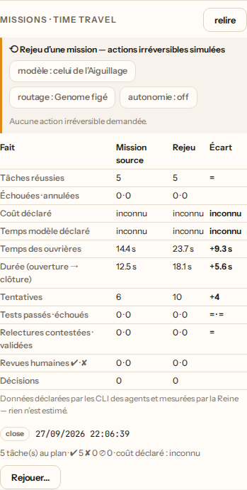
  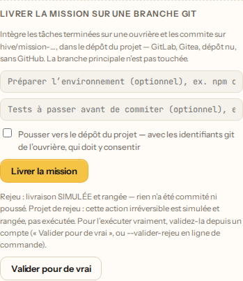
  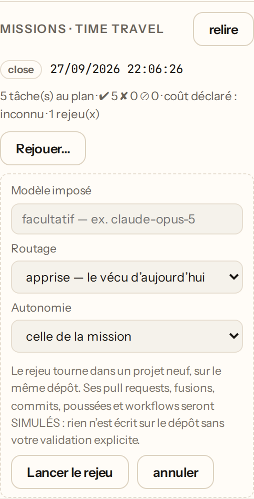
</p>

## 👑 La Reine répond — parler à la ruche

Chaque membre (donneur d'ordre comme porteur de nœud) peut interroger la ruche
en langage naturel — la langue du message est détectée et la réponse arrive
dans cette langue. La Reine applique l'**Intelligence Core** (spec :
`docs/QUEEN-INTELLIGENCE-CORE.md`) : diagnostic stratégique, réutilisation
des technologies existantes, catégories de ressources A/B/C/D, et réduction de
la dépendance humaine — tout en ne citant que l'état réel de la ruche pour les
questions de suivi :

```bash
npm run cli -- ask "Où en est le projet ?"
npm run cli -- ask "Which node works best?"
# ou : POST /api/chat { "message": "…", "projectId"?: "…", "stream"?: true }
#     · Accept: text/event-stream → deltas puis done
#     · vue 👑 Reine et `hive ask` (même chemin SSE progressif)
```

Deux modes, jamais bloquants : **état réel** (réponses déterministes composées
depuis les rapports, le pouls, le nectar, les anomalies et la mémoire — 100 %
hors-ligne) et **IA** (si `ANTHROPIC_API_KEY` est définie côté Queen :
`HIVE_CHAT_MODEL`, défaut `claude-haiku-4-5` ; la clé ne quitte jamais
l'orchestrateur, et le modèle ne reçoit que les chiffres réels de la ruche).
État réel comme IA **fluxent** en SSE quand le client le demande (`stream:
true` ou `Accept: text/event-stream`) — la bulle Reine du dashboard et
`npm run cli -- ask` partagent ce chemin. Quitter la vue, **Effacer**, ou
**Ctrl+C** sur `hive ask` coupe le flux (pas de bulle d’erreur /
`(interrompu)`). Le prompt voit aussi, en lecture seule, le **travail en
cours**, les **sous-agents** et l’état **Plein Essaim** — la Reine n’élève
jamais l’autonomie ni ne réécrit git. La Reine guide aussi le donneur d'ordre :
bonnes pratiques par type de projet (web, API, mobile, data, e-commerce, CLI)
et structure de brief efficace. En mode IA, le décompte de **tokens** Anthropic
s’affiche sur chaque réponse (et en session). La barre de modes relie Chat →
Plan (Projets / Queen Bee) → Autonomie (Plein Essaim sur le projet) →
Sauvegardes (Rayon). S’il y a des échecs récents et une étape, la Reine propose
une puce **Restaurer…** qui ouvre la timeline du Rayon.

## 🪑 Chambre — poste d’ouvrière (ADR 0010)

Depuis la **fiche d’un nœud** (vue Ruche) → **Ouvrir la Chambre**
(`#/chambre/<nodeId>`, libellé · baptême si constaté) : identité baptisée, métier de cycle, caste, fichiers
ouverts **constatés** (Read/Edit/Write), **Journal** et **Missions** de **cette**
ouvrière, et l’**Ordinateur** = Atelier noVNC (ou « éteint » — pas de faux
bureau). Sur les **cartes nœud**, le baptême constaté (`GET /api/baptemes`,
jeton ruche) remplace le nom technique en titre — sinon « Pas encore
baptisée ». Sur le **Rayon**, des curseurs montrent qui lit/édite quel chemin
(baptême, sinon silence) — un clic ouvre la **Chambre** de cette ouvrière ;
le bandeau **En train de…** liste les présences même si le miroir du dépôt
est vide — un clic sur le **chemin** ouvre le fichier dans l’arbre. Sur
l’**Essaim**, les cartes ouvrières (et le Waggle) portent le
baptême constaté ; un clic ouvre aussi la **Chambre**. Les **réquisitions**
(clé API, MCP, binaire, atelier, logiciel) s’accordent ou se refusent depuis la
Chambre — Accorder n’est plus un no-op : `cle_api` ouvre le modal `.env` Queen ;
`atelier` allume le bureau de recette ; `mcp` / `logiciel` proposent une entrée
Fabrique ; `binaire` rappelle d’installer l’outil sur le poste. En cours de tâche,
un échec infra auth ouvre `cle_api` ; un CLI absent (ENOENT) ouvre `binaire` —
pause, reprise après Accorder. Les secrets
restent chez la Queen (jamais en base ni poussés aux nœuds distants). Un lien
de partage **ne voit jamais** ces identités.

La **fabrique** propose un outil (script npm, pont, MCP) comme tâche → revue →
merge ; Chantiers ne peut le lancer qu’**après** merge et déclaration dans
`package.json`. L’**horizon** tient un carnet faits ≠ hypothèses (sans gonfler
l’instantané). Les **motifs** inter-projets (ex. jeu-3d : fabrique avant assets)
créent des tâches ordonnées — jamais le diff d’un autre dépôt — avec aperçu des
étapes et confirmation avant application. Les **procédures perso** (par projet)
se créent aussi depuis la Chambre.

À l’écran : bandeau **À trancher** (réquisitions), **Journal** avec
**flux outils** constatés (pastilles READ/EDIT/WRITE), **Missions** filtrées,
onglets Fiche / Travail / Intégrations / Suivi (horizon + fabrique).
**Voir le Rayon** pose le focus sur la présence la plus récente (sinon
navigation seule). Échap → Ruche, sauf saisie / dialogue / iframe Atelier.
Maquette : `docs/maquettes/chambre/`.
Dans la vue 👑 Reine du tableau de bord : **micro** (dictée Web Speech du
navigateur), **voix** (lecture à haute voix des réponses), et **joindre** des
documents (PDF, Word `.docx`, texte, code…). Le navigateur **extrait le texte**
avant l’envoi — la vidéo et l’audio ne sont pas transcrits automatiquement
(joignez un script ou dictez). Aucune clé d’API ne traverse le navigateur.

## 🧠 Queen Bee — du brief au DAG (Palier 2)

Dans **« Nouveau projet »**, décrivez l'objectif en langage naturel et cliquez
**« ✨ Générer les tâches »** : Hive propose un graphe de tâches, éditable avant
lancement. Queen Bee applique la même **Intelligence Core** : diagnostic du brief,
biais vers les solutions existantes, tâches marquant les besoins humains (clés,
décisions), et rationale explicite. En terminal : `POST /api/plan { "brief": "…" }`.

Le planner est **pluggable**, avec repli automatique — jamais bloquant :

| Mode            | Quand                                          | Coût / clé                |
| --------------- | ---------------------------------------------- | ------------------------- |
| **Heuristique** | Défaut. Découpage déterministe par mots-clés.  | Hors-ligne, gratuit       |
| **IA (Claude)** | Si `ANTHROPIC_API_KEY` est définie côté Queen. | Clé **locale** à la Queen |

```bash
# Activer le planner IA (facultatif) — la clé ne quitte jamais l'orchestrateur.
ANTHROPIC_API_KEY=sk-ant-…            # présence → mode IA, sinon heuristique
HIVE_PLANNER_MODEL=claude-haiku-4-5   # défaut rapide/économique ; opus pour + de finesse
```

## 🧩 Hive Mind — la ruche apprend (Palier 2)

La ruche garde une **mémoire partagée** : chaque production **validée** laisse
un _souvenir_ (ce qui a été fait + la réponse de l'agent). Avant d'assigner une
nouvelle tâche, l'orchestrateur récupère les souvenirs les plus pertinents et
**les injecte dans le prompt de l'ouvrière** — les tâches suivantes profitent du
travail déjà accompli.

Ce qu'un projet apprend (souvenirs du Hive Mind comme épisodes du Cerveau)
sert à une tâche d'un autre projet quand la source est **publique**, quand les
deux projets ont le **même propriétaire**, ou **aucun** (la ruche au seul jeton,
une personne et ses projets), et que chaque membre du projet cible est aussi
membre du projet source (sans aucun membre, rien à vérifier). Une tâche choisit ses souvenirs par
son titre et son prompt : sans cette condition, une personne invitée dans un
seul projet d'Alice lirait, par ses tâches, le savoir de tous les autres. Le
savoir d'un projet partagé coule donc vers les projets privés d'Alice, jamais
l'inverse. Entre propriétaires différents, ou entre un projet possédé et un
projet sans propriétaire, un projet **privé** garde son savoir pour lui. Être
membre n'élargit jamais rien. Le projet ne figure jamais dans le prompt. La
Reine (`/api/chat`) ciblée sur un projet suit la même règle ; sans projet
ciblé, comme le panneau Hive Mind et `GET /api/hive-mind`, réservés au jeton de
ruche, elle voit toute la mémoire.

Une réussite déclarée par l'ouvrière ne suffit pas : le souvenir n'entre en
mémoire que lorsque l'**Evaluator accepte** la production ou qu'un **humain
l'approuve** en revue. « Acceptée » exige tout à la fois : Gardiennes propres,
**tests verts** venus d'un bac à sable (bubblewrap, podman ou docker sur le
nœud) ou de la CI GitHub, et une contre-revue favorable d'une **autre famille
d'agent**. Une production sans diff n'est jamais relue. Sur une installation
par défaut — une seule famille, ni bac ni CI — le Hive Mind reste donc **vide
tant qu'un humain n'approuve pas** les productions en revue.

L'approbation humaine ne rachète pas une objection : objection d'une
relectrice, validation rouge, signal suspect des Gardiennes ou désaccord avec le
Parlement gardent le souvenir dehors, et le journal dit pourquoi
(`memory_withheld`). Un rejet (objection, CI rouge, rejet humain) retire un
souvenir retenu ; l'annulation de l'approbation humaine qui SEULE le validait
aussi. Les relectures n'en laissent jamais. Le journal le dit :
`memory_recorded` (avec qui a validé), `memory_forgotten` (avec pourquoi) et
`memory_withheld`. Un souvenir écrit avant cette règle, à la simple réussite,
est retiré de la même façon quand sa tâche est rejetée.

Les échecs, eux, vont au **Cerveau** (dossier `cerveau/`, à côté de la base) :
échec d'une ouvrière, objection d'une relectrice et rejet de l'Evaluator
laissent chacun un _épisode_ attribué — agent, modèle commandé, nœud, tâche et
résultat exacts. Une production rejetée laisse un seul épisode, quelle que soit
la porte arrivée la première. Un rejet de l'Evaluator se compte par tâche :
deux tâches sans rapport aux tests rouges font deux épisodes, pas un motif. La
ruche pose `serviLe` (dernier service) sur un épisode au plus une fois par jour
quand il part vers une ouvrière ; les notes écrites à la main ne sont jamais
réécrites.

La récupération est **100 % hors-ligne** (scoring lexical type BM25, sans
embeddings ni API), donc déterministe et sans coût. Le dashboard affiche un
**panneau Hive Mind** (recherche + souvenirs récents, en direct). Interrogez la
mémoire :

```bash
npm run cli -- mind "authentification jwt"   # souvenirs les plus pertinents
npm run cli -- mind                          # souvenirs récents
# ou : GET /api/hive-mind?q=…
```

## 🌗 Le banc d'ombre — deux modèles, la même petite tâche

L'Aiguillage n'apprend que de ce qu'il a choisi : deux modèles ne se mesurent
jamais sur la même tâche. Le **banc d'ombre**, allumé projet par projet, fait
rejouer une petite tâche testable, tirée au sort (5 % par défaut), par un
**second modèle**, dans le bac isolé d'une ouvrière (bubblewrap ou conteneur,
sans les identifiants de l'hôte). Cette ombre **ne se livre jamais** :
ni livraison, ni merge, ni rapport. Les deux productions passent par les
validations du bac, les Gardiennes, la contre-revue et l'Evaluator. **Les tests
du projet** départagent, et la contre-revue ne pèse que sur la confiance.

Le budget est exigé à l'allumage : un nombre d'ombres et un coût déclaré au
plus par 24 h glissantes, une seule ombre en vol à la fois. Les comparaisons se
lisent dans le registre Genome (provenance `shadow`) et **ne changent aucun
poids du routing**, tant que leur pondération n'est pas choisie.

```bash
# ou le panneau « Banc d'ombre » dans ⬡ Projets
curl -X POST http://localhost:7777/api/projects/<projet>/banc-ombre \
  -H "x-hive-token: $HIVE_TOKEN" -H 'content-type: application/json' \
  -d '{"actif": true, "executionsParJour": 3, "plafondCoutUsd": 1}'
```

Critères d'admission, budget, confiance et limites :
**[BANC-OMBRE.md](BANC-OMBRE.md)**.

## 🕸️ Graphe d'expérience — relier ce que la ruche a vécu

Le graphe **relie** des faits déjà rangés — journal, Cerveau, revues, tests —
sans en créer un seul : projet, mission, tâche, ouvrière, version de modèle,
décision, revue, test, erreur, leçon et production, reliés par `produced_by`,
`reviewed_by`, `failed_with`, `fixed_by`, `validated_by`, `similar_to`,
`derived_from` et `supersedes`. Chaque nœud et chaque lien portent leur
**provenance** (l'id de l'événement du journal, ou la note du Cerveau) et leur
**date**. C'est une projection en mémoire, refaite à la demande : aucune table.

Trois natures ne se confondent jamais : les **faits** (le journal), les
**corrélations** (« ces deux tâches nomment les mêmes fichiers », « la réussite
a suivi cette erreur ») et les **leçons validées** (une note écrite dans le
Cerveau, un souvenir Hive Mind validé). Une corrélation n'est jamais rangée
comme un fait, et ne devient jamais une règle. Un souvenir Hive Mind n'y entre
comme leçon que lorsque le journal nomme QUI l'a validé (l'Evaluator ou un
humain, `memory_recorded.source`) : la parole seule de l'ouvrière n'en fait
pas une.

À chaque affectation, les tâches passées qui **ressemblent** à la nouvelle —
mêmes signatures d'erreur, mêmes fichiers nommés, même catégorie — sont jointes
au prompt de l'ouvrière comme **données non fiables** : titre, traits communs,
issue, modèles, titres des leçons liées, jamais le contenu que Hive Mind, la
Couveuse ou le Cerveau portent déjà. Le tiroir d'une tâche les montre sous
« Pourquoi ce Worker, ce modèle » — des corrélations, pas la raison du choix.

**Isolé par défaut** : une ouvrière ne reçoit que l'expérience de son projet.
La fédération entre projets est un réglage de l'hôte, dans le `.env` de la
Reine :

```bash
HIVE_EXPERIENCE_PORTEE=ruche   # défaut : projet
```

Fédérée, l'ouvrière de A lit aussi les titres, fichiers et modèles des tâches
voisines des autres projets dont le savoir lui est admis — la règle des
souvenirs et des épisodes (voir Hive Mind) : projets **publics**, ou projets
privés du même propriétaire dont l'auditoire inclut celui de A. Le réglage de
l'hôte ne fait jamais passer l'expérience d'un projet privé chez une autre
personne. Le journal de A, lui, ne les recopie pas : le
tiroir dit « une tâche d'un autre projet », sans son id, son projet ni son
titre.

La vue 🧠 **Mémoire** montre le graphe d'un projet (liste et voisinage d'un
nœud) ; « Toute la ruche » est réservée aux administrateurs. Le graphe d'un
projet nomme les erreurs, les leçons et les décisions du Cerveau par leur
seul id : leurs titres parlent de toute la ruche (celui d'une erreur est le
titre de la dernière tâche qui l'a rencontrée, de n'importe quel projet), et
ne se lisent que dans « Toute la ruche ».

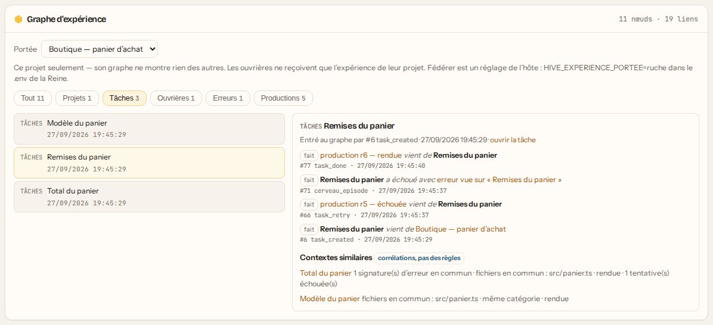

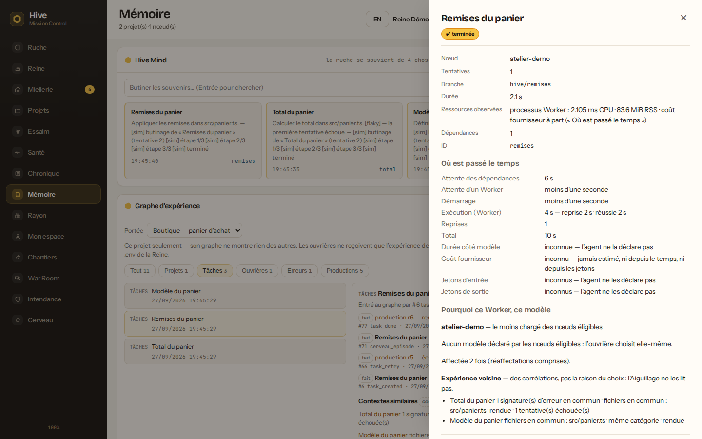

```bash
# GET /api/projects/:id/experience[?genre=task][&noeud=task:<id>]
# GET /api/admin/experience            (compte administrateur)
```

## ⚖️ Débat et critique — une objection atteint la correction

Une production réussie est relue par un modèle d'une **autre famille** ; si le
relecteur conteste — ou si un humain la rejette en Miellerie —, l'Evaluator la
remet en file. La tentative suivante ne repart pas à l'aveugle : elle reçoit,
dans un bloc de données borné, **les objections, les motifs de l'Evaluator et
la raison de l'humain** (champ facultatif à côté du bouton « Rejeter »). La
Miellerie affiche sous chaque tâche la critique que sa tentative a reçue.

Le relecteur termine par une ligne `HIVE_CRITIQUE` : des constats classés par
**sévérité** (`bloquant`, `majeur`, `mineur`, `info`) et par **critère**
(`correction`, `securite`, `tests`, `performance`, `lisibilite`,
`conformite`), chacun avec sa preuve. Un constat bloquant ou majeur fait
corriger ; une remarque mineure ou info ne relance jamais la production. La
Miellerie et la War Room comptent les constats par critère.

Le protocole complet — seuils du Conseil, règles de l'Evaluator, portes de
retry, issues d'un désaccord — est dans
**[PROTOCOLE-DEBAT.md](PROTOCOLE-DEBAT.md)**.

## 📜 Le journal garde ses preuves

Tout ce que la ruche fait passe par son **journal**, et le journal est borné.
Deux familles d'événements n'y vivent pas le même temps :

- les **traces** (progrès d'agent, nœuds, Conseils, gestes d'accès) : les
  **5 000 derniers** événements, que les écrans rattrapent en direct et que la
  Chronique, le Pulse, le Waggle et le Ghost replient ;
- les **preuves** d'une tâche — CI et bac, relectures croisées et leurs
  verdicts, revue humaine, renvois et critiques, raison du routing, faits du
  registre Genome, provenance d'une livraison, mesure du Worker — vivent **avec
  leur tâche** : tant que la ruche peut encore en décider quelque chose (en
  vol, en attente d'une revue, d'une livraison ou d'une fusion), aucune nuit de
  bavardage ne les efface ; close (échouée, fusionnée, rejetée sans nouvel
  essai), elle les garde **trente jours** ; disparue, elle ne garde rien.

Un **plafond de 50 000 lignes** borne le tout en dernier recours : il retire
d'abord les preuves des tâches closes les plus anciennes, puis celles des tâches
ouvertes restées le plus longtemps inactives — **tâche par tâche**, jamais la
moitié d'un dossier. Si cela ne suffit pas (une tâche qui **boucle** —
refusée puis réassignée toutes les trois secondes — a toujours une preuve
récente), il **coupe** en tout dernier : d'abord les preuves qu'une plus
récente du même type remplace, puis les plus anciennes. Le journal ne dépasse
jamais le plafond. Chaque passe qui retire quelque chose l'écrit au Journal
(« journal élagué : … », le plafond et la coupe nommés à part) et le compte
par type ; le registre Genome ne se dit « tronqué » que si des faits d'une
tâche encore connue ont pu disparaître (l'aveu est prudent : il peut le dire à
tort, jamais taire une perte).

**Limites connues.** Une tâche terminée qui attend encore une revue ou une
livraison garde ses preuves tant qu'elle existe — mais la tâche elle-même est
effacée trente jours après sa dernière mise à jour (`pruneTasks`), fusion ou
non, sauf si une dépendante ou une délégation la retient. Et l'historique d'une
délégation (`delegation_*`, rattaché à sa racine et non à une tâche) reste une
trace : il ne vit que dans la fenêtre des 5 000 derniers événements.

## 🌳 Délégation — un Worker confie une sous-tâche

Un Worker Claude Code ou Codex peut confier une sous-tâche bornée à un autre
Worker, par deux outils MCP : `hive_delegate`, puis
`hive_wait_for_delegation_result`. Les bornes sont écrites dans la description
même de l'outil, et chaque refus nomme celle qui a été franchie et ce qui
reste :

- au plus **3 niveaux** sous la tâche racine, **4 enfants** par parent,
  **16 descendants** par racine (enfants terminés compris) ;
- des budgets **cumulés par racine** — chaque enfant réserve sa part, qui ne se
  rend pas : **30 min**, **5 000 000 µUSD** (5 USD du coût _déclaré_ par le CLI
  de l'agent) et **4 unités** de ressources (un compte abstrait : rien n'est
  mesuré derrière).

Quand la dépense déclarée de l'arbre atteint son budget coût, plus aucun enfant
n'est admis, aucune correction ne repart, et ceux en vol sont annulés — chacun
avec sa raison, que le parent qui l'attend reçoit tout de suite — comme celui
dont l'enfant a échoué sans rien rendre. Une tentative sans coût déclaré, ou
interrompue avant d'avoir rendu (ouvrière perdue, annulation), n'est jamais
comptée pour zéro : le tiroir de la tâche dit « au moins ».

La réservation d'un enfant est aussi **son plafond, tenu dans la boucle de son
agent** : chaque tentative reçoit ce qu'il en reste — la réservation moins le
coût déclaré de ses tentatives précédentes, jamais le reste de la racine — et
Claude Code (≥ 2.1.217) s'arrête dessus (`--max-budget-usd`, au plus une
réponse de dépassement, documentée). La tâche finit alors **arrêtée par son
budget** : ni un échec de l'agent, ni une panne — pas de reprise, et le
registre Genome la compte interrompue. Un Claude Code plus ancien ne reçoit pas
le drapeau, et le journal de la tâche le dit ; Codex ne déclare aucun coût,
rien ne l'arrête dans sa boucle. Ce coût déclaré est l'estimation du CLI, pas
une facture.

Un parent qui attend ses enfants **relâche sa place à son propre arbre** sur
son ouvrière : un arbre ne s'interbloque plus sur un poste plein, et une autre
racine ne se glisse pas dans cette place — `maxConcurrency` borne toujours le
travail neuf.

`preferredAgent` / `preferredModel` ne font que **départager des ex æquo** —
l'Aiguillage garde le dernier mot, et la raison du choix dit si la préférence a
compté. L'**opérateur**, lui, peut forcer : dans le tiroir d'une tâche, la
**consigne de routage** impose ou exclut une famille d'agent ou un modèle
(propriétaire du projet ou administrateur). C'est une exclusion dure, que ni
les préférences ni une course de drones ne franchissent ; l'affectation est
consignée « forcée par l'opérateur », et aucun score appris n'est touché. Si
aucune ouvrière en ligne ne la satisfait, la tâche attend et le journal le dit.

## 🛡️ Sting Detector — prévention de conflits (Palier 2)

Deux tâches qui pourraient tourner **en même temps** (aucun ordre de dépendance
entre elles) et qui **touchent le même fichier** risquent de se marcher dessus.
Le Sting Detector les repère — analyse hors-ligne des titres/prompts, sans
exécuter d'agent :

- **Conflit fort** (même fichier cité) → l'ordonnanceur **diffère** l'une des
  deux jusqu'à ce que l'autre se termine (sérialisation, prévention effective).
- **Conflit faible** (fort recouvrement de vocabulaire) → simple **avertissement**
  dans le journal, jamais bloquant.

Un **panneau Conflits** apparaît dans le dashboard dès qu'un conflit est détecté,
les tâches retenues par sérialisation sont **marquées ⏸** dans la table, et les
événements défilent dans le Journal en temps réel.

```bash
npm run cli -- stings <projectId>            # conflits potentiels du projet
# ou : GET /api/projects/:id/conflicts
```

## 🔌 Connecteurs externes — webhook signé et Slack

La ruche **pousse ses faits vers l'extérieur** — une production qui attend un
verdict, une décision de revue, une tâche bloquée, une livraison fusionnée — et,
pour Slack, **reçoit des approbations**. Tout se règle dans **Intendance →
Connecteurs externes** (administrateur) :

- **Activer** : poser le secret du connecteur. Il est écrit dans le `.env` de la
  Reine (comme les clés d'API), **jamais en base, jamais envoyé à un nœud, jamais
  relu** — l'écran n'en montre que la présence.
- **Autoriser par projet** : un connecteur ne fait **rien** pour un projet qui
  ne l'a pas autorisé. On accorde des **portées** dans un ensemble fermé
  (`lecture`, `notification`, `approbation`, `action`), bornées par le **mode**
  du connecteur : un connecteur en lecture seule ne peut jamais approuver.
- **Tester** : envoie un fait de test et dit **l'issue réelle** (un récepteur
  en 500 n'est pas « envoyé ») ; un test par connecteur et par projet toutes
  les 10 secondes au plus (`429` sinon).
- **Journal** : chaque appel extérieur — réussi, raté ou refusé — laisse une
  ligne : qui, quel acte, quelle portée, quel résultat, l'empreinte SHA-256 du
  corps exact envoyé (caviardé au préalable) et un **aperçu caviardé d'au plus
  200 caractères** — jamais un secret, jamais la charge entière. 90 jours, et
  il part avec son projet quand celui-ci est supprimé.

**Webhook générique** : un `POST` JSON signé HMAC (en-tête `X-Hive-Signature`,
`t=…,v1=…`) vers l'URL que vous posez — `https://`, ou `http://` vers la
boucle locale seulement ; une redirection n'est jamais suivie. Il ne reçoit
rien.

**Slack** : le jeton de bot (`xoxb-…`, scope `chat:write`) poste dans les
**canaux inscrits** (par ID : `C0…`) — et seulement parmi ceux que
l'**administrateur** permet (`SLACK_CANAUX`, IDs séparés par des virgules,
posé dans l'Intendance) : un projet ne peut inscrire aucun autre canal, et sans
cette liste Slack ne poste nulle part. Les canaux et usagers inscrits d'un
projet, et son journal, ne se lisent que par son propriétaire ou un
administrateur. Le jeton d'app (`xapp-…`) ouvre le
**Socket Mode** — la seule voie entrante, sans URL publique. Un bouton
« Approuver » / « Rejeter » n'est appliqué que si le projet a accordé
`approbation` **et** que le canal **et** l'usager (`U0…`) sont inscrits ; listes
vides = personne. Il rejoint **la même revue** que la Miellerie — jamais une
autorité nouvelle ; le fait `task_reviewed` dit qu'il vient de Slack et de quel
usager, sans raison inventée — et chaque bouton est lié à la production qu'il montre : un
clic sur une tentative remplacée, ou sur un verdict changé depuis, est refusé
comme périmé. Le cliqueur voit l'issue dans Slack. Sans jeton d'app, les
demandes d'approbation partent **sans** boutons et renvoient à la Miellerie.

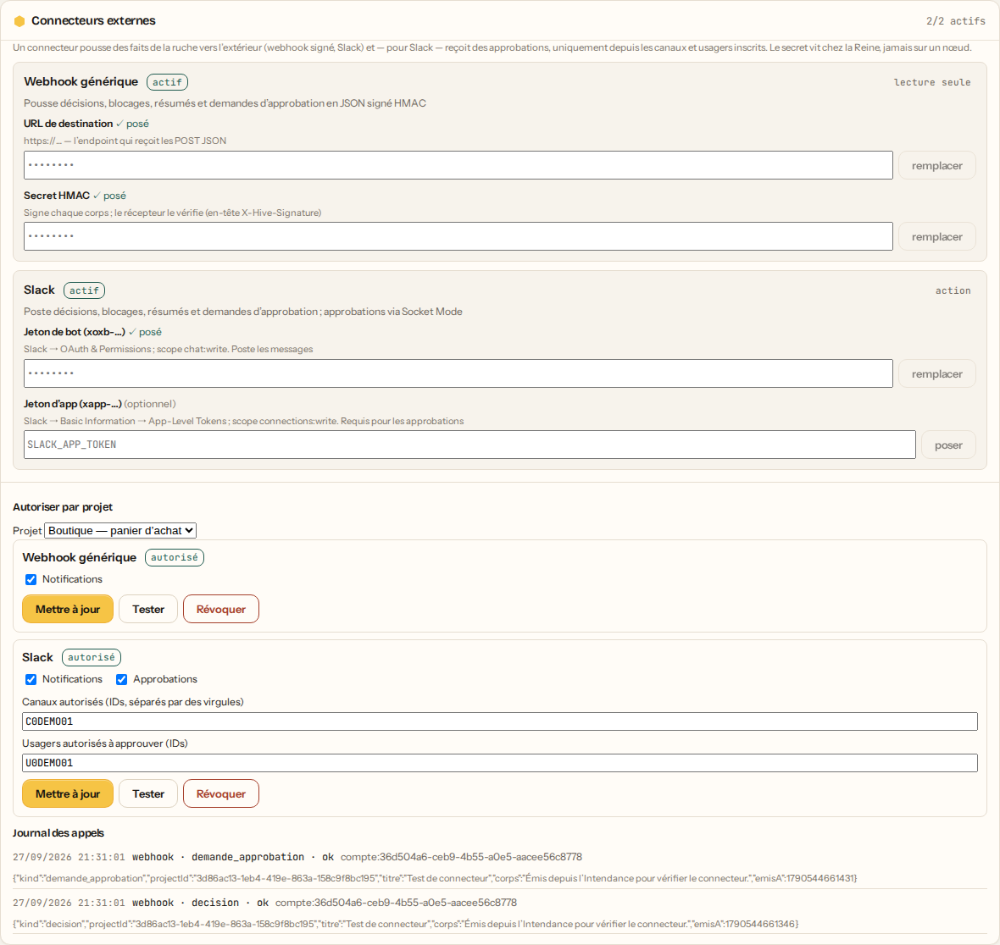

## 🤝 Inviter un ami (connecter son IA en 30 s)

1. **Vous (hôte)** — lancez l'orchestrateur avec un vrai token (`npm run dev`),
   puis créez un **billet** :

   ```bash
   npm run cli -- invite                    # sur le réseau local
   npm run cli -- tunnel                    # depuis n'importe où, en wss:// chiffré
   npm run cli -- invite --uses 3 --hours 2 # 3 machines, valable 2 h
   ```

   Vous obtenez une commande unique à envoyer :

   ```
   npm run join -- hive2_eyJ2IjoyLCJ1cmwiOiJ3c3M6…
   ```

2. **Votre ami** — récupère Hive, lance `npm install`, puis **colle la commande**.
   Son Claude Code / Codex est détecté automatiquement, et sa clé de nœud est
   mémorisée pour les reconnexions — avec l'adresse de la ruche : relancé plus
   tard, `npm run join` sans rien derrière reprend sa place. La clé ne se
   présente qu'à la ruche qui l'a délivrée ; le billet d'une autre ruche
   s'échange normalement.

   ```bash
   npm run join -- hive2_eyJ2IjoyLCJ1cmwiOiJ3c3M6…
   # 🐝 Connexion à : wss://…/ws  (« Ruche de Micka »)
   #    🔑 Clé de nœud obtenue et mémorisée — les redémarrages ne redemanderont rien.
   # ✔ Nœud démarré — vous butinez pour la ruche.
   ```

### Ce qu'un billet est, et ce qu'il n'est pas

Un billet **ne donne aucun pouvoir sur la ruche** : il ne sert qu'à obtenir une
**clé propre à la machine** de votre ami. C'est ce qui rend possible ce qui ne
l'était pas :

|                            |                                                                                                  |
| -------------------------- | ------------------------------------------------------------------------------------------------ |
| **Éphémère**               | 24 h par défaut (`--hours`), puis il ne vaut plus rien                                           |
| **À usage compté**         | une seule machine par défaut (`--uses`)                                                          |
| **Révocable**              | `npm run cli -- revoquer <billetId>`                                                             |
| **Exclusion individuelle** | `npm run cli -- exclure <nodeId>` coupe **une** personne, immédiatement, sans toucher aux autres |
| **Rien en clair en base**  | seules des empreintes PBKDF2 sont rangées : une base volée ne donne aucun accès                  |

```bash
npm run cli -- membres        # qui a les clés, quels billets circulent encore
npm run cli -- exclure node-…  # sa clé ne vaut plus rien, sa connexion est coupée
```

> Un membre exclu **ne peut pas revenir avec le token maître** : ni sous son
> identifiant, ni sous un autre. Dès qu'une ruche a exclu quelqu'un, le token
> maître n'enregistre plus de machine inconnue — les nouvelles entrent par
> billet. Les machines déjà connues, elles, ne sont pas dérangées.
>
> Le résidu, dit franchement : le porteur du token maître peut encore se faire
> passer pour une machine **déjà connue**. Ce geste-là ne passe pas inaperçu, il
> coupe la connexion de la vraie machine — mais si votre token a fuité, changez-le
> plutôt que de compter sur l'exclusion.

### La machine d'à côté, sans billet à copier (réseau local)

Quand la machine à ajouter est sur le **même réseau local**, pas besoin de
s'envoyer un billet à soi-même. Deux réglages, **éteints par défaut** :

1. **Sur la ruche** — `HIVE_DECOUVERTE=1` (et `HIVE_HOST=0.0.0.0`, sinon aucune
   machine ne pourra la joindre ; `hive doctor` le signale). Elle écoute les
   machines qui se signalent en mDNS (`_hive._tcp`).
2. **Sur la machine** — `hive join --decouvrable` (ou `HIVE_DECOUVRABLE=1`).
   Elle se signale, et affiche un **code d'appariement** :

   ```
   🐝 Cette machine se signale sur le réseau local : « portable-camille »
      Linux · Claude Code, Codex · 2 places
      (rien d’autre n’est diffusé : ni version, ni chemin, ni clé)
      🔑 Code d'appariement : K7Q2-9XMP
   ```

3. **Dans le tableau de bord** — **Inviter** → « Sur votre réseau local » →
   **Rejoindre**, puis recopiez le code. La machine échange son billet contre sa
   clé et apparaît parmi les ouvrières. Elle mémorise sa clé et l'adresse de la
   ruche : relancée (`hive join --decouvrable` ou à nu), elle reprend sa place
   sans nouvel appariement.

<p align="center">
  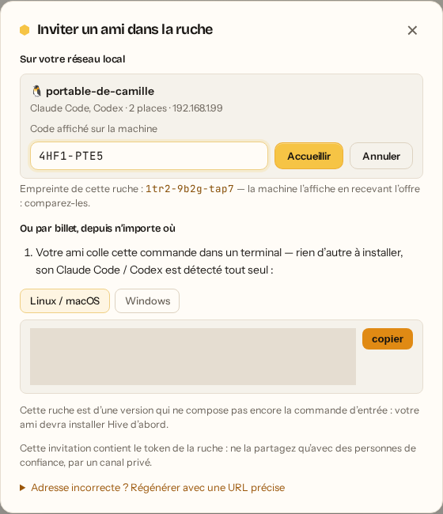
  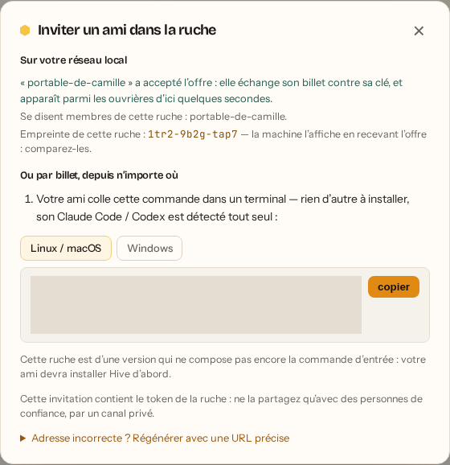
  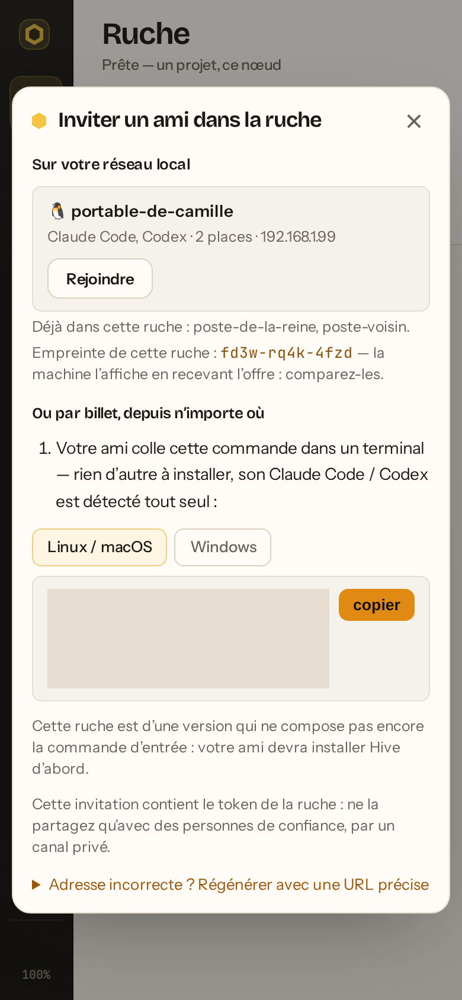
</p>

Ce qui rend ce raccourci sûr :

|                                  |                                                                                                                                                                                                             |
| -------------------------------- | ----------------------------------------------------------------------------------------------------------------------------------------------------------------------------------------------------------- |
| **Rien n'est diffusé en trop**   | nom, système, familles d'agents connectés, places, état (libre / membre) et l'empreinte publique de la ruche d'un membre — c'est tout                                                                       |
| **Jamais d'entrée sans le code** | le code n'existe que sur l'écran de la machine : une ruche voisine qui l'entend ne peut pas se l'approprier                                                                                                 |
| **Le billet voyage scellé**      | chiffré sous le code (AES-256-GCM, clé PBKDF2) ; un imposteur qui recevrait l'offre ne l'ouvre pas, un témoin du réseau non plus                                                                            |
| **Cinq essais par code**         | au cinquième refus, la machine en tire un nouveau ; un billet qui n'a pas été ouvert est révoqué sur-le-champ, et il expire en 10 minutes                                                                   |
| **La même porte ensuite**        | le billet s'échange par `POST /api/rejoindre`, comme n'importe quel billet — clé propre au nœud, révocable                                                                                                  |
| **Le seul segment de la ruche**  | la ruche n'offre qu'à une adresse privée de l'un de ses propres sous-réseaux — jamais la boucle ni l'adresse de métadonnées des nuages `169.254.169.254` : une source forgée ne la fait pas écrire ailleurs |

L'empreinte de la ruche (`abcd-efgh-jkmn`) est affichée dans le tableau de bord
**et** par la machine quand elle reçoit l'offre : comparez-les, comme on compare
l'empreinte d'un hôte SSH. Elle est **tirée au sort** au premier démarrage et
rangée dans la base de la ruche — jamais dérivée d'un secret : elle est
diffusée, elle ne doit rien apprendre à personne. Une machine membre qui se
signale dit de quelle ruche elle est ; la vôtre la montre « se disent membres
de cette ruche » — une annonce, pas une preuve (l'empreinte se recopie) : seule
la liste des ouvrières connectées fait foi.

> Limites, dites franchement : IPv4 seulement ; mDNS ne franchit pas un routeur
> (un seul segment réseau). Un pare-feu qui bloque le port UDP 5353 : la machine
> **n'apparaît pas** dans la liste. Un pare-feu qui bloque le port d'accueil de
> la machine : elle apparaît, mais **Rejoindre** répond « machine injoignable ».
> Dans les deux cas, le billet reste le chemin de repli.

### Se connecter depuis l'extérieur

Par défaut, la ruche n'est joignable que sur le réseau local. Pour un ami
ailleurs, `npm run cli -- tunnel` ouvre un tunnel sortant chiffré et émet le
billet dessus — **aucun port à ouvrir sur la box, aucun VPN, aucun domaine** :

```bash
npm run cli -- tunnel
# 🌍 Ouverture d'un tunnel via Cloudflare Quick Tunnel…
#    ✔ https://xyz.trycloudflare.com  →  wss://xyz.trycloudflare.com/ws
```

Pas de `cloudflared` ? Une commande vous dit quoi faire sur **votre** machine :

```bash
npm run cli -- cloudflare            # diagnostic + prochaines étapes
npm run cli -- cloudflare --install  # binaire local, AUCUN sudo
```

Hive n'embarque **aucune dépendance de tunnel** : la commande détecte un
`cloudflared` (ou `localtunnel`) que vous avez installé vous-même. Faire
transiter le code source de tous les membres par un tiers doit être votre choix,
pas un effet de bord d'un `npm install`.

> ⚠️ **`ws://` vers une adresse publique est refusé par défaut.** Ce n'est pas
> seulement le billet qui fuiterait, mais **tout le trafic** : prompts, logs et
> **diffs de code source**. Utilisez `wss://`, ou `--insecure` en connaissance de
> cause.

#### URL stable — pour une ruche qui dure

L'URL d'un tunnel rapide **change à chaque redémarrage**. Les nœuds mémorisent
leur clé et survivent aux relances, mais l'URL qu'ils ont apprise meurt avec le
tunnel : il faudrait réémettre un billet à **chaque membre, à chaque relance**.

Avec un compte Cloudflare (gratuit) et un domaine, dix minutes une fois suffisent
à obtenir une adresse définitive :

```bash
npm run cli -- cloudflare --setup ruche.mondomaine.com
```

La commande énumère les quatre étapes (`login`, `create`, `route dns`, `run`),
**dit pourquoi chacune existe**, signale celle qui ouvre un navigateur, et donne
la ligne à poser dans votre `.env` :

```
HIVE_PUBLIC_URL=wss://ruche.mondomaine.com/ws
```

Elle n'exécute rien à votre place : vous devez pouvoir lire ce qui va être fait
sur votre compte Cloudflare avant que ça arrive.

**Autres options d'adresse** : `HIVE_PUBLIC_URL=wss://mondomaine/ws`, ou
`npm run cli -- invite wss://mondomaine/ws`.

<details>
<summary>Ancien format <code>hive1_</code></summary>

Les invitations `hive1_` contiennent le **token maître** : accès total, sans
expiration ni révocation individuelle. Elles restent acceptées pour ne pas
déconnecter les ruches existantes, mais `npm run join` affiche un avertissement.
Émettez un billet dès que possible.

</details>
