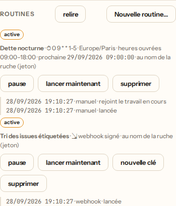

# Les Routines — du travail planifié ou déclenché

Une **routine** lance une mission du projet sans qu'on clique : à une heure
(cron, dans un fuseau horaire), quand un webhook signé arrive, ou quand la CI
d'une branche devient rouge. Dette nocturne, veille de dépendances, tri des
issues étiquetées, réparation de `main` : la ruche s'y met seule, et dit
chaque fois ce qu'elle a fait.

Créer une routine **autorise la dépense à l'avance** (ADR
[0014](adr/0014-routines-autorisation-prealable.md)). C'est donc un réglage,
réservé à qui répond du projet : son propriétaire, un administrateur, ou le
jeton de ruche sur un projet sans propriétaire. La routine part ensuite avec
l'autorité du compte qui l'a créée, **relue à chaque déclenchement**. Si ce
compte ne répond plus du projet, le déclenchement est refusé et la routine se
met en pause.

Chaque déclenchement lance une **tâche ordinaire** du projet. Elle suit la même
file, sous le même plafond de La Balance, passe par l'Evaluator et la relecture
croisée, puis par la même porte de livraison. Une routine ne fusionne jamais
rien.

## Créer une routine

Dans ⬡ Projets, sous-section **Routines** de la carte du projet : **voir les
routines**, puis **Nouvelle routine…**. Le panneau liste chaque routine, son
prochain créneau, au nom de qui elle part, et ses cinq derniers
déclenchements. Il permet aussi de la mettre en pause, de la lancer
maintenant ou de la supprimer.

<p align="center">
  
</p>

Par l'API :

```bash
curl -X POST http://localhost:7777/api/projects/<projet>/routines \
  -H 'x-hive-token: <HIVE_TOKEN>' -H 'content-type: application/json' \
  -d '{
    "nom": "Dette nocturne",
    "consigne": "Réduire la dette technique du module de paiement, un petit pas testé.",
    "declencheur": "cron",
    "expression": "0 9 * * 1-5",
    "fuseau": "Europe/Paris"
  }'
```

| Champ         | Valeurs                                                                     | Défaut               |
| ------------- | --------------------------------------------------------------------------- | -------------------- |
| `declencheur` | `cron`, `webhook`, `ci_rouge`                                               | —                    |
| `expression`  | cron à 5 champs (`cron` seulement)                                          | —                    |
| `fuseau`      | nom IANA : `Europe/Paris`, `America/New_York`, `UTC`…                       | `UTC`                |
| `branche`     | la branche surveillée (`ci_rouge` seulement)                                | `main`               |
| `plage`       | heures ouvrées `{ "jours": [1,2,3,4,5], "debut": "09:00", "fin": "18:00" }` | aucune (toute heure) |
| `concurrence` | `coalesce_if_active`, `skip_if_active`, `always_enqueue`                    | `coalesce_if_active` |
| `rattrapage`  | `skip_missed`, `enqueue_missed_with_cap` (`cron` seulement)                 | `skip_missed`        |

## Les trois déclencheurs

**Cron.** Cinq champs (minute, heure, jour du mois, mois, jour de semaine),
lus à l'heure **murale** du fuseau : `0 9 * * 1-5` en `Europe/Paris` part à
9 h à Paris toute l'année, été comme hiver. Une heure qui n'existe pas
(passage à l'heure d'été) part à l'heure décalée. Une heure qui a lieu deux
fois (retour à l'heure d'hiver) ne part qu'une fois. Quand le jour du mois
et le jour de semaine sont tous deux restreints, l'un **ou** l'autre suffit,
comme dans toute crontab. `7` vaut dimanche.

**CI rouge.** La ruche lit la tête de la branche chez GitHub, puis ses
check-runs, au plus toutes les cinq minutes. Un commit en échec (`failure`,
`timed_out`, `startup_failure`) lance **une** mission, et les noms des
contrôles en échec lui sont joints. Le même commit ne relance jamais rien.
Il faut un dépôt GitHub lié au projet et `HIVE_GITHUB_TOKEN` côté Reine. La
routine est refusée à la création sans dépôt, et une panne de lecture
s'affiche sur la routine.

**Webhook signé.** La réponse de création contient la clé de la routine
(`secret`, `rtn_…`) et son URL (`routine.webhook`). **La clé n'est remise
qu'une fois.** Chaque appel est signé comme le webhook d'abonnement :

```
x-hive-signature: t=<secondes UNIX>,v1=<HMAC-SHA256 hexadécimal de « <t>.<corps brut> »>
x-hive-delivery: <identifiant unique de la livraison>   (facultatif, recommandé)
```

- La fenêtre est de cinq minutes. Une livraison rejouée (même
  `x-hive-delivery`) répond `200 {"doublon": true}` et ne relance rien.
- Une signature fausse ou périmée, une routine inconnue et une clé révoquée
  répondent le même `401`.
- Le corps peut joindre des faits à la mission :
  `{"contexte": {"issue": "#42", "titre": "…"}}`. Il accepte dix chaînes au
  plus, de 1 000 caractères chacune. Ces faits entrent dans le prompt comme
  des **données**, jamais comme des consignes.
- **Nouvelle clé** (`POST …/routines/<id>/secret`) révoque l'ancienne dans le
  même geste.

Le webhook suppose une Reine joignable depuis l'extérieur (édition Cloud,
tunnel ou proxy). Une ruche strictement locale utilise le cron et la CI
rouge, qui sondent depuis la ruche.

### Confier les issues étiquetées : l'Action `hive-dispatch`

[`examples/github-actions/hive-dispatch.yml`](../examples/github-actions/hive-dispatch.yml)
se copie dans le dépôt surveillé. Quand une issue reçoit l'étiquette `hive`,
elle signe un appel au webhook d'une routine, avec le numéro, le titre et
l'URL de l'issue. Il faut deux secrets du dépôt : `HIVE_ROUTINE_URL` et
`HIVE_ROUTINE_KEY`. Elle ne porte **jamais** le jeton de ruche : la clé ne
vaut que pour cette routine, et se révoque d'un clic. Elle n'appelle pas
`POST /api/plan`, qui propose un découpage sans rien lancer.

## Les politiques

**Concurrence** : que faire quand le travail du déclenchement précédent vole
encore ?

- `coalesce_if_active` (défaut) : le déclenchement **rejoint** le travail en
  cours. La ligne `fusionnee` nomme le run rejoint, et dix pushs rouges en
  une heure ne font pas dix missions.
- `skip_if_active` : le déclenchement est sauté (`sautee`).
- `always_enqueue` : une nouvelle mission part quand même.

**Rattrapage** : que faire des créneaux cron passés pendant que la Reine
était arrêtée ?

- `skip_missed` (défaut) : **un seul** run pour tout le retard, sur le dernier
  créneau, et une ligne `manquee` qui compte les autres. Une Reine éteinte
  deux jours ne se réveille pas en lançant quarante-huit missions.
- `enqueue_missed_with_cap` : un run par créneau, 25 au plus. La concurrence
  s'applique encore, donc par défaut les suivants rejoignent le premier.

**Heures ouvrées** (`plage`) : hors de la plage, lue dans le fuseau de la
routine, un créneau cron ou un webhook est rangé `ignoree`, et la CI n'est
même pas lue. « Lancer maintenant » ignore la plage : un humain a choisi son
heure.

Mettre une routine en pause, puis la reprendre, ne rattrape pas les créneaux
de la pause : le prochain créneau part de la reprise.

## Ce que chaque déclenchement laisse

Une ligne dans l'historique de la routine, **quelle qu'en soit l'issue** :

| Statut      | Sens                                                                |
| ----------- | ------------------------------------------------------------------- |
| `lancee`    | une tâche est partie (son identifiant est dans `taches`)            |
| `fusionnee` | le travail précédent volait encore ; ce déclenchement l'a rejoint   |
| `sautee`    | le travail précédent volait encore ; politique `skip_if_active`     |
| `manquee`   | créneaux passés pendant l'arrêt de la Reine, et non relancés        |
| `ignoree`   | hors des heures ouvrées, ou routine en pause                        |
| `refusee`   | le compte de la routine ne répond plus du projet ; routine en pause |

L'historique garde les 50 derniers déclenchements par routine. Les curseurs
(prochain créneau, dernier commit rouge traité) vivent sur la routine
elle-même, si bien que l'élagage ne relance jamais rien. Chaque déclenchement
émet aussi `routine_run` dans la Chronique.

## Les routes

| Méthode et chemin                                       | Porte                                  |
| ------------------------------------------------------- | -------------------------------------- |
| `GET /api/projects/:id/routines`                        | lecture du projet                      |
| `POST /api/projects/:id/routines`                       | réglage (propriétaire, admin)          |
| `PUT /api/projects/:id/routines/:routineId` `{actif}`   | réglage — pause, reprise               |
| `DELETE /api/projects/:id/routines/:routineId`          | réglage — idempotent                   |
| `POST /api/projects/:id/routines/:routineId/secret`     | réglage — nouvelle clé du webhook      |
| `POST /api/projects/:id/routines/:routineId/declencher` | engagement — lancer maintenant         |
| `POST /api/projects/:id/routines/:routineId/webhook`    | signature HMAC de la clé de la routine |

## Pas encore là

- La porte « ne rien lancer si le dépôt n'a pas bougé »
  (`require_external_activity`).
- Des notes gardées d'un run à l'autre.
- Une boîte « Planifié » dans Mission Control.
- Un budget propre à chaque routine, en plus du plafond du projet.
